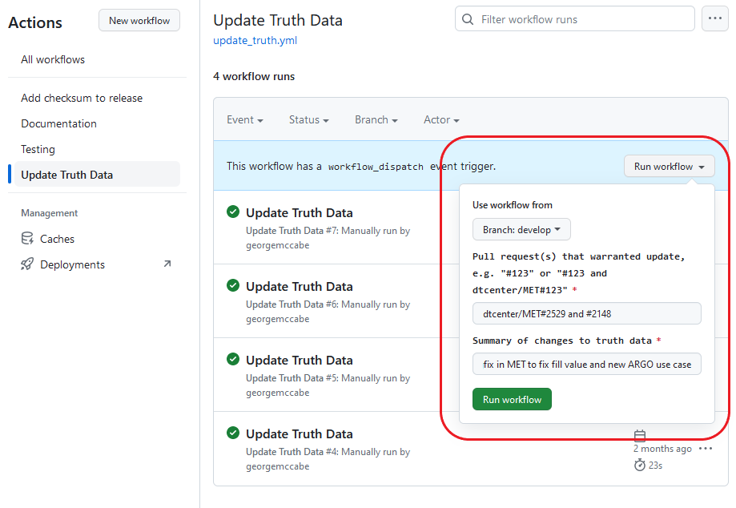

.. _adding-use-cases:

****************
Adding Use Cases
****************

.. |metplus_data_dir| replace:: /d2/www/dtcenter/dfiles/code/METplus/METplus_Data
.. |metplus_staging_dir| replace:: /d2/projects/METplus/METplus_Data_Staging
.. |dtc_web_server| replace:: mohawk.rap.ucar.edu

Work in a Feature Branch
========================

Test and develop new use cases in a GitHub feature branch.
More information on this process can be found in the
:ref:`GitHub Workflow <github-workflow>` chapter.
If no GitHub issue for the new use case exists, create it, following the
instructions to fill out the template.
This branch will be the source of the pull request to merge the changes into
the develop branch.

Types of Use Cases
==================

* Use cases that involve a single MET tool/METplus wrapper will reside
  in the *METplus/parm/use_cases/met_tool_wrapper* directory.

* Use cases that involve multiple MET tools/METplus wrappers will reside
  in the *METplus/parm/use_cases/model_applications* directory, under a
  subdirectory that corresponds to a specific category.  

.. _use_case_categories:

Use Case Categories
===================

New MET tool wrapper use cases will be put in the repository under
*parm/use_cases/met_tool_wrapper/<MET TOOL NAME>* where *<MET TOOL NAME>*
is the name of the MET tool being wrapped.

New model applications use cases will be put in the repository under
*parm/use_cases/model_applications/<CATEGORY>* where *<CATEGORY>* is
one of the following:

* air_quality_and_comp
* climate
* clouds
* data_assimilation
* extremes
* land_surface
* marine_and_cryosphere
* medium_range
* miscellaneous
* pbl
* precipitation
* s2s (Subseasonal to Seasonal)
* s2s_mid_lat (Subseasonal to Seasonal: Mid-Latitude)
* s2s_mjo (Subseasonal to Seasonal: Madden-Julian Oscillation)
* short_range (formerly convection_allowing_models)
* space_weather
* tc_and_extra_tc (Tropical Cyclone and Extratropical Cyclone)

If the new use case does not fall into any of these categories
or it is unclear which category is the most appropriate,
please create a post in the
`METplus GitHub Discussions Forum <https://github.com/dtcenter/METplus/discussions>`_.

Use Case Content
================

Configure New Use Case
----------------------

If creating a new MET tool wrapper use case, in the MET tool name
sub-directory (*parm/use_cases/met_tool_wrapper/<MET TOOL NAME>*), each
use case should have the following:

* A METplus configuration file where the MET tool name follows PascalCase,
  e.g. **GridStat.conf** or **ASCII2NC.conf**.
  If the use case uses a Python embedding script, it should be
  indicated by adding "_python_embedding" to the MET tool name.
  e.g. **GridStat_python_embedding.conf**.

If creating a new model applications use case, in the category sub-directory
(*parm/use_cases/model_applications/<CATEGORY>*), each use case should have the
following:

* A METplus configuration file named
  *\<MET-TOOL\>_fcst\<FCST\>_obs\<OBS\>_cilmo\<CLIMO\>\<DESCRIPTOR\>.conf*
  where

    * *<MET-TOOL>* is the MET tool that performs the primary statistical
      analysis, i.e. GridStat or SeriesAnalysis.

    * *<FCST>* is the name of the forecast input data source (this can be
      excluded if no forecast data is used).

    * *<OBS>* is the name of the observation input data source (this can be
      excluded if no observation data is used).

    * *<CLIMO>* is the optional climatology input data source (this can be
      excluded if no climatology data is used).

    * *<DESCRIPTOR>* is an optional description that can include field
      category, number of fields, statistical types, and file formats.

If the use case uses a Python Embedding script or any other additional files
(besides input data), then put them in a sub-directory that matches the METplus
configuration file name excluding the .conf suffix.

.. figure:: figure/model_applications_example.png

	    
Use Case Rules
--------------

- The name of the use case files should conform to the guidelines listed above
  in Use Case Content.
- The use case METplus configuration file should not **set** any variables
  specific to the user's environment, such as INPUT_BASE, OUTPUT_BASE, and
  PARM_BASE, METPLUS_CONF, etc.
- A limited number of run times should be processed so that they use case runs
  in a reasonable amount of time.  They are designed to demonstrate the
  functionality but not necessarily processed all of the data that would be
  processed for analysis. Users can take an example and modify the run times
  to produce more output as desired.
- No errors should result from running the use case.
- All data that is input to the use case (not generated by METplus) should
  be referenced relative to {INPUT_BASE} and the directory structure of the
  use case. For example, if adding a new model application use case found under
  *model_applications/precipitation*, the input directory should be relative to
  *{INPUT_BASE}/model_applications/precipitation*::

    FCST_GRID_STAT_INPUT_DIR = {INPUT_BASE}/model_applications/precipitation

- The input data required to run the use case should be added to the METplus
  input data directory on the primary DTC web server following the instructions
  :ref:`here <use_case_input_data>`.
- All data written by METplus should be referenced relative to {OUTPUT_BASE}::

    GRID_STAT_OUTPUT_DIR = {OUTPUT_BASE}/grid_stat

- The Sphinx documentation file should be as complete as possible, listing as
  much relevant information about the use case as possible. Keyword tags should
  be used so that users can locate other use cases that exhibit common
  *functionality/data sources/tools/etc*. If a new keyword is used, it should
  be added to the Quick Search Guide (*docs/Users_Guide/quicksearch.rst*). More
  information can be found :ref:`here <use_case_documentation>`.
- The use case should be run by someone other than the author to ensure that it
  runs smoothly outside of the development environment set up by the author.

.. _memory-intense-use-cases:

Use Cases That Exceed Github Actions Memory Limit
-------------------------------------------------

Below is a list of use cases in the repository that cannot be run in Github
Actions  due to their excessive memory usage. They have been tested and
cleared by reviewers of any other issues and can be used by METplus users in
the same manner as all other use cases.

- *model_applications/marine_and_cryosphere/GridStat_fcstRTOFS_obsGHRSST_climWOA_sst*

.. _use_case_documentation:
  
Document New Use Case
---------------------

Create a New Model Applications Docs Directory
^^^^^^^^^^^^^^^^^^^^^^^^^^^^^^^^^^^^^^^^^^^^^^

**If the use case falls under an existing Model Applications category,
skip this section.**

If the use case is the first in a new Model Applications category, create the
directory under **docs**/*use_cases/model_applications* if it does not already
exist. Inside this directory, create a file called **README.rst**.
Inside this file add the following each on a single line:

* Title of category
* Dashes (-) that are the exact same length as the title
* A short description of the category

For example,
*docs/use_cases/model_applications*/**air_quality_and_comp/README.rst**
would look something like this::

    Air Quality and Composition
    ---------------------------
    A short description of this category goes here.

The content of this file is rendered above the icons for the use cases in this
category in the User's Guide > METplus Use Cases >
`Model Applications <https://metplus.readthedocs.io/en/latest/generated/model_applications/index.html>`_
page.

Add Sphinx Documentation File
^^^^^^^^^^^^^^^^^^^^^^^^^^^^^

In the corresponding documentation MET tool name directory
(**docs**/*use_cases/met_tool_wrapper/<MET TOOL NAME>*) for a met_tool_wrappers
use case OR category directory for a model_applications use case
(**docs**/*use_cases/model_applications/<CATEGORY>*), add:

* A Python Sphinx Documentation (.py) file with the same name as the METplus
  configuration file

    * Users are encouraged to copy an existing documentation file and modify it
      to describe the new use case.

    * Update any references to the .conf file to use the correct name.

    * Update the Scientific Objective section to describe the use case.

    * Update the description of the input data in the Datasets section.

    * Update the list of External Dependencies (if applicable) to include any
      required Python packages.  Update the :ref:`python_requirements_table`
      table.  If the package is already listed in the spreadsheet, add
      a link to the documentation page for this new use case, following the
      format in the table.  If the package is not already listed, update
      the table to include the name of the required package, the version,
      the METplus component (e.g. METplus wrappers, METcalcpy, METplotpy), the
      source, a brief description of the package, and a link to this new use
      case that uses this new Python package.
      
    * Update the list of tools used in the METplus Components section.

    * Update the list of run times in the METplus Workflow section.

    * Update the list of keywords, referring to :ref:`quick-search` for
      a list of possible keywords to use (Note: The link text for the
      keywords must match the actual keyword exactly or it will not
      show up in the search, i.e. **ASCII2NCToolUseCase** must match
      https://metplus.readthedocs.io/en/latest/search.html?q=**ASCII2NCToolUseCase**.

    * Add an image to use as the thumbnail (if desired). Images can be added
      to the *docs/_static* directory and should be named
      <category>-<conf>.png
      where <category> is the use case category and <conf> is the name of the
      configuration file, i.e.
      **air_quality_and_comp-EnsembleStat_fcstICAP_obsMODIS_aod.png.**
      The image can be referenced in the documentation file with this syntax:

::

    # sphinx_gallery_thumbnail_path = '_static/air_quality_and_comp-EnsembleStat_fcstICAP_obsMODIS_aod.png'

.. note::
    Text that ends with an underscore (_) may be interpreted as a reference, so
    avoid ending a line with this character to avoid generating warnings in the
    documentation.

Accessing the Documentation
---------------------------

It is important to ensure that the new use case files are displayed and the
formatting looks correct. Prior to the release of METplus v4.0.0 contributors
were required to build the documentation manually.  However, the METplus
components now use Read the Docs to build and display the documentation. For
more information on how to view the newly added use case, see the 
:ref:`Read the Docs METplus Documentation <read-the-docs>`.  Contributors can
still build the documentation manually if desired. See the
:ref:`Build the Documentation Manually <manual-build>` section below for more
information.

.. _manual-build:

Build the Documentation Manually
--------------------------------

Build the documentation and ensure that the new use case file is
displayed and the formatting looks correct. The Python packages sphinx,
sphinx-gallery (0.6 or higher), and sphinx_rtd_theme are required to build.
There is a conda environment called sphinx_env available on some of the NCAR
development machines that can be used::

    conda activate /home/met_test/.conda/envs/metplus_env

or

::

    conda activate /home/met_test/.conda/envs/sphinx_env

.. note::
    If conda is not already in PATH, find it and run it
    with the full path.

Or create a conda environment and install the packages::

    conda create --name sphinx_env python=3.6
    conda activate sphinx_env
    conda install sphinx
    conda install -c conda-forge sphinx-gallery
    pip install git+https://github.com/ESMCI/sphinx_rtd_theme@version-dropdown-with-fixes

.. note::
    The specific version of sphinx_rtd_theme is needed to build the
    documentation with the version selector.
    If the docs are being built locally, this version is not
    necessarily needed. If it is easier, run 'conda install
    sphinx_rtd_theme' instead of the pip from git command
    to install the package.

To build the docs, run the **build_docs.py** script from the docs directory.
Make sure the conda environment is activated or the required packages
are available in the Python3 environment::

    cd ~/METplus/docs
    ./build_docs.py

.. _use_case_input_data:

Input Data
==========

Sample input data needed to run the use case should be provided. Please try to
limit the input data to the minimum that is
needed to demonstrate the use case effectively. GRIB2 files can be pared down
to only contain the fields and/or vertical levels that are needed for using
`wgrib2 <https://www.cpc.ncep.noaa.gov/products/wesley/wgrib2/>`_.

Example: To create a file called subset.grib2 that only contains TMP data from
file.grib2, run the following command::

    wgrib2 file.grib2 | grep TMP | wgrib2 -i file.grib2 -grib_out subset.grib2

If the input data is in NetCDF format, the
`ncks <http://nco.sourceforge.net/nco.html>`_ tool can be used to subset
the file(s).

Providing new data
------------------

Log into the computer where the input data resides
^^^^^^^^^^^^^^^^^^^^^^^^^^^^^^^^^^^^^^^^^^^^^^^^^^

Switch to Bash
^^^^^^^^^^^^^^

Run "bash" to activate a bash shell. This step isn't necessary if bash
is already the default shell. The met_test user's default shell is bash.
The instructions needed to run
on the DTC web server will run smoothly in bash:

    bash

Run the following command to see which shell is currently in use::

    echo $SHELL

.. warning::
    **IMPORTANT:** The following environment variables are set to make
    running these instructions easier. Make sure they are set to the correct
    values that correspond to the use case being added before
    copy/pasting any of these commands or there may be unintended consequences.
    Copy and paste these values after they have been modified into a text file
    that can be copied and pasted into the terminal.

Download the template environment file
^^^^^^^^^^^^^^^^^^^^^^^^^^^^^^^^^^^^^^

This file is available on the DTC web server. Use 'wget' to download the
file to the current working directory, or visit the URL in a browser and save
it on the computer::

    wget https://dtcenter.ucar.edu/dfiles/code/METplus/METplus_Data/add_use_case_env.bash

Or click this `link <https://dtcenter.ucar.edu/dfiles/code/METplus/METplus_Data/add_use_case_env.bash>`_.

Rename env file
^^^^^^^^^^^^^^^

Rename this file to include the feature branch. For example, if the branch
is feature_ABC_desc, then run::

    mv add_use_case_env.bash feature_ABC_desc_env.bash

Change the values of the env file
^^^^^^^^^^^^^^^^^^^^^^^^^^^^^^^^^

Open this file with an editor and modify it to include the
appropriate information for the use case.

* METPLUS_VERSION should only include the major and minor version. For example,
  if the next release is 4.0.0, set this value to 4.0. If the next release is
  4.0.1, set this value to 4.0.

To determine the next version of METplus, call the **run_metplus.py** script
(found in the ush directory of the METplus repository) without any arguments.
The first line of output will list the current development version. The first
2 numbers displayed should correspond to the next major/minor release::

    Running METplus 4.0.0-beta4-dev

If the above is shown, then METPLUS_VERSION should be set to 4.0

* METPLUS_USE_CASE_CATEGORY should be one of the list items in the
  :ref:`use_case_categories` section unless approval has been received  to
  create a new category. For a new met_tool_wrapper use case, set this value
  to met_tool_wrapper.

* METPLUS_USE_CASE_NAME should be the name of the new use case without the
  .conf extension, i.e. EnsembleStat_fcstICAP_obsMODIS_aod. If adding a new
  met_tool_wrapper use case, set this value to met_test_YYYYMMDD where
  YYYYMMDD is today's date.

* METPLUS_FEATURE_BRANCH should exactly match the name of the current working
  branch.

Source the env file and check environment
^^^^^^^^^^^^^^^^^^^^^^^^^^^^^^^^^^^^^^^^^

Source the environment file and verify that the variables are set
correctly. If the source command fails, make sure that the current
working shell is bash::

    source feature_ABC_desc_env.bash
    printenv | grep METPLUS_

.. note::
    The value for METPLUS_USER_ENV_FILE should be the name of the environment
    file that was just sourced.

Create sub-directories for input data
^^^^^^^^^^^^^^^^^^^^^^^^^^^^^^^^^^^^^

Put new dataset into a directory that matches the use case directories, i.e.
model_applications/${METPLUS_USE_CASE_CATEGORY}/${METPLUS_USE_CASE_NAME}.
For a new met_tool_wrapper use case, put the data in a directory called
met_test/new.
All of the data required for the use case belongs in this directory so that it
is clear which use case uses the data. Additional sub-directories under the
use case directory can be used to separate out different data sources if
desired.

Verify use case config file contains correct directory
^^^^^^^^^^^^^^^^^^^^^^^^^^^^^^^^^^^^^^^^^^^^^^^^^^^^^^

Set directory paths in the use case config file relative to INPUT_BASE
i.e *{INPUT_BASE}/model_applications/<category>/<use_case>* where
<category> is the value that has been set for ${METPLUS_USE_CASE_CATEGORY} and
<use_case> is the value that has been set for ${METPLUS_USE_CASE_NAME}.
For a new met_tool_wrapper use case, use *{INPUT_BASE}/met_test/new*.
Set {INPUT_BASE} to the local directory to test that the use case
still runs properly.

Create new data tarfile
^^^^^^^^^^^^^^^^^^^^^^^

Create a tarfile on the development machine with the new dataset. Make sure
the tarfile contains directories, i.e.
*model_applications/${METPLUS_USE_CASE_CATEGORY}*::

    tar czf ${METPLUS_NEW_DATA_TARFILE} model_applications/${METPLUS_USE_CASE_CATEGORY}/${METPLUS_USE_CASE_NAME}

OR for a met_tool_wrapper use case, run::

    tar czf ${METPLUS_NEW_DATA_TARFILE} met_test/new

Verify that the correct directory structure is found inside the tarfile::

    tar tzf ${METPLUS_NEW_DATA_TARFILE}

The output should show that all of the data is found under the
*model_applications/<category>/<use_case>* directory. For example::

    model_applications/marine_and_cryosphere/
    model_applications/marine_and_cryosphere/PlotDataPlane_obsHYCOM_coordTripolar/
    model_applications/marine_and_cryosphere/PlotDataPlane_obsHYCOM_coordTripolar/weight_north.nc
    model_applications/marine_and_cryosphere/PlotDataPlane_obsHYCOM_coordTripolar/rtofs_glo_2ds_n048_daily_diag.nc
    model_applications/marine_and_cryosphere/PlotDataPlane_obsHYCOM_coordTripolar/weight_south.nc

Copy files to DTC Web Server
^^^^^^^^^^^^^^^^^^^^^^^^^^^^

If you have access to the internal DTC web server, copy over the tarfile and
the environment file to the staging directory:

.. parsed-literal::

    scp ${METPLUS_NEW_DATA_TARFILE} |dtc_web_server|:|metplus_staging_dir|/
    scp ${METPLUS_USER_ENV_FILE} |dtc_web_server|:|metplus_staging_dir|/

If you do not have access to the internal DTC web server,
upload the files to the RAL FTP server::

    ftp -p ftp.rap.ucar.edu

For an example on how to upload data to the ftp site see
“How to Send Us Data” on the
`Resources for Troubleshooting page <https://github.com/dtcenter/METplus/discussions/954>`_.

Adding new data to full sample data tarfile
-------------------------------------------

If you are unable to access the DTC web server to upload data or if
permission has not been granted to use the met_test shared user
account, someone from the
METplus development team will have to complete the instructions in this
section. Please let one of the team members know if this is necessary.
Comment on the GitHub issue associated with this use case and/or email the team
member(s) that have been coordinating with this work. If it is unclear who to
contact, please create a post in the
`METplus GitHub Discussions Forum <https://github.com/dtcenter/METplus/discussions>`_.

Log into the DTC Web Server with SSH
^^^^^^^^^^^^^^^^^^^^^^^^^^^^^^^^^^^^

The web server is only accessible on the NCAR VPN.

.. parsed-literal::

    ssh |dtc_web_server|

Switch to the met_test user
^^^^^^^^^^^^^^^^^^^^^^^^^^^

The commands must be run as the met_test user to write into the data
directory::

    runas met_test

If unable to run this command successfully, please contact a METplus developer.

Setup the environment to run commands on web server
^^^^^^^^^^^^^^^^^^^^^^^^^^^^^^^^^^^^^^^^^^^^^^^^^^^

Change directory to the data staging dir,
source the environment file that was created, and make sure the environment
variables are set properly.

.. parsed-literal::

    cd |metplus_staging_dir|
    source feature_ABC_desc_env.bash
    printenv | grep METPLUS\_

Create a feature branch directory in the tarfile directory
^^^^^^^^^^^^^^^^^^^^^^^^^^^^^^^^^^^^^^^^^^^^^^^^^^^^^^^^^^

As the met_test user, create a new directory in the METplus_Data web
directory named after the branch containing the changes for the new use case.
On the DTC web server::

    cd ${METPLUS_DATA_TARFILE_DIR}
    mkdir ${METPLUS_FEATURE_BRANCH}
    cd ${METPLUS_FEATURE_BRANCH}

Copy the environment file into the feature branch directory
^^^^^^^^^^^^^^^^^^^^^^^^^^^^^^^^^^^^^^^^^^^^^^^^^^^^^^^^^^^

This will make it easier for the person who will update the tarfiles for the
next release to include the new data (right before the pull request is merged
into the develop branch)::

    cp ${METPLUS_DATA_STAGING_DIR}/${METPLUS_USER_ENV_FILE} ${METPLUS_DATA_TARFILE_DIR}/${METPLUS_FEATURE_BRANCH}

Check if the category tarfile exists already
^^^^^^^^^^^^^^^^^^^^^^^^^^^^^^^^^^^^^^^^^^^^

Check the symbolic link in the develop directory to determine latest tarball::

    export METPLUS_EXISTING_DATA_TARFILE=`ls -l ${METPLUS_DATA_TARFILE_DIR}/develop/sample_data-${METPLUS_USE_CASE_CATEGORY}.tgz | sed 's|.*->||g'`
    echo ${METPLUS_EXISTING_DATA_TARFILE}

**If the echo command does not contain a full path to sample data tarfile, then
the sample data tarball may not exist yet for this category.** Double check
that no sample data tarfiles for the category are found in any of the release
or develop directories.

Add contents of existing tarfile to feature branch directory (if applicable)
^^^^^^^^^^^^^^^^^^^^^^^^^^^^^^^^^^^^^^^^^^^^^^^^^^^^^^^^^^^^^^^^^^^^^^^^^^^^

**ONLY RUN THE COMMAND THAT IS APPROPRIATE TO THE USE CASE. READ CAREFULLY!**

**CONDITION 1: If there is an existing tarfile
for the category (from the previous step)**,
then untar the sample data tarball into the feature branch directory::

    tar zxf ${METPLUS_EXISTING_DATA_TARFILE} -C ${METPLUS_DATA_TARFILE_DIR}/${METPLUS_FEATURE_BRANCH}

**CONDITION 2: If no tarfile exists yet, skip this step.**

Rename or modify existing data or data structure (if applicable)
^^^^^^^^^^^^^^^^^^^^^^^^^^^^^^^^^^^^^^^^^^^^^^^^^^^^^^^^^^^^^^^^

**If the reason for the feature branch is to adjust an existing use case,
such as renaming a use case or changing the data file, then adjust the
directory structure and/or the data files which should now be in the
feature branch directory (from the last step).** Changes to a
use case name or input data for
a pre-existing use case should be separately verified to run successfully,
and noted in the Pull Request form
(described later).

Add new data to feature branch directory
^^^^^^^^^^^^^^^^^^^^^^^^^^^^^^^^^^^^^^^^

Untar the new data tarball into the feature branch directory::

    tar zxf ${METPLUS_DATA_STAGING_DIR}/${METPLUS_NEW_DATA_TARFILE} -C ${METPLUS_DATA_TARFILE_DIR}/${METPLUS_FEATURE_BRANCH}

Verify that all of the old and new data exists in the directory that was
created (i.e. *model_applications/<category>*).

Create the new tarfile
^^^^^^^^^^^^^^^^^^^^^^
Create the new sample data tarball.

**ONLY RUN THE COMMAND THAT IS APPROPRIATE TO THE USE CASE. READ CAREFULLY!**

**CONDITION 1:** Model Application Use Case Example::

    tar czf sample_data-${METPLUS_USE_CASE_CATEGORY}.tgz model_applications/${METPLUS_USE_CASE_CATEGORY}

**CONDITION 2:** MET Tool Wrapper Use Case Example::

    tar czf sample_data-${METPLUS_USE_CASE_CATEGORY}.tgz met_test

Add volume_mount_directories file
^^^^^^^^^^^^^^^^^^^^^^^^^^^^^^^^^

Copy the volume_mount_directories file from the develop directory into the
branch directory. Update the entry for the new tarball if the mounting point
has changed (unlikely) or add a new entry if adding a new sample data
tarfile. The format of this file generally follows
<category>:model_applications/<category>, i.e.
climate:model_applications/climate::

    cp ${METPLUS_DATA_TARFILE_DIR}/develop/volume_mount_directories ${METPLUS_DATA_TARFILE_DIR}/${METPLUS_FEATURE_BRANCH}

Log out of DTC Web Server
^^^^^^^^^^^^^^^^^^^^^^^^^

The rest of the instructions are run on the machine where the use case was
created and tested.

Trigger Input Data Ingest
-------------------------

**IF WORKING IN THE *dtcenter/METplus REPOSITORY*, PLEASE SKIP THIS STEP.**

If working in a forked METplus repository, the newly added input data will not
become available for the tests unless it is triggered from the dtcenter
repository. A METplus developer will need to run the following steps. Please
provide them with the name of the forked repository and the branch that will
be used to create the pull request with the new use case. In this example,
the branch feature_XYZ exists in the *my_fake_user/METplus* repository. First,
clone the *dtcenter/METplus* repository, the run the following::

    git remote add my_fake_user https://github.com/my_fake_user/METplus
    git checkout develop
    git checkout -b feature_XYZ
    git pull my_fake_user feature_XYZ
    git push origin feature_XYZ
    git remote remove my_fake_user

These commands will add a new remote to the forked repository, create a branch
off of the develop branch with the same name as the branch on the fork, pull
in the changes from the forked branch, then push the new branch up to
*dtcenter/METplus* on GitHub. Finally, the remote is removed to avoid clutter.

Once these steps have been completed, go to *dtcenter/METplus* on GitHub
in a web browser and navigate to the
`Actions tab <https://github.com/dtcenter/METplus/actions>`_.
Click on the job named
"Docker Setup - Update Data Volumes" then click on "Update Data Volumes" and
verify that the new data tarfile was found on the DTC web server and the new
Docker data volume was created successfully. See
:ref:`verify-new-input-data-was-found`. If the input data was ingested
properly, then delete the feature branch from *dtcenter/METplus*.
This will avoid
confusion if this branch diverges from the branch on the forked repository that
will be used in the final pull request.

.. _add_use_case_to_test_suite:

Add use case to the test suite
------------------------------

The *internal/tests/use_cases/all_use_cases.txt* file in the METplus
repository contains the list of all use cases.
Add the new use case to this file so it will be available in
the tests. See the :ref:`cg-ci-all-use-cases` section for details.

.. _add_new_category_to_test_runs:

Add new category to test runs
-----------------------------

The *.github/parm/use_case_groups.json* file in the METplus repository
contains a list of the use case groups to run together.
Add a new entry to the list that includes the category of the new use case,
the list of indices that correspond to the index number described in the
:ref:`add_use_case_to_test_suite` section.

See the :ref:`cg-ci-use-case-groups` section for details.

Set the "run" variable to true so that the new use case group will run in
the automated test suite whenever a new change is pushed to GitHub. This
allows users to test that the new use case runs successfully.

Example::

      {
        "category": "climate",
        "index_list": "2",
        "run": true
      }

.. note::
    Make sure there is a comma after the curly braces for the item that comes
    before the new item in the list.

This example adds a new use case group that contains the climate use case
with index 2 and is marked to "run" for every push.

New use cases are added as a separate item to make reviewing the test results
easier. A new use case will produce new output data that is not found in the
"truth" data set which is compared to the output of the use case runs to check
if code changes altered the final results. Isolating the new output will make
it easier to verify that the only differences are caused by the new data.
It also makes it easier to check the size of the output data and length of time
the use case takes to run to determine if it can be added to an existing group
or if it should remain in its own group.

Monitoring Automated Tests
--------------------------

All of the use cases in the METplus repository are run via GitHub Actions to
ensure
that everything runs smoothly. If the above instructions to add new data were
followed correctly, then GitHub Actions will automatically obtain the
new data and use it for the tests when the changes are pushed to GitHub.
Adding the use case to the test suite will allow the ability to check
that the data
was uploaded correctly and that the use case runs in the Python environment
created in Docker. The status of the tests can be viewed on GitHub under the
`Actions tab <https://github.com/dtcenter/METplus/actions>`_.
The feature branch should be found in the list of results near the top.
At the far left of the entry will be a small status icon:

- A yellow circle that is spinning indicates that the build is currently
  running.
- A yellow circle that is not moving indicates that the build is
  waiting to be run.
- A green check mark indicates that all of the jobs ran successfully.
- A red X indicates that something went wrong.
- A gray octagon with an exclamation mark (!) inside means it was canceled.

Click on the text next to the icon (last commit message) to see more details.

.. _verify-new-input-data-was-found:

Verifying that new input data was found
^^^^^^^^^^^^^^^^^^^^^^^^^^^^^^^^^^^^^^^

On the left side of the window there will be a list of jobs that are run.
Click on the job titled "Docker Setup - Update Data Volumes"

.. figure:: figure/update_data_volumes.png

On this page, click the item labeled "Update Data Volumes" to view the log
output. If the new data was found properly, there will be output saying
"Will pull data from..." followed by the path to the feature branch directory.
It will also list the dataset category that will be added.

If the data volume was already successfully created from a prior job, the
script will check if the tarfile on the web server has been modified since
the data volume was created. It will recreate it if it has been modified or
do nothing for this step otherwise.

If the log file cannot find the directory on the web server, then something
went wrong in the previous instructions.

.. figure:: figure/data_volume_not_found.png

If this is the case and data should be found, repeat the instructions to stage
the input data or post in the
`METplus GitHub Discussions Forum <https://github.com/dtcenter/METplus/discussions>`_
for assistance.

Verify that the use case ran successfully
^^^^^^^^^^^^^^^^^^^^^^^^^^^^^^^^^^^^^^^^^

Please verify that the use case was
actually run by referring to the appropriate section under "Jobs" that starts
with "Use Case Tests." Click on the job and search for the use case config
filename in the log output by using the search box on the top right of the
log output.

If the use case fails in GitHub Actions but runs successfully in the user's
environment, potential reasons include: 

- Errors providing input data (see :ref:`use_case_input_data`)
- Using hard-coded paths from the user's machine
- Referencing variables set in the user's configuration file or local
  environment
- Memory usage of the use case exceeds the available memory in the
  Github Actions environment

Github Actions has
`limited memory <https://docs.github.com/en/actions/using-github-hosted-runners/about-github-hosted-runners#supported-runners-and-hardware-resources>`_
available and will cause the use case to fail when exceeded. A failure
caused by exceeding the memory allocation in a Python Embedding script
may result in an unclear error message. 
If it is suspected that this is the case, consider utilizing a Python
memory profiler to check the
Python script's memory usage. If the use case exceeds the limit, try to pare 
down the data held in memory and use less memory intensive Python routines.

If memory mitigation cannot move the use case’s memory usage below the
Github Actions limit, 
see :ref:`exceeded-Github-Actions` for next steps.

Verify that the use case ran in a reasonable amount of time
^^^^^^^^^^^^^^^^^^^^^^^^^^^^^^^^^^^^^^^^^^^^^^^^^^^^^^^^^^^

Find the last successful run of the use case category job and compare the time
it took to run to the run that includes the new use case. The time for the job
is listed in the Summary view of the latest workflow run next to the name of
the job. If the time to run has
increased by a substantial amount, please look into modifying the configuration
so that it runs in a reasonable time frame.

If the new use case runs in a reasonable amount of time but the total time to
run the set of use cases is now above 20 minutes or so, consider creating a
new job for the new use case. See the :ref:`cg-ci-subset_category` section
and the multiple medium_range jobs for an example.

.. _exceeded-Github-Actions:

Use Cases That Exceed Memory Allocations of Github Actions
----------------------------------------------------------

If a use case utilizing Python embedding does not run successfully in 
Github Actions due to exceeding the memory limit and memory mitigation 
steps were unsuccessful in lowering memory usage, please take the following steps.

- Document the Github Actions failure in the Github use case issue. 
  Utilize a Python memory profiler to identify as specifically as possible 
  where the script exceeds the memory limit.
- Add the use case to the :ref:`memory-intense-use-cases` list.
- In the *internal/tests/use_cases/all_use_cases.txt* file, ensure that the 
  use case is listed as the lowest-listed use case in its respective category. 
  Change the number in front of the new use case to an 'X', preceded 
  by the ‘#’ character::

	#X::GridStat_fcstRTOFS_obsGHRSST_climWOA_sst::model_applications/marine_and_cryosphere/GridStat_fcstRTOFS_obsGHRSST_climWOA_sst.conf, model_applications/marine_and_cryosphere/GridStat_fcstRTOFS_obsGHRSST_climWOA_sst/ci_overrides.conf:: icecover_env, py_embed

- In the *.github/parm/use_case_groups.json* file, remove the entry that 
  was added during the :ref:`add_new_category_to_test_runs` 
  for the new use case. This will stop the use case from running on a pull request. 
- Push these two updated files to the working branch in Github and
  confirm that it now compiles successfully.
- During the :ref:`create-a-pull-request` creation, inform the reviewer of 
  the Github Actions failure. The reviewer should confirm the use case is 
  successful when run manually, that the memory profiler output confirms that 
  the Python embedding script exceeds the Github Actions limit, and that 
  there are no other Github Actions compiling errors.

.. _create-a-pull-request:

Create a Pull Request
=====================

Create a pull request to merge the changes from the working branch
into the develop
branch. More information on this process can be found in the
:ref:`GitHub Workflow <gitHub-workflow>`
chapter under
:ref:`Open a pull request using a browser <pull-request-browser>`.

Pull Request Reviewer Instructions
==================================

.. _update-the-develop-data-directory:

Update the develop data directory
---------------------------------

Once the person reviewing the pull request has verified that the new use case
was run successfully using the new data,
they will need to update the links on the DTC web server before the
pull request is merged so that the develop branch will contain the new data.

Log into the DTC Web Server with SSH
^^^^^^^^^^^^^^^^^^^^^^^^^^^^^^^^^^^^

The web server is only accessible on the NCAR VPN.

.. parsed-literal::

    ssh |dtc_web_server|

Switch to the met_test user
^^^^^^^^^^^^^^^^^^^^^^^^^^^

Commands must run as the met_test user::

    runas met_test

Change directory to the METplus Data Directory
^^^^^^^^^^^^^^^^^^^^^^^^^^^^^^^^^^^^^^^^^^^^^^

.. parsed-literal::

    cd |metplus_data_dir|

Source the environment file for the feature. The relative path will look
something like this::

    source feature_ABC_desc/feature_ABC_desc_env.sh

Compare the volume_mount_directories file
^^^^^^^^^^^^^^^^^^^^^^^^^^^^^^^^^^^^^^^^^

Compare the feature branch file to the upcoming METplus version directory file::

    diff ${METPLUS_FEATURE_BRANCH}/volume_mount_directories v${METPLUS_VERSION}/volume_mount_directories

**ONLY RUN THE COMMAND THAT IS APPROPRIATE TO THE USE CASE. READ CAREFULLY!**

**CONDITION 1: IF there is a new entry or change in the feature version**,
copy the feature file into the upcoming METplus version directory and the develop directory::

    cp ${METPLUS_FEATURE_BRANCH}/volume_mount_directories v${METPLUS_VERSION}/volume_mount_directories
    cp ${METPLUS_FEATURE_BRANCH}/volume_mount_directories develop/volume_mount_directories

Copy data from the feature directory into the next version directory
^^^^^^^^^^^^^^^^^^^^^^^^^^^^^^^^^^^^^^^^^^^^^^^^^^^^^^^^^^^^^^^^^^^^

**Make sure the paths are correct before copying.**

**ONLY RUN THE COMMAND THAT IS APPROPRIATE TO THE USE CASE. READ CAREFULLY!**

**CONDITION 1:** Model Applications Use Cases::

    from_directory=${METPLUS_DATA_TARFILE_DIR}/${METPLUS_FEATURE_BRANCH}/model_applications/${METPLUS_USE_CASE_CATEGORY}/${METPLUS_USE_CASE_NAME}
    echo $from_directory
    ls $from_directory

    to_directory=${METPLUS_DATA_TARFILE_DIR}/v${METPLUS_VERSION}/model_applications/${METPLUS_USE_CASE_CATEGORY}
    echo $to_directory
    ls $to_directory

**OR**

**CONDITION 2:** MET Tool Wrapper Use Cases::

    from_directory=${METPLUS_DATA_TARFILE_DIR}/${METPLUS_FEATURE_BRANCH}/met_test/new
    echo $from_directory
    ls $from_directory

    to_directory=${METPLUS_DATA_TARFILE_DIR}/v${METPLUS_VERSION}/met_test
    echo $to_directory
    ls $to_directory

After verifying the directories are correct, copy the files::

    cp -r $from_directory $to_directory/

List the tarfile for the use case category in the next release version directory::

    cd ${METPLUS_DATA_TARFILE_DIR}/v${METPLUS_VERSION}
    ls -lh sample_data-${METPLUS_USE_CASE_CATEGORY}*

**ONLY RUN THE COMMAND THAT IS APPROPRIATE TO THE USE CASE. READ CAREFULLY!**

**CONDITION 1: IF the latest version of the tarfile is in this directory**,
then rename the existing sample data tarball for
the use case category just in case something goes wrong::

    mv sample_data-${METPLUS_USE_CASE_CATEGORY}-${METPLUS_VERSION}.tgz sample_data-${METPLUS_USE_CASE_CATEGORY}-${METPLUS_VERSION}.sav.`date +%Y%m%d%H%M`.tgz

**OR**

**CONDITION 2: IF the sample data tarfile for the category is a link to
another METplus
version**, then simply remove the tarfile link::

    unlink sample_data-${METPLUS_USE_CASE_CATEGORY}.tgz
    
Remove old data (if applicable).

If the pull request notes mention an old directory path that should be removed,
please remove that directory. Be careful not to remove any files that are
still needed.

Create the new sample data tarfile.

**ONLY RUN THE COMMAND THAT IS APPROPRIATE TO THE USE CASE. READ CAREFULLY!**

**CONDITION 1:** Model Applications Use Cases::

    tar czf sample_data-${METPLUS_USE_CASE_CATEGORY}-${METPLUS_VERSION}.tgz model_applications/${METPLUS_USE_CASE_CATEGORY}

**OR**

**CONDITION 2:** MET Tool Wrapper Use Cases::

    tar czf sample_data-${METPLUS_USE_CASE_CATEGORY}-${METPLUS_VERSION}.tgz met_test

Update the link in the develop directory if needed
^^^^^^^^^^^^^^^^^^^^^^^^^^^^^^^^^^^^^^^^^^^^^^^^^^

Check if the develop directory contains a symbolic link to an older version of
the tarfile. Note: These commands must be run together (no other commands in
between) to work::

    cd ${METPLUS_DATA_TARFILE_DIR}/develop
    ls -lh sample_data-${METPLUS_USE_CASE_CATEGORY}.tgz | grep ${METPLUS_VERSION}
    if [ $? != 0 ]; then echo Please update the link; else echo The link is already correct; fi

**IF the screen output says "The link is already correct" then DO NOT
RUN THE NEXT COMMAND. IF it says "Please update the link" then please listen
to the polite instructions**::

    unlink sample_data-${METPLUS_USE_CASE_CATEGORY}.tgz
    ln -s ${METPLUS_DATA_TARFILE_DIR}/v${METPLUS_VERSION}/sample_data-${METPLUS_USE_CASE_CATEGORY}-${METPLUS_VERSION}.tgz sample_data-${METPLUS_USE_CASE_CATEGORY}.tgz

Check that the link now points to the new tarfile that was just created::

  ls -lh sample_data-${METPLUS_USE_CASE_CATEGORY}.tgz

After the Pull Request is Approved
==================================
  
Merge the pull request and ensure that all tests pass
-----------------------------------------------------

Merge the pull request on GitHub. Then go to the "Actions" tab and verify that
all of the GitHub Actions tests pass for the develop branch. A green check mark
for the latest run that lists "develop" as the branch signifies that the run
completed successfully.

.. figure:: figure/github_actions_develop.png

If the circle on the left side is yellow, then the run has not completed yet.
If everything ran smoothly, clean up the files on the web server.

Consider rearranging the use case groups
----------------------------------------

If another group of use cases in the same category exists, consider adding the
new use case to an existing group to speed up execution.
If a new use case runs quickly (check the time next to the use case group in
the diagram found on the Summary page of each GitHub Actions run),
produces a reasonably small sized output data
artifact (found at the bottom of a completed GitHub Actions run), and the same
applies to another group of same category, it would make sense to combine them.
In the .github/workflow/testing.yml file, modify the categories list under the
"use_case_tests" job (see :ref:`add_new_category_to_test_runs`). For example,
if the following is found in the list::

    - "met_tool_wrapper:0-53"

and the new use case is defined with::

    - "met_tool_wrapper:54"

then combine the two list items into a single item::

    - "met_tool_wrapper:0-54"

Update the Truth Data
---------------------

The addition of a new use case results in new output data. When this happens,
the reference branch needs to be updated so that future pull requests will
compare their results to a "truth" data set that contains the new files.
Create a pull request with "develop" as the source branch and "develop-ref" as
the destination branch. This is done so that the pull request number
responsible for the changes in the truth data can be referenced to easily
track where differences occurred.

A GitHub Action workflow is available to handle this step.

* Ensure that the develop data directory has been updated to include all of the
  new input data.
  Check with the reviewers of recent pull requests that add a new use case to
  confirm that the steps under :ref:`update-the-develop-data-directory` have
  been completed. If this step has not been completed, then the new use case(s)
  will fail and the new output data will not be added to the truth data set.
* Navigate to https://github.com/dtcenter/METplus/actions/workflows/update_truth.yml
  or from the METplus GitHub page, click on the Actions tab,
  then click on "Update Truth Data" under menu on the left.
* Click on the "Run workflow" button on the right.
* Click on the Branch pull down and select "develop" unless you are updating
  the truth data for a bugfix on a main_vX.Y branch.
* Enter the pull request numbers that warranted the update.
  Include the '#' symbol before the number to create a link to the PR.
  PRs from a repository other than METplus should include
  the repository name before '#' symbol.
* Enter a brief summary of the changes.
  Developers can navigate to the PRs for more information.

* Click the "Run workflow" button.
* A new workflow run should appear at the top of the list and complete quickly.
* Click on the "Pull Requests" tab.
  A new pull request should have been created with the information that
  was entered. Click on the new pull request.
* Verify that the information in this pull request is correct.
  If the "develop" branch was selected in the "Run workflow" menu,
  then the pull request should show **develop-ref <- develop**.
* Add the appropriate project and milestone values on the right hand side.
* Scroll to the bottom of the pull request and click "Squash and merge."
* Click "Confirm squash and merge." It is not necessary to wait for the
  automation checks to complete for this step.
* Monitor the Testing automation run for the develop-ref branch and ensure that
  all of the use cases run successfully and the final step named
  "Create Output Docker Data Volumes" completed successfully.
* If any use cases fail, check that the input data has been updated following
  the instructions under :ref:`update-the-develop-data-directory` and rerun
  all of the jobs of the -ref workflow.

Clean Up DTC Web Server
-----------------------

Remove the saved copy of the sample data tarfile
^^^^^^^^^^^^^^^^^^^^^^^^^^^^^^^^^^^^^^^^^^^^^^^^

Check if there are any "sav" files in the METplus version directory::

    cd ${METPLUS_DATA_TARFILE_DIR}/v${METPLUS_VERSION}
    ls -lh sample_data-${METPLUS_USE_CASE_CATEGORY}-${METPLUS_VERSION}.sav.*.tgz

If there is more than one file with "sav" in the filename, make sure that the
file removed is the file that was created for this feature.

Remove the feature branch data directory
^^^^^^^^^^^^^^^^^^^^^^^^^^^^^^^^^^^^^^^^

If more development is needed for the feature branch, do not remove the
directory. If the work is complete, then remove the directory::

    ls ${METPLUS_DATA_TARFILE_DIR}/${METPLUS_FEATURE_BRANCH}
    rm -rf ${METPLUS_DATA_TARFILE_DIR}/${METPLUS_FEATURE_BRANCH}

Clean up the staging directory
^^^^^^^^^^^^^^^^^^^^^^^^^^^^^^

Remove the tarfile and environment file from the staging directory::

    cd ${METPLUS_DATA_STAGING_DIR}

    ls ${METPLUS_NEW_DATA_TARFILE}
    rm ${METPLUS_NEW_DATA_TARFILE}

    ls ${METPLUS_USER_ENV_FILE}
    rm ${METPLUS_USER_ENV_FILE}
