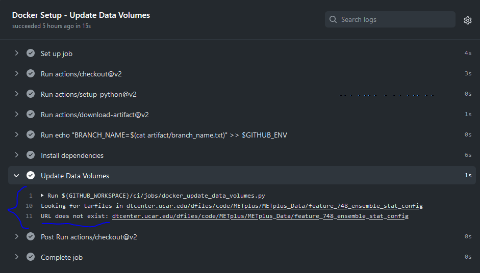

Adding Use Cases
================

.. |metplus_data_dir| replace:: /d2/www/dtcenter/dfiles/code/METplus/METplus_Data
.. |metplus_staging_dir| replace:: /d2/projects/METplus/METplus_Data_Staging
.. |dtc_web_server| replace:: mohawk.rap.ucar.edu

Work in a Feature Branch
------------------------

Test and develop new use cases in a GitHub feature branch.
More information on this process can be found in the
:ref:`GitHub Workflow <github-workflow>` chapter.
If no GitHub issue for the new use case exists, create it, following the
instructions to fill out the template.
This branch will be the source of the pull request to merge the changes into
the develop branch.

Types of Use Cases
------------------

* Use cases that involve a single MET tool/METplus wrapper will reside
  in the *METplus/parm/use_cases/met_tool_wrapper* directory.

* Use cases that involve multiple MET tools/METplus wrappers will reside
  in the *METplus/parm/use_cases/model_applications* directory, under a
  subdirectory that corresponds to a specific category.  

.. _use_case_categories:

Use Case Categories
-------------------

New MET tool wrapper use cases will be put in the repository under
parm/use_cases/met_tool_wrapper/<MET TOOL NAME> where <MET TOOL NAME>
is the name of the MET tool being wrapped.

New model applications use cases will be put in the repository under
parm/use_cases/model_applications/<CATEGORY> where <CATEGORY> is
one of the following:

* air_quality_and_comp
* climate
* coastal
* convection_allowing_models
* cryosphere
* data_assimilation
* extremes
* land_surface
* marine_and_coastal
* medium_range
* miscellaneous
* pbl
* precipitation
* s2s (Subseasonal to Seasonal)
* space_weather
* tc_and_extra_tc (Tropcial Cyclone and Extra Tropical Cyclone)

If you feel that the new use case does not fall into any of these categories
or are unsure which category is the most appropriate, please contact MET Help
(met_help@ucar.edu).

Use Case Content
----------------

Configure New Use Case
^^^^^^^^^^^^^^^^^^^^^^

If creating a new MET tool wrapper use case, in the MET tool name
sub-directory (parm/use_cases/met_tool_wrapper/<MET TOOL NAME>), each
use case should have the following:

* A METplus configuration file where the MET tool name follows PascalCase,
  e.g. GridStat.conf or ASCII2NC.conf.
  If the use case uses a Python embedding script, it should be
  indicasted in the by adding "_python_embedding" to the MET tool name.
  e.g. GridStat_python_embedding.conf

If creating a new model applications use case, in the category sub-directory
(parm/use_cases/model_applications/<CATEGORY>), each use case should have the
following:

* A METplus configuration file named
  \<MET-TOOL\>_fcst\<FCST\>_obs\<OBS\>_cilmo\<CLIMO\>\<DESCRIPTOR\>.conf where

    * **<MET-TOOL>** is the MET tool that performs the primary statistical
      analysis, i.e. GridStat or SeriesAnalysis

    * **<FCST>** is the name of the forecast input data source (this can be
      excluded if no forecast data is used)

    * **<OBS>** is the name of the observation input data source (this can be
      excluded if no observation data is used)

    * **<CLIMO>** is the optional climotology input data source (this can be
      excluded if no climatology data is used)

    * **<DESCRIPTOR>** is an optional description that can include field
      category, number of fields, statistical types, and file formats

If the use case uses a Python Embedding script or any other additional files
(besides input data), then put them in a sub-directory that matches the METplus
configuration file name excluding the .conf suffix.

.. figure:: figure/model_applications_subdir.png

Use Case Rules
^^^^^^^^^^^^^^

- The name of the use case files should conform to the guidelines listed above
  in Use Case Content.
- The use case METplus configuration file should not set any variables that
  specific to the user's environment, such as INPUT_BASE, OUTPUT_BASE, and
  PARM_BASE, METPLUS_CONF, etc.
- A limited number of run times should be processed so that they use case runs
  in a reasonable amount of time.  They are designed to demonstrate the
  functionality but not necessarily processed all of the data that would be
  processed for analysis. Users can take an example and modify the run times
  to produce more output as desired.
- No errors should result from running the use case.
- All data that is input to the use case (not generated by METplus) should
  be referenced relative to {INPUT_BASE} and the directory structure of the
  use case. For example, if adding a new model application use case found under
  model_applications/precipitation, the input directory should be relative to
  {INPUT_BASE}/model_applications/precipitation::

    FCST_GRID_STAT_INPUT_DIR = {INPUT_BASE}/model_applications/precipitation

- The input data required to run the use case should be added to the METplus
  input data directory on the primary DTC web server following the instructions
  :ref:`here <use_case_input_data>`.
- All data written by METplus should be referenced relative to {OUTPUT_BASE}::

    GRID_STAT_OUTPUT_DIR = {OUTPUT_BASE}/grid_stat

- The Sphinx documentation file should be as complete as possible, listing as
  much relevant information about the use case as possible. Keyword tags should
  be used so that users can locate other use cases that exhibit common
  functionality/data sources/tools/etc. If a new keyword is used, it should be
  added to the Quick Search Guide (docs/Users_Guide/quicksearch.rst). More
  information can be found :ref:`here <use_case_documentation>`.
- The use case should be run by someone other than the author to ensure that it
  runs smoothly outside of the development environment set up by the author.

.. _use_case_documentation:

Document New Use Case
^^^^^^^^^^^^^^^^^^^^^

Create a New Model Applications Docs Directory
""""""""""""""""""""""""""""""""""""""""""""""

**If the use case falls under an existing Model Applications category, you can
skip this section.**

If the use case is the first in a new Model Applications category, create the
directory under **docs**/use_cases/model_applications if it does not already
exist. Inside this directory, create a file called README.rst. Inside this file
add the following each on a single line:

* Title of category
* Dashes (-) that are the exact same lengh as the title
* A short description of the category

For example,
docs/use_cases/model_applications/**air_quality_and_comp/README.rst**
would look something like this::

    Air Quality and Composition
    ---------------------------
    A short description of this category goes here.

The content of this file is rendered above the icons for the use cases in this
category in the User's Guide > METplus Use Cases >
`Model Applications <https://metplus.readthedocs.io/en/latest/generated/model_applications/index.html>`_
page.

Add Sphinx Documentation File
"""""""""""""""""""""""""""""

In the corresponding documentation MET tool name directory
(**docs**/use_cases/met_tool_wrapper/<MET TOOL NAME>) for a met_tool_wrappers
use case OR category directory for a model_applications use case
(**docs**/use_cases/model_applications/<CATEGORY>), add:

* A Python Sphinx Documentation (.py) file with the same name as the METplus
  configuration file

    * Users are encouraged to copy an existing documentation file and modify it
      to describe the new use case.

    * Update any references to the .conf file to use the correct name

    * Update the Scientific Objective section to describe the use case

    * Update the description of the input data in the Datasets section

    * Update the list of tools used in the METplus Components section

    * Update the list of run times in the METplus Workflow section

    * Update the list of keywords, referring to :ref:`quick-search` for
      a list of possible keywords to use (Note: The link text for the
      keywords must match the actual keyword exactly or it will not
      show up in the search, i.e. **ASCII2NCToolUseCase** must match
      https://metplus.readthedocs.io/en/latest/search.html?q=**ASCII2NCToolUseCase**

    * Add an image to use as the thumbnail (if desired). Images can be added
      to the docs/_static directory and should be named <category>-<conf>.png
      where <category> is the use case category and <conf> is the name of the
      configuration file, i.e.
      air_quality_and_comp-EnsembleStat_fcstICAP_obsMODIS_aod.png.
      The image can be referenced in the documentation file with this syntax:

::

    # sphinx_gallery_thumbnail_path = '_static/air_quality_and_comp-EnsembleStat_fcstICAP_obsMODIS_aod.png'

.. note::
    Text that ends with an underscore (_) may be interpreted as a reference, so
    avoid ending a line with this character to avoid generating warnings in the
    documentation.

Accessing the Documentation
^^^^^^^^^^^^^^^^^^^^^^^^^^^

It is important to ensure that the new use case files is displayed and the
formatting looks correct. Prior to the release of METplus v4.0.0 contributors
were required to build the documentation manually.  However, the METplus
components now use Read the Docs to build and display the documentation. For
more information on how to view the newly added use case, see the 
:ref:`Read the Docs METplus Documenation <read-the-docs>`.  Contributors can
still build the documentation manually if desired. See the
:ref:`Build the Documentation Manually <manual-build>` section below for more
information.

.. _manual-build:

Build the Documentation Manually
^^^^^^^^^^^^^^^^^^^^^^^^^^^^^^^^

Build the documentation and ensure that the new use case file is
displayed and the formatting looks correct. The Python packages sphinx,
sphinx-gallery (0.6 or higher), and sphinx_rtd_theme are required to build.
There is a conda environment called sphinx_env available on some of the NCAR
development machines that can be used::

    conda activate /home/met_test/.conda/envs/metplus_env

or

::

    conda activate /home/met_test/.conda/envs/sphinx_env

.. note::
    If conda is not already in your path, you will have to find it and run it
    from the full path.

or you can create your own conda environment and install the packages::

    conda create --name sphinx_env python=3.6
    conda activate sphinx_env
    conda install sphinx
    conda install -c conda-forge sphinx-gallery
    pip install git+https://github.com/ESMCI/sphinx_rtd_theme@version-dropdown-with-fixes

.. note::
    The specific version of sphinx_rtd_theme is needed to build the documentation
    with the version selector. If you are building the docs locally, you don't
    necessarily need this version. If it is easier, you can run 'conda install
    sphinx_rtd_theme' instead of the pip from git command to install the package

To build the docs, run the build_docs.py script from the docs directory. Make
sure your conda environment is activated or the required packages are available
in your Python 3 environment::

    cd ~/METplus/docs
    ./build_docs.py

.. _use_case_input_data:

Input Data
----------
Sample input data needed to run the use case should be provided. Please try to
limit your input data to the minimum that is
needed to demonstrate your use case effectively. GRIB2 files can be pared down
to only contain the fields and/or vertical levels that are needed using
`wgrib2 <https://www.cpc.ncep.noaa.gov/products/wesley/wgrib2/>`_.

Example: To create a file called subset.grib2 that only contains TMP data from
file.grib2, run the following command::

    wgrib2 file.grib2 | grep TMP | wgrib2 -i file.grib2 -grib_out subset.grib2

If the input data is in NetCDF format, the
`ncks <http://nco.sourceforge.net/nco.html>`_ tool can be used to subset
the file(s).

Providing new data
^^^^^^^^^^^^^^^^^^

Log into the computer where your input data resides
"""""""""""""""""""""""""""""""""""""""""""""""""""

Switch to Bash
""""""""""""""

If you are using a shell other than bash, run "bash" to activate a bash
shell. This will make the instructions you need to run on the DTC web server
as the met_test user easier because met_test's default shell is bash::

    bash

If you are unsure which shell you use, run the following command::

    echo $SHELL

.. warning::
    **IMPORTANT:** The following environment variables are set to make
    running these instructions easier. Make sure they are set to the correct
    values that correspond to the use case being added before
    copy/pasting any of these commands or there may be unintended consequences.
    Copy and paste these values after you have modified them into a text file
    that you can copy and paste into the terminal.

Download the template environment file
""""""""""""""""""""""""""""""""""""""

This file is available on the DTC web server. You can use wget to download the
file to your current working directory, or visit the URL in a browser and save
it to your computer::

    wget https://dtcenter.ucar.edu/dfiles/code/METplus/METplus_Data/add_use_case_env.bash

Or click this `link <https://dtcenter.ucar.edu/dfiles/code/METplus/METplus_Data/add_use_case_env.bash>`_.

Rename env file
"""""""""""""""

Rename this file to include your feature branch. For example, if your branch
is feature_ABC_desc, then run::

    mv add_use_case_env.bash feature_ABC_desc_env.bash

Change the values of the env file
"""""""""""""""""""""""""""""""""

Open this file with your favorite editor and modify it to include the
appropriate information for your use case.

* METPLUS_VERSION should only include the major and minor version. For example,
  if the next release is 4.0.0, set this value to 4.0. If the next release is
  4.0.1, set this value to 4.0.

To determine the next version of METplus, call the "run_metplus.py" script
(found in the ush directory of the METplus repository) without any arguments.
The first line of output will list the current development version. The first
2 numbers displayed should correspond to the next major/minor release::

    Running METplus 4.0.0-beta4-dev

If the above is shown, then METPLUS_VERSION should be set to 4.0

* METPLUS_USE_CASE_CATEGORY should be one of the list items in the
  :ref:`use_case_categories` section unless you have received approval to
  create a new category. For a new met_tool_wrapper use case, set this value
  to met_tool_wrapper.

* METPLUS_USE_CASE_NAME should be the name of the new use case without the
  .conf extension, i.e. EnsembleStat_fcstICAP_obsMODIS_aod. If adding a new
  met_tool_wrapper use case, set this value to met_test_YYYYMMDD where
  YYYYMMDD is today's date.

* METPLUS_FEATURE_BRANCH should match the name of the branch you are working in
  exactly.

Source the env file and check environment
"""""""""""""""""""""""""""""""""""""""""

Source your environment file and verify that the variables are set
correctly. If the source command fails, make sure you have switched to using
bash::

    source feature_ABC_desc_env.bash
    printenv | grep METPLUS_

.. note::
    The value for METPLUS_USER_ENV_FILE should be the name of the environment
    file that you just sourced.

Create sub-directories for input data
"""""""""""""""""""""""""""""""""""""

Put new dataset into a directory that matches the use case directories, i.e.
model_applications/${METPLUS_USE_CASE_CATEGORY}/${METPLUS_USE_CASE_NAME}.
For a new met_tool_wrapper use case, put the data in a directory called
met_test/new.
All of the data required for the use case belongs in this directory so that it
is clear which use case uses the data. Additional sub-directories under the
use case directory can be used to separate out different data sources if
desired.

Verify use case config file contains correct directory
""""""""""""""""""""""""""""""""""""""""""""""""""""""

Set directory paths in the use case config file relative to INPUT_BASE
i.e {INPUT_BASE}/model_applications/<category>/<use_case> where
<category> is the value you set for ${METPLUS_USE_CASE_CATEGORY} and
<use_case> is the value you set for ${METPLUS_USE_CASE_NAME}. For a new
met_tool_wrapper use case, use {INPUT_BASE}/met_test/new.
You can set {INPUT_BASE} to your local directory to test that the use case
still runs properly.

Create new data tarfile
"""""""""""""""""""""""

Create a tarfile on your development machine with the new dataset. Make sure
the tarfile contains directories, i.e.
model_applications/${METPLUS_USE_CASE_CATEGORY}::

    tar czf ${METPLUS_NEW_DATA_TARFILE} model_applications/${METPLUS_USE_CASE_CATEGORY}/${METPLUS_USE_CASE_NAME}

OR for a met_tool_wrapper use case, run::

    tar czf ${METPLUS_NEW_DATA_TARFILE} met_test/new

Verify that the correct directory structure is found inside the tarfile::

    tar tzf ${METPLUS_NEW_DATA_TARFILE}

The output should show that all of the data is found under the
model_applications/<category>/<use_case> directory. For example::

    model_applications/marine_and_coastal/
    model_applications/marine_and_coastal/PlotDataPlane_obsHYCOM_coordTripolar/
    model_applications/marine_and_coastal/PlotDataPlane_obsHYCOM_coordTripolar/weight_north.nc
    model_applications/marine_and_coastal/PlotDataPlane_obsHYCOM_coordTripolar/rtofs_glo_2ds_n048_daily_diag.nc
    model_applications/marine_and_coastal/PlotDataPlane_obsHYCOM_coordTripolar/weight_south.nc

Copy files to DTC Web Server
""""""""""""""""""""""""""""

If you have access to the internal DTC web server, copy over the tarfile and
the environment file to the staging directory:

.. parsed-literal::

    scp ${METPLUS_NEW_DATA_TARFILE} |dtc_web_server|:|metplus_staging_dir|/
    scp ${METPLUS_USER_ENV_FILE} |dtc_web_server|:|metplus_staging_dir|/

If you do not, upload the files to the RAL FTP::

    ftp -p ftp.rap.ucar.edu

For an example on how to upload data to the ftp site see
“How to Send Us Data” on the
`MET Help Webpage <https://dtcenter.org/community-code/model-evaluation-tools-met/met-help-desk>`_.

Adding new data to full sample data tarfile
^^^^^^^^^^^^^^^^^^^^^^^^^^^^^^^^^^^^^^^^^^^

If you are unable to access the DTC web server to upload data or if you do
not have permission to use the met_test shared user account, someone from the
METplus development team will have to complete the instructions in this
section. Please let one of the team members know if this is the case.
Comment on the GitHub issue associated with this use case and/or email the team
member(s) you have been coordinating with for this work. If you are unsure who
to contact, then please email MET Help (met_help@ucar.edu).

Log into the DTC Web Server with SSH
""""""""""""""""""""""""""""""""""""

The web server is only accessible if you are on the NCAR VPN.

.. parsed-literal::

    ssh |dtc_web_server|

Switch to the met_test user
"""""""""""""""""""""""""""

The commands must be run as the met_test user to write into the data
directory::

    runas met_test

If unable to run this command successfully, please contact a METplus developer.

Setup the environment to run commands on web server
"""""""""""""""""""""""""""""""""""""""""""""""""""

Change directory to the data staging dir,
source the environment file you created, and make sure the environment
variables are set properly.

.. parsed-literal::

    cd |metplus_staging_dir|
    source feature_ABC_desc_env.bash
    printenv | grep METPLUS\_

Create a feature branch directory in the tarfile directory
""""""""""""""""""""""""""""""""""""""""""""""""""""""""""

As the met_test user, create a new directory in the METplus_Data web
directory named after the branch containing the changes for the new use case.
On the DTC web server::

    cd ${METPLUS_DATA_TARFILE_DIR}
    mkdir ${METPLUS_FEATURE_BRANCH}
    cd ${METPLUS_FEATURE_BRANCH}

Copy the environment file into the feature branch directory
"""""""""""""""""""""""""""""""""""""""""""""""""""""""""""

This will make it easier for the person who will update the tarfiles for the
next release to include the new data (right before the pull request is merged
into the develop branch)::

    cp ${METPLUS_DATA_STAGING_DIR}/${METPLUS_USER_ENV_FILE} ${METPLUS_DATA_TARFILE_DIR}/${METPLUS_FEATURE_BRANCH}

Check if the category tarfile exists already
""""""""""""""""""""""""""""""""""""""""""""

Check the symbolic link in the develop directory to determine latest tarball::

    export METPLUS_TARFILE_TO_ADD_DATA=`ls -l ${METPLUS_DATA_TARFILE_DIR}/develop/sample_data-${METPLUS_USE_CASE_CATEGORY}.tgz | sed 's|.*->||g'`
    echo ${METPLUS_TARFILE_TO_ADD_DATA}

**If the echo command does not contain a full path to sample data tarfile, then
the sample data tarball may not exist yet for this category.** Double check
that no sample data tarfiles for the category are found in any of the release
or develop directories.

Add contents of existing tarfile to feature branch directory (if applicable)
""""""""""""""""""""""""""""""""""""""""""""""""""""""""""""""""""""""""""""

**If you have determined that there is an existing tarfile for the category
(from the previous step)**, then untar the sample data tarball into
the feature branch directory. If no tarfile exists yet, you can skip this
step::

    tar zxf ${METPLUS_TARFILE_TO_ADD_DATA} -C ${METPLUS_DATA_TARFILE_DIR}/${METPLUS_FEATURE_BRANCH}

Create the new tarfile
""""""""""""""""""""""

Untar the new data tarball into the feature branch directory::

    tar zxf ${METPLUS_DATA_STAGING_DIR}/${METPLUS_NEW_DATA_TARFILE} -C ${METPLUS_DATA_TARFILE_DIR}/${METPLUS_FEATURE_BRANCH}

Verify that all of the old and new data exists in the directory that was
created (i.e. model_applications/<category>).

Create the new sample data tarball.

Model Application Use Case Example::

    tar czf sample_data-${METPLUS_USE_CASE_CATEGORY}.tgz model_applications/${METPLUS_USE_CASE_CATEGORY}

MET Tool Wrapper Use Case Example::

    tar czf sample_data-${METPLUS_USE_CASE_CATEGORY}.tgz met_test

Add volume_mount_directories file
"""""""""""""""""""""""""""""""""

Copy the volume_mount_directories file from the develop directory into the
branch directory. Update the entry for the new tarball if the mounting point
has changed (unlikely) or add a new entry if adding a new sample data
tarfile. The format of this file generally follows
<category>:model_applications/<category>, i.e.
climate:model_applications/climate::

    cp ${METPLUS_DATA_TARFILE_DIR}/develop/volume_mount_directories ${METPLUS_DATA_TARFILE_DIR}/${METPLUS_FEATURE_BRANCH}

Log out of DTC Web Server
"""""""""""""""""""""""""

The rest of the instructions are run on the machine where the use case was
created and tested.

Trigger Input Data Ingest
^^^^^^^^^^^^^^^^^^^^^^^^^

If working in the dtcenter/METplus repository, please skip this step.
If working in a forked METplus repository, the newly added input data will not
become available for the tests unless it is triggered from the dtcenter
repository. A METplus developer will need to run the following steps. Please
provide them with the name of your forked repository and the branch that will
be used to create the pull request with the new use case. In this example,
the branch feature_XYZ exists in the my_fake_user/METplus repository. First,
clone the dtcenter/METplus repository, the run the following::

    git remote add my_fake_user https://github.com/my_fake_user/METplus
    git checkout develop
    git checkout -b feature_XYZ
    git pull my_fake_user feature_XYZ
    git push origin feature_XYZ
    git remote remove my_fake_user

These commands will add a new remote to the forked repository, create a branch
off of the develop branch with the same name as the branch on the fork, pull
in the changes from the forked branch, then push the new branch up to
dtcenter/METplus on GitHub. Finally, the remote is removed to avoid clutter.

Once these steps have been completed, go to dtcenter/METplus on GitHub in a web
browser and navigate to the
`Actions tab <https://github.com/dtcenter/METplus/actions>`_.
Click on the job named
"Docker Setup - Update Data Volumes" then click on "Update Data Volumes" and
verify that the new data tarfile was found on the DTC web server and the new
Docker data volume was created successfully. See
:ref:`verify-new-input-data-was-found`. If the input data was ingested
properly, then delete the feature branch from dtcenter/METplus. This will avoid
confusion if this branch diverges from the branch on the forked repository that
will be used in the final pull request.

.. _add_use_case_to_test_suite:

Add use case to the test suite
^^^^^^^^^^^^^^^^^^^^^^^^^^^^^^

In the METplus repository, there is a text file that contains the list of
all use cases::

  internal_tests/use_cases/all_use_cases.txt

Add the new use case to this file so it will be available in
the tests. The file is organized by use case category. Each category starts
a line that following the format::

  Category: <category>

where <category> is the name of the use case category. If you are adding a
use case that will go into a new category, you will have to add a new category
definition line to this file and add your new use case under it. Each use case
in that category will be found on its own line after this line.
The use cases can be defined using 3 different formats::

    <index>::<config_args>
    <index>::<name>::<config_args>
    <index>::<name>::<config_args>::<python_packages>

**<index>**

The index is the number associated with the use case so it can be referenced
easily. The first index number in a new category should be 0.
Each use case added should have an index that is one greater than the previous.

**<index>::<config_args>**

This format should only be used if the use case has only 1 configuration file
and no additional Python package dependencies besides the ones that are
required by the METplus wrappers. <config_args> is the path of the conf file
used for the use case relative to METplus/parm/use_cases. The filename of the
config file without the .conf extension will be used as the name of the use
case. Example::

    6::model_applications/medium_range/PointStat_fcstGFS_obsGDAS_UpperAir_MultiField_PrepBufr.conf

The above example will be named
'PointStat_fcstGFS_obsGDAS_UpperAir_MultiField_PrepBufr' and will run using the
configuration file listed.

**<index>::<name>::<config_args>**

This format is required if the use case contains multiple configuration files.
Instead of forcing the script to guess which conf file should be used as the
name of the use case, you must explicitly define it. The name of the use case
must be separated from the <config_args> with '::' and each conf file path or
conf variable override must be separated by a comma. Example::

    44::GridStat_multiple_config:: met_tool_wrapper/GridStat/GridStat.conf,met_tool_wrapper/GridStat/GridStat_forecast.conf,met_tool_wrapper/GridStat/GridStat_observation.conf

The above example is named 'GridStat_multiple_config' and uses 3 .conf files.
Use cases with only one configuration file can also use this format is desired.

**<index>::<name>::<config_args>::<python_packages>**

This format is used if there are additional Python packages required to run
the use case. <python_packages> is a list of packages to install before running
the use case separated by commas.

Example::

    8::TCStat_SeriesAnalysis_fcstGFS_obsGFS_FeatureRelative_SeriesByLead_PyEmbed_Multiple_Diagnostics:: model_applications/medium_range/TCStat_SeriesAnalysis_fcstGFS_obsGFS_FeatureRelative_SeriesByLead_PyEmbed_Multiple_Diagnostics.conf,user_env_vars.MET_PYTHON_EXE=python3::pygrib,metpy

The above example is named
TCStat_SeriesAnalysis_fcstGFS_obsGFS_FeatureRelative_SeriesByLead_PyEmbed_Multiple_Diagnostics.
It uses a configuration file and sets the variable MET_PYTHON_EXE from the
user_env_vars config section to python3 (This is needed to run Python Embedding
use cases that contain additional Python depedencies). It also needs pygrib
and metpy Python packages to be installed before running.

**Obtaining Python Packages**

Some Python packages can be installed simply by running
"pip3 install <package_name>" while others require their own dependencies to be
installed as well. If pip3 is sufficient, then no additional action is
required. If not, then a bash script can be added to the ci/jobs directory to
handle the installation. The script should be named get_<package>.sh where
<package> is the name of the package in all lowercase. For example, if a use
case in all_use_cases.txt lists METcalcpy as a Python package dependency, then
the test will look for a script called ci/jobs/get_metcalpy.sh and call it if
it exists. If it does not exist, it will try to run "pip3 install metcalcpy"
which would fail (as of the time of writing this documentation).

Existing scripts currently include::

    ci/jobs/get_cartopy.sh
    ci/jobs/get_metcalpy.sh
    ci/jobs/get_metplotpy.sh
    ci/jobs/get_pygrib.sh
    ci/jobs/get_xesmf.sh

**Using Conda**

If Conda (Miniconda) is needed to install the package, then script should
contain a call to get_miniconda.sh. If Miniconda was already installed for
another package, the script is smart enough to skip that step. Here is an
example of a script that uses Conda to install a package::

    #! /bin/bash

    script_dir=$(dirname "$0")

    ${script_dir}/get_miniconda.sh

    echo Installing xesmf with conda
    conda install -c conda-forge dask netCDF4 xesmf

.. _add_new_category_to_test_runs:

Add new category to test runs
^^^^^^^^^^^^^^^^^^^^^^^^^^^^^

Add a new entry to the testing.yml file found in the .github/workflows directory
in the METplus repository.
Find the job in the testing.yml file named "use_case_tests" and add a new entry
in the "categories" list with the category of the new use case followed by a
colon, then the index of the use case from the list described in the
:ref:`add_use_case_to_test_suite` section, then another colon followed by
"NEW". For example, if the new use case
is found in the medium_range category with an index of 9, and the testing.yml file
has the following entries in the categories list::

    use_case_tests:
      name: Use Case Tests
      runs-on: ubuntu-latest
      if: "!contains(github.event.head_commit.message, 'ci-doc-only')"
      needs: [get_image, update_data_volumes]
      strategy:
        fail-fast: false
        matrix:
          categories:
            - "met_tool_wrapper:0-53"
            - "air_quality_and_comp:0"
            - "climate:0-1"
            - "convection_allowing_models:0"
            - "convection_allowing_models:1"
            - "convection_allowing_models:2-6"
            - "convection_allowing_models:7"
            - "convection_allowing_models:8"
            - "cryosphere:0"
            - "data_assimilation:0"
            - "marine_and_coastal:0"
            - "medium_range:0"
            - "medium_range:1-2"
            - "medium_range:3-5"
            - "medium_range:6"
            - "medium_range:7-8"
            - "precipitation:0"
            - "precipitation:1"
            - "precipitation:2"
            - "precipitation:3-8"
            - "s2s:0"
            - "space_weather:0-1"
            - "tc_and_extra_tc:0-2"

then add the following to the list::

    - "medium_range:9:NEW"

.. note::
    Make sure that the indentation matches the other lines and use spaces to
    indent instead of tabs.

New use cases are added as a separate item to make reviewing the test results
easier. A new use case will produce new output data that is not found in the
"truth" data set which is compared the output of the use case runs to check
if code changes altered the final results. Isolating the new output will make
it easier to verify that the only differences are caused by the new data.
It also makes it easier to check the size of the output data and length of time
the use case takes to run to determine if it can be added to an existing group
or if it should remain in its own group.

.. _subset_category:

Subset Category into Multiple Tests
"""""""""""""""""""""""""""""""""""

Use cases can be separated into multiple test jobs.
Add a colon (:), then define
the cases to run for the job. Use cases are numbered
starting with 0 and are in order of how they are found in the all_use_cases.txt
file.

The argument supports a comma-separated list of numbers. Example::

    - "data_assimilation:0,2,4"
    - "data_assimilation:1,3"

The above example will run a job with data_assimilation use cases 0, 2, and
4, then another job with data_assimilation use cases 1 and 3.

It also supports a range of numbers separated with a dash. Example::

    - "data_assimilation:0-3"
    - "data_assimilation:4-5"

The above example will run a job with data_assimilation 0, 1, 2, and 3, then
another job with data_assimilation 4 and 5.

You can also use a combination of commas and dashes to define the list of cases
to run. Example::

    "data_assimilation:0-2,4"
    ...
    "data_assimilation:3"

The above example will run data_assimilation 0, 1, 2, and 4 in one
job, then data_assimilation 3 in another job.

Monitoring Automated Tests
^^^^^^^^^^^^^^^^^^^^^^^^^^

All of the use cases in the METplus repository are run via GitHub Actions to
ensure
that everything runs smoothly. If the above instructions to add new data were
followed correctly, then GitHub Actions will automatically obtain the
new data and use it for the tests when you push your changes to GitHub.
Adding the use case to the test suite will allow you to check that the data
was uploaded correctly and that the use case runs in the Python environment
created in Docker. The status of the tests can be viewed on GitHub under the
`Actions tab <https://github.com/dtcenter/METplus/actions>`_.
Your feature branch should be found in the list of results near the top.
At the far left of the entry will be a small status icon:

- A yellow circle that is spinning indicates that the build is currently
  running.
- A yellow circle that is not moving indicates that the build is
  waiting to be run.
- A green check mark indicates that all of the jobs ran successfully.
- A red X indicates that something went wrong.
- A grey octagon with an exclamatory mark (!) inside means it was cancelled.

Click on the text next to the icon (last commit message) to see more details.

.. _verify-new-input-data-was-found:

Verifying that new input data was found
"""""""""""""""""""""""""""""""""""""""

On the left side of the window there will be a list of jobs that are run.
Click on the job titled "Docker Setup - Update Data Volumes"

.. figure:: figure/update_data_volumes.png

On this page, click the item labeled "Update Data Volumes" to view the log
output. If the new data was found properly, there will be output saying
"Will pull data from..." followed by the path to the feature branch directory.
It will also list the dataset category that will be added

.. figure:: figure/data_volume_pull.png

If the data volume was already successfully created from a prior job, the
script will check if the tarfile on the web server has been modified since
the data volume was created. It will recreate it if it has been modified or
do nothing for this step otherwise.

.. figure:: figure/data_volume_exists.png

If the log file cannot find the directory on the web server, then something
went wrong in the previous instructions.

If this is the case and data should be found, repeat the instructions to stage
the input data or contact MET Help (met_help@ucar.edu) for assistance.

Verify that the use case ran successfully
"""""""""""""""""""""""""""""""""""""""""

You should verify that the use case was
actually run by referring to the appropriate section under "Jobs" that starts
with "Use Case Tests." Click on the job and search for the use case config
filename in the log output by using the search box on the top right of the
log output.

Verify that the use case ran in a reasonable amount of time
"""""""""""""""""""""""""""""""""""""""""""""""""""""""""""

Find the last successful run of the use case category job and compare the time
it took to run to the run that includes the new use case. The time for the job
is listed in the Summary view of the latest workflow run next to the name of
the job. If the time to run has
increased by a substantial amount, please look into modifying the configuration
so that it runs in a reasonable time frame.

If the new use case runs in a reasonable amount of time but the total time to
run the set of use cases is now above 20 minutes or so, consider creating a
new job for the new use case. See the :ref:`subset_category` section and the
multiple medium_range jobs for an example.

Create a Pull Request
---------------------

Create a pull request to merge the changes from your branch into the develop
branch. More information on this process can be found in the
:ref:`GitHub Workflow <gitHub-workflow>` chapter under
"Open a pull request using your browser."

Pull Request Reviewer Instructions
----------------------------------

Update the develop data directory
^^^^^^^^^^^^^^^^^^^^^^^^^^^^^^^^^

Once the person reviewing the pull request has verified that the new use case
was run successfully using the new data,
they will need to update the links on the DTC web server before the
pull request is merged so that the develop branch will contain the new data.

.. warning::
    Check if there are multiple feature branch directories that have data for
    the same model_applications category. If there are more than one, then
    you will need to be careful not to overwrite the final tarfile so that
    one or more of the new data files are lost! These instructions need
    to be updated to handle this situation.

Log into the DTC Web Server with SSH
""""""""""""""""""""""""""""""""""""

The web server is only accessible if you are on the NCAR VPN.

.. parsed-literal::

    ssh |dtc_web_server|

Switch to the met_test user
"""""""""""""""""""""""""""

Commands must run as the met_test user::

    runas met_test

Change directory to the METplus Data Directory
""""""""""""""""""""""""""""""""""""""""""""""

.. parsed-literal::

    cd |metplus_data_dir|

Source the environment file for the feature. The relative path will look
something like this::

    source feature_ABC_desc/feature_ABC_desc_env.sh

Compare the volume_mount_directories file
"""""""""""""""""""""""""""""""""""""""""

Compare the feature branch file to the develop directory file::

    diff ${METPLUS_FEATURE_BRANCH}/volume_mount_directories develop/volume_mount_directories

**IF there is a new entry or change in the feature version**,
copy the feature file into the develop directory::

    cp ${METPLUS_FEATURE_BRANCH}/volume_mount_directories develop/volume_mount_directories

Copy the data from the feature directory into the next version directory
""""""""""""""""""""""""""""""""""""""""""""""""""""""""""""""""""""""""

Make sure the paths are correct before copying.

Model Applications Use Cases::

    from_directory=${METPLUS_DATA_TARFILE_DIR}/${METPLUS_FEATURE_BRANCH}/model_applications/${METPLUS_USE_CASE_CATEGORY}
    echo $from_directory
    ls $from_directory

    to_directory=${METPLUS_DATA_TARFILE_DIR}/v${METPLUS_VERSION}/model_applications/${METPLUS_USE_CASE_CATEGORY}
    echo $to_directory
    ls $to_directory

MET Tool Wrapper Use Cases::

    from_directory=${METPLUS_DATA_TARFILE_DIR}/${METPLUS_FEATURE_BRANCH}/met_test
    echo $from_directory
    ls $from_directory

    to_directory=${METPLUS_DATA_TARFILE_DIR}/v${METPLUS_VERSION}/met_test
    echo $to_directory
    ls $to_directory

Once you have verified the correct directories are set, copy the files::

    cp -r $from_directory/* $to_directory/

List the tarfile for the use case category in the next release version directory::

    cd ${METPLUS_DATA_TARFILE_DIR}/v${METPLUS_VERSION}
    ls -lh sample_data-${METPLUS_USE_CASE_CATEGORY}*

**IF the latest version of the tarfile is in this directory**,
then rename the existing sample data tarball for
the use case category just in case something goes wrong::

    mv sample_data-${METPLUS_USE_CASE_CATEGORY}-${METPLUS_VERSION}.tgz sample_data-${METPLUS_USE_CASE_CATEGORY}-${METPLUS_VERSION}.sav.`date +%Y%m%d%H%M`.tgz

**OR**

**IF the sample data tarfile for the category is a link to another METplus
version**, then simply remove the tarfile link::

    unlink sample_data-${METPLUS_USE_CASE_CATEGORY}.tgz

Create the new sample data tarfile.

Model Applications Use Cases::

    tar czf sample_data-${METPLUS_USE_CASE_CATEGORY}-${METPLUS_VERSION}.tgz model_applications/${METPLUS_USE_CASE_CATEGORY}

MET Tool Wrapper Use Cases::

    tar czf sample_data-${METPLUS_USE_CASE_CATEGORY}-${METPLUS_VERSION}.tgz met_test

Update the link in the develop directory if needed
""""""""""""""""""""""""""""""""""""""""""""""""""

Check if the develop directory contains a symbolic link to an older version of
the tarfile. Note: These commands must be run together (no other commands in
between) to work::

    cd ${METPLUS_DATA_TARFILE_DIR}/develop
    ls -lh sample_data-${METPLUS_USE_CASE_CATEGORY}.tgz | grep ${METPLUS_VERSION}
    if [ $? != 0 ]; then echo Please update the link; else echo The link is already correct; fi

**IF the screen output says "The link is already correct" then DO NOT
RUN THE NEXT COMMAND. IF it says "Please update the link" then please listen
to the polite instructions**::

    unlink sample_data-${METPLUS_USE_CASE_CATEGORY}.tgz
    ln -s ${METPLUS_DATA_TARFILE_DIR}/v${METPLUS_VERSION}/sample_data-${METPLUS_USE_CASE_CATEGORY}-${METPLUS_VERSION}.tgz sample_data-${METPLUS_USE_CASE_CATEGORY}.tgz

Check that the link now points to the new tarfile that was just created::

  ls -lh sample_data-${METPLUS_USE_CASE_CATEGORY}.tgz

After the Pull Request is Approved
----------------------------------
  
Merge the pull request and ensure that all tests pass
^^^^^^^^^^^^^^^^^^^^^^^^^^^^^^^^^^^^^^^^^^^^^^^^^^^^^

Merge the pull request on GitHub. Then go to the "Actions" tab and verify that
all of the GitHub Actions tests pass for the develop branch. A green check mark
for the latest run that lists "develop" as the branch signifies that the run
completed successfully.

If the circle on the left side is yellow, then the run has not completed yet.
If everything ran smoothly, clean up the files on the web server.

Consider rearranging the use case groups
^^^^^^^^^^^^^^^^^^^^^^^^^^^^^^^^^^^^^^^^

If another group of use cases in the same category exists, consider adding the
new use case to an existing group to speed up execution.
If a new use case runs quickly (check the time next to the use case group in
the diagram found on the Summary page of each GitHub Actions run),
produces a reasonably small sized output data
artifact (found at the bottom of a completed GitHub Actions run), and the same
applies to another group of same category, it would make sense to combine them.
In the .github/workflow/testing.yml file, modify the categories list under the
"use_case_tests" job (see :ref:`add_new_category_to_test_runs`). For example,
if the following is found in the list::

    - "met_tool_wrapper:0-53"

and the new use case is defined with::

    - "met_tool_wrapper:54"

then combine the two list items into a single item::

    - "met_tool_wrapper:0-54"

Create a pull request from develop into develop-ref
^^^^^^^^^^^^^^^^^^^^^^^^^^^^^^^^^^^^^^^^^^^^^^^^^^^

The addition of a new use case results in new output data. When this happens,
the reference branch needs to be updated so that future pull requests will
compare their results to a "truth" data set that contains the new files.
Create a pull request with "develop" as the source branch and "develop-ref" as
the destination branch. Assign this pull request to another METplus team
member.

Click
`here <https://github.com/dtcenter/METplus/compare/develop-ref...develop>`_
and click the green "Create pull request" button to create the pull request.

.. figure:: figure/develop_into_develop-ref.png

Clean Up DTC Web Server
^^^^^^^^^^^^^^^^^^^^^^^

Remove the saved copy of the sample data tarfile
""""""""""""""""""""""""""""""""""""""""""""""""

Check if there are any "sav" files in the METplus version directory::

    cd ${METPLUS_DATA_TARFILE_DIR}/v${METPLUS_VERSION}
    ls -lh sample_data-${METPLUS_USE_CASE_CATEGORY}-${METPLUS_VERSION}.sav.*.tgz

If there is more than one file with "sav" in the filename, make sure that the
file removed is the file that was created for this feature.

Remove the feature branch data directory
""""""""""""""""""""""""""""""""""""""""

If more development is needed for the feature branch, do not remove the
directory. If the work is complete, then remove the directory::

    ls ${METPLUS_DATA_TARFILE_DIR}/${METPLUS_FEATURE_BRANCH}
    rm -rf ${METPLUS_DATA_TARFILE_DIR}/${METPLUS_FEATURE_BRANCH}

Clean up the staging directory
""""""""""""""""""""""""""""""

Remove the tarfile and environment file from the staging directory::

    cd ${METPLUS_DATA_STAGING_DIR}

    ls ${METPLUS_NEW_DATA_TARFILE}
    rm ${METPLUS_NEW_DATA_TARFILE}

    ls ${METPLUS_USER_ENV_FILE}
    rm ${METPLUS_USER_ENV_FILE}
