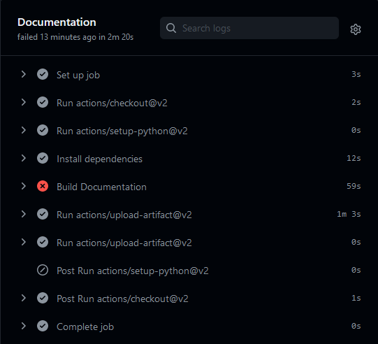
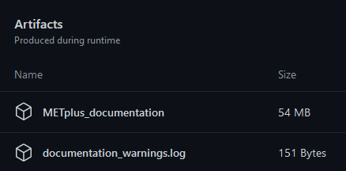

**********************
Continuous Integration
**********************

METplus utilizes GitHub Actions to run processes automatically when changes
are pushed to GitHub. These tasks include:

* Building documentation to catch warnings/errors
* Building a Docker image to run tests
* Creating/Updating Docker data volumes with new input data used for tests
* Running unit tests
* Running use cases
* Comparing use case output to truth data
* Creating/Updating Docker data volumes with truth data to use in comparisons

GitHub Actions Workflows
========================

GitHub Actions runs workflows defined by files in the **.github/workflows**
directory of a GitHub repository.
Files with the .yml suffix are parsed and GitHub Actions will
trigger a workflow run if the triggering criteria is met.
It can run multiple jobs in parallel or serially depending on dependency rules
that can be set. Each job can run a series of commands or scripts called steps.
Job steps can include "actions" with can be used to perform tasks. Many useful
actions are provided by GitHub and external collaborators. Developers can also
write their own custom actions to perform complex tasks to simplify a workflow.

Testing (testing.yml)
---------------------

This workflow performs a variety of tasks to ensure that changes do not break
any existing functionality.
See the :ref:`cg-ci-testing-workflow` for more information.

Documentation (documentation.yml)
---------------------------------

METplus documentation is written using Sphinx.
The METplus components utilize ReadTheDocs to build and display documentation.
However, ReadTheDocs will render the documentation when warnings occur.
This GitHub Actions workflow is run to catch/report warnings and errors.

This workflow is only triggered when changes are made to files under the
**docs** directory of the METplus repository.
It builds the documentation by running "make clean html" and
makes the files available to download at the end of the workflow
as a GitHub Actions artifact. This step is no longer mandatory because
ReadTheDocs is configured to automatically generate the documentation for each
branch/tag and publish it `online <https://metplus.readthedocs.io>`_.

The Makefile that runs sphinx-build was modified to write warnings and errors
to a file called warnings.log using the -w argument. This file will be empty
if no errors or warnings have occurred in the building of the documentation.
If it is not empty, the script called by this workflow will exit with a
non-zero value so that the workflow reports a failure.

A summary of the lines that contain WARNING or ERROR are output in the
GitHub Actions log for easy access.
The warnings.log file is also made available as a GitHub Actions
artifact so it can be downloaded and reviewed. Artifacts can be found
at the bottom of the workflow summary page when the workflow has completed.

Release Published (release_published.yml)
-----------------------------------------

This workflow is triggered when a release is published on GitHub.
It uses cURL to trigger a Slack message on the DTC-METplus announcements
channel that lists information about the release. A Slack bot was created
through the Slack API and the webhook that generated for the Slack channel
was saved as a GitHub Secret.

This workflow may no longer be required, as Slack now has GitHub integration
to automatically create posts on certain events. The format of the automated
release posts will be reviewed and this workflow will likely be removed
if the information posted is sufficient.

.. _cg-ci-testing-workflow:

Testing Workflow
================

Name
----

The name of a workflow can be specified to describe an overview of what is run.
The following line in the testing.yml file::

    name: Testing

defines the workflow identifier that can be seen from the Actions tab on the
METplus GitHub page.

.. figure:: figure/gha-workflow-name.png

Event Control
-------------

The "on" keyword is used to determine which events will trigger the workflow
to run::

    on:
      push:
        branches:
          - develop
          - develop-ref
          - feature_*
          - main_*
          - bugfix_*
      pull_request:
        types: [opened, reopened, synchronize]

This configuration tells GitHub Actions to trigger the workflow when:

* A push event occurs on the develop or develop-ref branch
* A push event occurs on a branch that starts with
  feature\_, main\_, or bugfix\_
* A pull request is opened, reopened, or synchronized (when new changes are
  pushed to the source branch of the pull request.

Jobs
----

The "jobs" keyword is used to define the jobs that are run in the workflow.
Each item under "jobs" is a string that defines the ID of the job. This value
can be referenced within the workflow as needed.

Job Control
===========

Default Behavior
----------------

On Push
"""""""

When a push to a feature\_\*, bugfix\_\*, main_v\*, or develop\* branch occurs
the default behavior is to run the following:

* Build documentation
* Update Docker image
* Look for new input data
* Run unit tests
* Run any **new** use cases

On Pull Request
"""""""""""""""

When a pull request is created into the develop branch or a main_v\* branch,
additional jobs are run in automation. In addition to the jobs run for a push,
the scripts will:

* Run all use cases
* Compare use case output to truth data

On Push to Reference Branch
"""""""""""""""""""""""""""

Branches with a name that ends with "-ref" contain the state of the repository
that will generate output that is considered "truth" data. 
In addition to the jobs run for a normal push, the scripts will:

* Run all use cases
* Create/Update Docker data volumes that store truth data with the use case
  output

Commit Message Keywords
-----------------------

The automation logic reads the commit message for the last commit before a
push. Keywords in the commit message can override the default behavior.
Here is a list of the currently supported keywords and what they control:

* **ci-skip-all**: Don't run anything - skip all automation jobs
* **ci-skip-use-cases**: Don't run any use cases
* **ci-run-all-cases**: Run all use cases
* **ci-run-diff**: Obtain truth data and run diffing logic for
  use cases that are marked to run
* **ci-run-all-diff**: Obtain truth data and run diffing logic for
  all use cases
* **ci-only-docs**: Only run build documentation job - skip the rest

Force MET Version Used for Tests
--------------------------------

The tests typically use the develop version tag of the MET Docker image for
development testing. If testing is done on a stable release, then the
corresponding MET stable release will be used. However, there may be an
instance where a change in MET breaks something in another METplus component,
i.e. METplotpy or METviewer, until a corresponding change is made to that
component. If this occurs then some of the METplus use cases may break. To
allow the tests to run successfully in the meantime, an option was added to
force the version of the MET tag that is used to build the METplus Docker image
that is used for testing. In the testing.yml GitHub Actions workflow file
(found in .github/workflows), there is a commented variable called
MET_FORCE_TAG that can be uncommented and set to force the version of MET to
use. This variable is found in the "get_image" job under the "env" section
for the step named "Get METplus Image."

::

    - name: Get METplus Image
      run: .github/jobs/docker_setup.sh
      env:
          DOCKER_USERNAME: ${{ secrets.DOCKER_USERNAME }}
          DOCKER_PASSWORD: ${{ secrets.DOCKER_PASSWORD }}
          #MET_FORCE_TAG: 10.0.0
