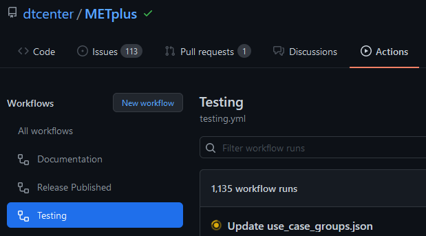

Continuous Integration
======================

More information on Continuous Integration (CI) coming soon!

METplus utilizes GitHub Actions to run processes automatically when changes
are pushed to GitHub. These tasks include:

* Building documentation
* Building a Docker image to run tests
* Creating/Updating Docker data volumes with new input data used for tests
* Running unit tests
* Running use cases
* Comparing use case output to truth data
* Creating/Updating Docker data volumes with truth data to use in comparisons

Workflow Control
----------------

GitHub Actions is controlled by a file in the .github/workflow directory called
testing.yml. If this file exists and is valid (no errors), GitHub Actions will
read this file and trigger a workflow run if the triggering criteria is met.
It can run multiple jobs in parallel or serially depending on dependency rules
that can be set. Each job can run a series of commands or scripts called steps.
Job steps can include "actions" with can be used to perform tasks. Many useful
actions are provided by GitHub and external collaborators. Developers can also
write their own custom actions to perform complex tasks to simplify a workflow.

Name
^^^^

The name of a workflow can be specified to describe an overview of what is run.
Currently METplus only has 1 workflow, but others can be added. The following
line in the testing.yml file::

    name: METplus CI/CD Workflow

defines the workflow that runs all of the jobs.

Event Control
^^^^^^^^^^^^^

The "on" keyword is used to determine which events will trigger the workflow
to run::

    on:
      push:
        branches:
          - develop
          - develop-ref
          - feature_*
          - main_*
          - bugfix_*
      pull_request:
        types: [opened, reopened, synchronize]

This configuration tells GitHub Actions to trigger the workflow when:

* A push event occurs on the develop or develop-ref branch
* A push event occurs on a branch that starts with
  feature\_, main\_, or bugfix\_
* A pull request is opened, reopened, or synchronized (when new changes are
  pushed to the source branch of the pull request.

Jobs
^^^^

The "jobs" keyword is used to define the jobs that are run in the workflow.
Each item under "jobs" is a string that defines the ID of the job. This value
can be referenced within the workflow as needed.

Job Control
-----------

Default Behavior
^^^^^^^^^^^^^^^^

On Push
"""""""

When a push to a feature\_\*, bugfix\_\*, main_v\*, or develop\* branch occurs
the default behavior is to run the following:

* Build documentation
* Update Docker image
* Look for new input data
* Run unit tests
* Run any **new** use cases

On Pull Request
"""""""""""""""

When a pull request is created into the develop branch or a main_v\* branch,
additional jobs are run in automation. In addition to the jobs run for a push,
the scripts will:

* Run all use cases
* Compare use case output to truth data

On Push to Reference Branch
"""""""""""""""""""""""""""

Branches with a name that ends with "-ref" contain the state of the repository
that will generate output that is considered "truth" data. 
In addition to the jobs run for a normal push, the scripts will:

* Run all use cases
* Create/Update Docker data volumes that store truth data with the use case
  output

Commit Message Keywords
^^^^^^^^^^^^^^^^^^^^^^^

The automation logic reads the commit message for the last commit before a
push. Keywords in the commit message can override the default behavior.
Here is a list of the currently supported keywords and what they control:

* **ci-skip-all**: Don't run anything - skip all automation jobs
* **ci-skip-use-cases**: Don't run any use cases
* **ci-run-all-cases**: Run all use cases
* **ci-run-diff**: Obtain truth data and run diffing logic
* **ci-only-docs**: Only run build documentation job - skip the rest
