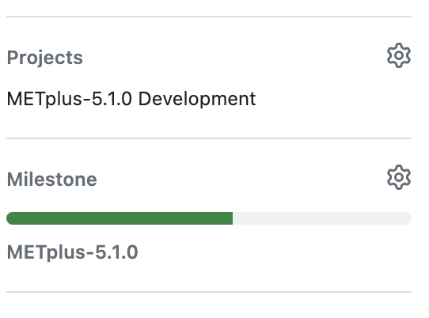

**************************************
Documentation Overview and Conventions
**************************************

Overview
========

The METplus documentation (beginning with version 3.0) is available
`online <https://metplus.readthedocs.io/>`_. The majority of the documentation 
is created using the Sphinx documentation generator tool, which was originally 
created for Python documentation. The METplus documentation is created using 
`reStructuredText (RST) <https://www.sphinx-doc.org/en/master/usage/restructuredtext/basics.html>`_. 
This link provides a brief introduction to RST concepts and syntax. It is
intended to give authors enough information to create and modify the documents
productively. 

Conventions
===========

We follow the conventions outlined in the 
`reStructuredText Primer <https://www.sphinx-doc.org/en/master/usage/restructuredtext/basics.html>`_, 
along with some additional METplus component specific conventions.

.. _create-chapters:

Defining Chapters and Sections
------------------------------

The METplus documentation uses the
`reStructured Text Primer <https://www.sphinx-doc.org/en/master/usage/restructuredtext/basics.html#sections>`_
documentation for defining section formatting::

  # with overline, for parts (e.g. the RTD documentation for the component
  (i.e. docs/index.rst), each guide (e.g. User's Guide, Contributor's Guide)
  (i.e. docs/Users_Guide/index.rst, docs/Contributors_Guide/index.rst))
  * with overline, for chapters
  = for sections
  - for subsections (this is a dash, not an underline)
  ^ for subsubsections
  " for the final level of headers

Part (e.g. User's Guide, Contributor's Guide) and chapter (e.g. Overview,
Coding Standards) headers are created by underlining and overlining the
header name using the appropriate character as described above. When using
the underline and overline formatting, their lengths must be identical and
should be the same length as the header text. If the overline and
underline are not the same length there will be a error
message::

  CRITICAL: Title overline & underline mismatch

When formatting headers, the length of the underline must be at least as
long as the title itself or there will be a warning message::

  WARNING: Title underline too short
  
Here is an example of a chapter title::
  
  *************
  Chapter Title
  *************
  
Include one line of whitespace below the last line of asterisks or it won't be
formatted properly.

Updating index.rst for Numbering Chapters and Sections
^^^^^^^^^^^^^^^^^^^^^^^^^^^^^^^^^^^^^^^^^^^^^^^^^^^^^^

Use the `:numbered:` option in the **index.rst** file under the "toctree"
directive in order to add numbers to the chapters and sections.  
`:numbered:` needs to be added at the index level to keep the numbers 
from restarting for each chapter.  Example::

  .. toctree::
     :hidden:
     :caption: Table of Contents
     :numbered:

Remember to delineate chapters and sections using the formatting in 
:ref:`create-chapters`.

To limit the number of sections visible in the table of
contents to four::

  :numbered: 4

The METplus team has decided to allow four levels of depth in the
table of contents, but the number can be changed to get the desired
number of visible levels.

See
`Sphinx table of contents <https://www.sphinx-doc.org/en/master/usage/restructuredtext/directives.html#directive-toctree>`_
for more information on the toctree directive.

Numbered and Bulleted Lists
---------------------------

It is possible to use actual numbers or `#.` to create a numbered list.
Here are some examples::

  1.
  Start the text section below for no indentation.

  #. This text block will be indented.

resulting in the following displayed text:

1.
Start the text section below for no indentation.

#. This text block will be indented.

Use asterisks for bullets. If a subsection is needed, 
include a blank line and indents.  Example::

  * Item 1
  * Item 2

    * First nested item
    * Second nested item

  * Item 3

resulting in the following displayed text:

* Item 1  
* Item 2

  * First nested item
  * Second nested item

* Item 3

Please note, if there are extra spaces before or after the asterisk, 
it will change how the list looks.  Be careful.

See
`Lists and Quote-Like blocks <https://www.sphinx-doc.org/en/master/usage/restructuredtext/basics.html#lists-and-quote-like-blocks>`_
for more information.

Code Blocks
-----------

Code blocks are a quick and easy way to bring attention to code snippets.
Start the code snippet below the code-block directive and indent two
spaces for the actual code. The blank lines above and below are necessary
or it won't be formatted correctly.
Example::

  (blank line above)
  .. code-block:: ini

    cd example
    ./run_something.py
    (blank line below)

resulting in the following:

  .. code-block:: ini

    cd example
    ./run_something.py
    
In the example above, `ini` is used as the language specified for the code
block.  Other examples of languages that can be used are, for example,
`yaml`, `javascript`, `html`, `shell`, `xml`, and `none`.

See
`Sphinx code blocks <https://www.sphinx-doc.org/en/master/usage/restructuredtext/directives.html#directive-code-block>`_
for more information.

Bold
----

**How to bold:**

To make text bold use two asterisks before and after the text. Example::  
    
      **Bolded text** 
      
Results in the following displayed text:

**Bolded text**

Note that if an asterisk is needed within a bolded section, use a backslash
to escape the asterisk. 
Example::

  **Name_everything\*.txt**
  
Results in the following displayed text: **Name_everything\*.txt**

See
`Sphinx documentation for bolding and inline text <https://www.sphinx-doc.org/en/master/usage/restructuredtext/basics.html#inline-markup>`_
for more information.

**What to bold:**

  * Variables (e.g. **MET_INSTALL_DIR, INPUT_BASE, METCALCPY_HOME**, etc.)
  * Filenames (**line_defaults.yaml, contour_defaults.yaml, defaults.conf**, etc.)

Italics
-------

**How to italicize:**

To italicize text use an asterisk before and after the text. Example::
      
      *Italicized text* 
      
Results in the following displayed text: *Italicized text*

See
`Sphinx documentation for italicizing and inline text <https://www.sphinx-doc.org/en/master/usage/restructuredtext/basics.html#inline-markup>`_.
for more information.

**What to italicize:**

  * Paths and directories are italicized.
  * If the path includes a file name, use italics. 
    This was used a lot in METplotpy, 
    Example: *$METPLOTPY_SOURCE/METplotpy/test/ens_ss/ens_ss.data* 

Underline
---------

The use of underlines is not recommended.  Underlining is not part of
Sphinx's reStructuredText specifications.  Underlines can be used as
transition markers.  See the :ref:`transition_marker` section.

.. _transition_marker:

Transition Markers
------------------

The syntax for a transition marker is a horizontal line of four or more
repeated punctuation characters. The syntax is the same as section title
underlines without title text. Transition markers require blank lines
before and after::

  ___________________

resulting in the following:

_________________

Footnotes
---------

*Footnote references* consist of a set of square-brackets followed by a trailing
underscore.

Each *footnote* consists of an explicit markup start (".. "), a left square
bracket, the footnote label, a right square bracket, and whitespace,
followed by indented body elements.

Footnote labels are one of:

  #. one of more digits (i.e. a number),
  #. a single "#" (denoting auto-numbered footnotes),
  #. a "#" followed by a simple reference name, or
  #. a single "*" (denoting auto-symbol footnotes)

METplus has typically used only the third instance described above.

An example of the `#` followed by a simple reference name footnote label is::

  * PersonA [#NCAR]_
  * PersonB [#UCAR]_
  * PersonC [#NCAR]_

  .. [#NCAR] National Center for Atmospheric Research
  .. [#UCAR] University Center for Atmospheric Research

resulting in the following displayed text:

  * PersonA [#NCAR]_
  * PersonB [#UCAR]_
  * PersonC [#NCAR]_

  .. [#NCAR] National Center for Atmospheric Research
  .. [#UCAR] University Center for Atmospheric Research

An example of the usage of footnotes in reStructured text can be seen in the
`METplus docs/index.rst file <https://raw.githubusercontent.com/dtcenter/METplus/develop/docs/index.rst>`_
and displayed in ReadTheDocs `here <https://metplus.readthedocs.io/en/develop/index.html>`_.
     
See
`Sphinx footnotes <https://www.sphinx-doc.org/en/master/usage/restructuredtext/basics.html#footnotes>`_
for more information.

Comments
--------

If comments need to be made within RST, use a blank line above and a ".. " to
comment out text.
Example::

  add blank line here
  .. Text you’d like commented out.

See
`Sphinx comments <https://www.sphinx-doc.org/en/master/usage/restructuredtext/basics.html#comments>`_
for more information.

Math Equations, Symbols, and Matrices
-------------------------------------

Support for math equations, symbols, and matrices is provided by the math
role: `:math:`.

Support is provided for
`mathematical content <https://docutils.sourceforge.io/docs/ref/rst/mathematics.html#math-syntax>`_
with the input format being LaTeX math syntax with support for Unicode symbols.

See the
`Sphinx math directive documentation <https://www.sphinx-doc.org/en/master/usage/restructuredtext/directives.html#directive-math>`_
and
`Math support in Sphinx <https://sphinx-rtd-trial.readthedocs.io/en/latest/ext/math.html>`_ for additional information.

There are quite a few examples in
`MET Appendix C <https://met.readthedocs.io/en/develop/Users_Guide/appendixC.html#appendix-c-verification-measures>`_.

Equations
^^^^^^^^^

To create math equations with an option to bold use `:math:\mathbf`. Then put
what is to be bolded in between 2 sets of asterisks"\*\*".
Example::  
    
      :math:\mathbf **1, 2, 3, 4, ...** :math:`mathbf{2^{n-1}}` 
      
resulting in the following displayed text: **1, 2, 3, 4, ...** :math:`mathbf{2^{n-1}}`

Symbols
^^^^^^^

To create a math symbol, in this example the Delta symbol, use the following
notation::

  :math:`Delta`

resulting in the following displayed symbol: :math:`\Delta`

Matrices
^^^^^^^^

Matrices are not frequently used in the METplus documentation, however there
is an example in the
`MET documentation for Stable Equitable Error in Probability Space (SEEPS)
<https://met.readthedocs.io/en/develop/Users_Guide/appendixC.html#stable-equitable-error-in-probability-space-seeps>`_.
Example::

  .. math:: \{S^{S}_{vf}\} = \frac{1}{2}
            \begin{Bmatrix}
               0 & \frac{1}{1-p_1} & \frac{1}{p_3} + \frac{1}{1-p_1}\\
               \frac{1}{p_1} & 0 & \frac{1}{p_3}\\
               \frac{1}{p_1} + \frac{1}{1-p_3} & \frac{1}{1-p_3} & 0
            \end{Bmatrix}

resulting in the following displayed text:

.. math:: \{S^{S}_{vf}\} = \frac{1}{2}
          \begin{Bmatrix}
             0 & \frac{1}{1-p_1} & \frac{1}{p_3} + \frac{1}{1-p_1}\\
             \frac{1}{p_1} & 0 & \frac{1}{p_3}\\
             \frac{1}{p_1} + \frac{1}{1-p_3} & \frac{1}{1-p_3} & 0
          \end{Bmatrix}

See `Overleaf's Guide - Matrices <https://www.overleaf.com/learn/latex/Matrices>`_ for more information.

Literal Blocks
--------------

Literal blocks are usually used for showing command line syntax and are
typically rendered in a monospaced font. Literal blocks are introduced
by ending a paragraph with the special marker `::`.
     
The literal block must be indented and separated by the surrounding text
with a blank line above and below the text.  Example::

  Some text::

    Write my command here
    (blank line below)
    
    
resulting in the following displayed text, noting that one of the two
colons has been removed:

  Some text::
  
    Write my command here

See
`Sphinx literal blocks <https://www.sphinx-doc.org/en/master/usage/restructuredtext/basics.html#rst-literal-blocks>`_
and
`literal blocks <https://docutils.sourceforge.io/docs/ref/rst/restructuredtext.html#literal-blocks>`_
for more information.

Line Blocks
-----------

Line blocks can be used where the structure of lines is significant. For
example, as a way of preserving line breaks or to preserve indents.

Having text on separate lines may be desired.  For example:

  | This text will
  | Be
  | Rendered
  | All on a single
  | Line like this

but if typed on separate lines in a RST file, the resulting displayed
text would be:

This text will Be Rendered All on a single Line like this

Note that the text is not formatted in the desired manner.

To keep the text on separate lines, use the vertical bar "| " prefix.  Each
vertical bar prefix with a space after, indicates a new line, so line breaks are
preserved. Include one line of blank space above and below text.
Example::

  blank line above
  | This text will
  | Be
  | Rendered
  | On separate lines
  | Like this
  blank line below

resulting in the following displayed text:

  | This text will
  | Be
  | Rendered
  | On separate lines
  | Like this

See line blocks under 
`Lists and Quote-like blocks <https://www.sphinx-doc.org/en/master/usage/restructuredtext/basics.html#lists-and-quote-like-blocks>`_
and the `line blocks <http://docutils.sourceforge.net/docs/ref/rst/restructuredtext.html#line-blocks>`_
section from the reStructuredText Markup Specification for more information.

Links
-----

Internal Links
^^^^^^^^^^^^^^

To support cross-referencing to locations within the same set of documentation,
standard RST labels are used.  For this to work properly, label names
**must be unique** throughout the entire document.

To link to a section, the section being linked to will need a label name
formatted in the following way:

| .. _label-name:

so that it can be referenced in a different section.

To reference the section with the label name in a different section, use
the `:ref:` role.  For example::

  :ref:`label-name`

For example, in the :ref:`running-metplus` section of the METplus User's Guide
under "Example Wrapper Use Case" it states:

* Create a :ref:`user_configuration_file` (named user_system.conf in this example).

The link to "User Configuration File" is an internal link referenced in the
following way in the .rst file::

  * Create a :ref:`user_configuration_file` (named user_system.conf in this example).

The syntax for the label name can be seen in the
`systemconfiguration.rst <https://raw.githubusercontent.com/dtcenter/METplus/develop/docs/Users_Guide/systemconfiguration.rst>`_
and looks like this::

  .. _user_configuration_file:
         
  User Configuration File 
  =======================

If the link exists in another chapter or document, and a different name
or title would be more appropriate, use the example below.
Please note, there is no space between text and the less than symbol `<`.
Example::

  :ref:`Text to show up <user_configuration_file>`

resulting in the following displayed text:

:ref:`Text to show up <user_configuration_file>`
  
See the
`Internal links documentation <https://www.sphinx-doc.org/en/master/usage/restructuredtext/basics.html#internal-links>`_
and
`Cross-referencing arbitrary locations <https://www.sphinx-doc.org/en/master/usage/referencing.html#cross-referencing-arbitrary-locations>`_
for more information.  

External Links
^^^^^^^^^^^^^^

To link to an external web page, use the following syntax::

  `Link text <link_URL>`_

The example below uses the DTC website::

    `DTC <https://dtcenter.org/>`_

resulting in the following displayed text:

`DTC <https://dtcenter.org/>`_

The link can also be separated from the target definition.
Example::

  Get the latest news at `DTC`_.
  .. _DTC: https://dtcenter.org

resulting in the following displayed text:
Get the latest news at `DTC`_.

See the
`External links documentation <https://www.sphinx-doc.org/en/master/usage/restructuredtext/basics.html#external-links>`_
for more information.

Linking Using Reference Numbers
^^^^^^^^^^^^^^^^^^^^^^^^^^^^^^^

To use a number for sections, tables, figures etc. instead of the title
use the `:numref:` role.

Example::

  Please refer to :numref:`user_configuration_file`.

resulting in the following displayed text, which shows the 
numbered section, not the name:  

Please refer to :numref:`user_configuration_file`.

See 
`Cross-referencing figures by figure number <https://www.sphinx-doc.org/en/master/usage/referencing.html#cross-referencing-figures-by-figure-number>`_
for more information.

Linking to METplus Use Case
^^^^^^^^^^^^^^^^^^^^^^^^^^^

Linking to METplus Use Cases must be done with an external web link. Since the
HTML file is generated from a Python script, the `:ref:` role can’t be used. 

The example below will use the METplus Use Case which has the following URL:
https://metplus.readthedocs.io/en/latest/generated/met_tool_wrapper/StatAnalysis/StatAnalysis.html#sphx-glr-generated-met-tool-wrapper-statanalysis-statanalysis-\py

The full URL is being shown above so it can be edited below.  This example will
be called "StatAnalysis: Basic Use Case".
To make sure the web address is correct:

  * Remove everything in the URL above, before the text “generated”.
    In this example, remove: `https://metplus.readthedocs.io/en/latest`
  * Put a `../` in front of “generated”
  * Also remove anything after `#`.  In this example:  
    `#sphx-glr-generated-met-tool-wrapper-statanalysis-statanalysis-py`
  * The web link should look like this example::

    `StatAnalysis: Basic Use Case <../generated/met_tool_wrapper/StatAnalysis/StatAnalysis.html>`_

  *  resulting in the following displayed text:

    `StatAnalysis: Basic Use Case <../generated/met_tool_wrapper/StatAnalysis/StatAnalysis.html>`_

Examples of the links can be seen in this 
`table <https://metplus.readthedocs.io/en/latest/Users_Guide/overview.html#metplus-components-python-requirements>`_ 
in the far right column.  Please note, it may be necessary to scroll down to
use the horizontal scroll bar to see the far right **Use Cases** column.

Linking to a Table
^^^^^^^^^^^^^^^^^^

Linking to a table is similar to linking to an internal link.
See the example below::

  .. _example_table:
         
  .. list-table:: example table

To link to this "example table" use the following syntax::

  :ref:`Example Table <example_table>`
  
which will result in the following displayed text: 

:ref:`Example Table <example_table>`

Linking to a Variable in the Glossary
^^^^^^^^^^^^^^^^^^^^^^^^^^^^^^^^^^^^^

To reference a variable in the :ref:`METplus_glossary`, use the term
role `:term:`. In the example below the variable name, USER_SCRIPT_COMMAND
will be used::

  :term:`USER_SCRIPT_COMMAND`

resulting in the following displayed text and link to the USER_SCRIPT_COMMAND
variable:

:term:`USER_SCRIPT_COMMAND`

See the documentation on the
`term role <https://www.sphinx-doc.org/en/master/usage/referencing.html#role-term>`_
for more information.

Images
------

To add an image use the
`image directive <https://docutils.sourceforge.io/docs/ref/rst/directives.html#image>`_:
`.. image::`. In the example below, an image called **doc_image_example.png**
will be added, which is located in the *figure* directory.
Example::

  .. image:: figure/doc_image_example.png

resulting in the following displayed image:

Please note, all of the images are stored in a *figure* directory, separate
from the RST files. For this Contributor's Guide, the *figure* directory is
located at *METplus/docs/Contributors_Guide/figure/*.

See
`images <https://www.sphinx-doc.org/en/master/usage/restructuredtext/basics.html#images>`_
and
`Images and Figures <https://lpn-doc-sphinx-primer-devel.readthedocs.io/concepts/images.html>`_
for more information.

Figures
-------

A figure is an image with caption and optional legend. To add a figure, use the
`figure directive <https://docutils.sourceforge.io/docs/ref/rst/directives.html#figure>`_:
`.. figure::`. In the example below a figure called
**1Issue-before-created.png** will be added, which is located in the *figure* directory.
Example::

  .. figure:: figure/1Issue-before-created.png

Please note, the figures are stored in a separate directory from the RST files.
In this case, in the *figure* directory located at
*METplus/docs/Contributors_Guide/figure/*.

We will use the image **1Issue-before-created.png**, 
located in the figure directory. This is an example
from the 
`GitHub Workflow Chapter <https://metplus.readthedocs.io/en/latest/Contributors_Guide/github_workflow.html#github-workflow>`_.
Below is an example::

  .. figure:: figure/1Issue-before-created.png

   	(Return and tab over). This is the caption for the figure.

resulting in the following displayed text and image:

	This is the caption for the figure.

See 
`Images and Figures <https://lpn-doc-sphinx-primer-devel.readthedocs.io/concepts/images.html>`_
for more information.

Automatically Number Figures
^^^^^^^^^^^^^^^^^^^^^^^^^^^^

To automatically number figures, the following needs to be added to the
**conf.py** file in the *docs* subdirectory::

  # -- Intersphinx control -----------------------------------------------------
  intersphinx_mapping = {'numpy':("https://docs.scipy.org/doc/numpy/", None)}
  
  numfig = True
  
  numfig_format = {
      'figure': 'Figure %s',
  }

Please note, the automatic numbering of figures is NOT set up in the METplus
**docs/conf.py** file, but it is set up in the MET **docs/conf.py** file.

.. _creating-tables:

Tables
------

There are a variety of
`table formats <https://docutils.sourceforge.io/docs/ref/rst/directives.html#tables>`_.
The METplus components frequently use
`list tables <https://docutils.sourceforge.io/docs/ref/rst/directives.html#list-table>`_.

List Tables
^^^^^^^^^^^

Below is an example of list table formatting::

  .. list-table:: Title # Adding a title is optional.
     :widths: 25 25     # Adding the widths is optional.
     :header-rows: 1    # Adding a header row is also optional.

     * - Heading row 1, column 1
       - Heading row 1, column 2
     * - Row 1, column 1
       -
     * - Row 2, column 1
       - Row 2, column 2

Please note that Row 1, column 2 is blank.  A blank cell must still be
accounted for in the formatting of the table.

The table will be displayed in the following way:

.. list-table:: Title
   :widths: 25 25
   :header-rows: 1 

   * - Heading row 1, column 1
     - Heading row 1, column 2
   * - Row 1, column 1
     -
   * - Row 2, column 1
     - Row 2, column 2

In some instances, the text in a column of a table needs to wrap to keep the
text readable.  To create a line break use :code:`:raw-html:` ``. See
Column Number 37-38 in the first column of 
`Table 13.8 Format information for SSVAR <https://met.readthedocs.io/en/latest/Users_Guide/ensemble-stat.html#id8>`_ 
as an example. View the `raw RST <https://raw.githubusercontent.com/dtcenter/MET/main_v11.1/docs/Users_Guide/ensemble-stat.rst>`__,
searching for "FBAR_NCL", which shows

.. code-block:: none

  FBAR_NCL, :raw-html:` ` FBAR_NCU

Using CSV Files to Create Tables
^^^^^^^^^^^^^^^^^^^^^^^^^^^^^^^^

It can be easier to create a table in a spreadsheet than through RST syntax.
A CSV (comma-separated values) file can be referenced in the RST file
using the "csv-table" directive.

For more information, see
`CSV Files <https://sublime-and-sphinx-guide.readthedocs.io/en/latest/tables.html#csv-files>`_
and
`CSV Table <https://docutils.sourceforge.io/docs/ref/rst/directives.html#csv-table-1>`_.

As of 2023, using CSV files to create tables hasn't been used in the METplus
documentation.

Converting an Existing Table into a List Table
^^^^^^^^^^^^^^^^^^^^^^^^^^^^^^^^^^^^^^^^^^^^^^
If a table already exists it can be converted into a Sphinx list table by
copying the existing table into a Google Sheet and using formulas to
restructure it into a list table format. An example of how to do this is
described below. This
`spreadsheet <https://docs.google.com/spreadsheets/d/1splypR5JLRLgokFwUcAXqkWGJvQkJ4IYX9IoD8niyyY/>`_
is used as an example.

The first step is to copy the table into the first cell (A1) of the
spreadsheet.

Next, using a cell in a column that is not used by the
existing table (in this example column D or a column further to the right
could be used), paste in the formula below to reformat the existing table::

  =ArrayFormula(transpose(split(concatenate(A1:C&char(9)),char(9))))

.. note::

  In the formula above "C" is used.  The "C" represents the last
  column used by the table and should be modified if a column
  past "C" is used.

In the formula above, the following functions are used and documentation
describing each function is linked below:

  * `char <https://https://support.google.com/docs/answer/3094120?hl=en&ref_topic=3105625&sjid=11023572608666589922-NA>`_ -
    Converts a number into a character according to the current Unicode table.

  * `split <https://support.google.com/docs/answer/3094136?sjid=11023572608666589922-NA>`_ -
    Divides text around a specified character or string and puts each
    fragment into a separate cell in the row.

  * `transpose <https://support.google.com/docs/answer/3094262?sjid=11023572608666589922-NA>`_ -
    Transposes the rows and columns of an array or range of cells.

  * `ArrayFormula <https://support.google.com/docs/answer/3093275?sjid=11023572608666589922-NA>`_ -
    Enables the display of values returned from an array formula into
    multiple rows and/or columns and the use of non-array functions with
    arrays.

In this example, the formula lives in cell E6 and the resulting reformatted
data is in column E. This reformatted data will be used to create the
formatting for a list table in an adjacent column.

Next, the metadata information for the table will be listed in cells F1 - F4::

  .. list-table:: Example Table
     :widths: auto
     :header-rows: 1
     (leave a blank line below)

to match the format that is needed for RST.

Now, the necessary formatting for a list-table will be added, in a new column,
to the reformatted data in column E.  An asterisk represents the start of a
row.  It is important that the asterisk be lined up with the first colon
under the metadata information described above (e.g. the first colon in
":width:" and ":header-rows:"). Note that in the example below, there are three
spaces before the asterisk. Starting with the adjacent cell to the
first cell of the reformatted data (in this case cell F6), add the following
formula to the cell, updating the cell number E6 if necessary::

  ="   * - "&E6 

In the two cells below (in this case, cells F7 and F8), add the following
formulas, updating the cell numbers E7 and E8, if necessary::

  ="     - "&E7 
  ="     - "&E8

Note that in the example above there are five spaces before the dash for proper
alignment.

To copy this formatting to the other cells, simply highlight the cells with
the newly added formulas, click and hold your mouse on the blue dot in the
lower right corner, and drag down to the last cell in the reformatted data
(Column E, in this example).

Now, copy and paste the contents of the latest reformatted column (in this
example, from column F)::

  .. list-table:: Example Table
     :widths: auto
     :header-rows: 1

     * - Subject
       - Professor
       - Number of Students
     * - Math
       - Patel
       - 16
     * - English
       - Smith
       - 18
     * - Science
       - Zhou
       - 17
     * - History
       - Hayashi
       - 19

ensuring that the data is properly aligned as shown in this
`List Table  <https://docutils.sourceforge.io/docs/ref/rst/directives.html#list-table>`_
example.  If it is not properly aligned, it will need to be realigned.

Below is the resulting displayed table:

.. _example_table:

.. list-table:: Example Table
   :widths: auto
   :header-rows: 1

   * - Subject
     - Professor
     - Number of Students
   * - Math
     - Patel
     - 16
   * - English
     - Smith
     - 18
   * - Science
     - Zhou
     - 17
   * - History
     - Hayashi
     - 19

Grid Tables
^^^^^^^^^^^

Grid tables are created by "drawing" the table structure with various symbols,
via grid-like "ASCII art". Creating grid tables can be cumbersome to create,
however the
`Grid Tables <https://docutils.sourceforge.io/docs/ref/rst/restructuredtext.html#grid-tables>`_
documentation indicates that the
`Emacs table mode <https://table.sourceforge.net/>`_ allows for easier editing
of grid tables.

An example of the use of a grid table can be found in the MET Installation Guide under the
dropdown title **IF THE USER ALREADY HAS THE LIBRARY DEPENDENCIES INSTALLED** in
the section 
`External Library Handling in compile_MET_all.sh <https://met.readthedocs.io/en/latest/Users_Guide/installation.html#external-library-handling-in-compile-met-all-sh>`_.

To force a grid table to use a line break inside of a cell so that the text will
wrap, insert an empty line between the text to be wrapped.  View the
`raw RST <https://raw.githubusercontent.com/dtcenter/MET/latest/docs/Users_Guide/installation.rst>`_,
searching for "IF THE USER ALREADY HAS THE LIBRARY DEPENDENCIES INSTALLED".

PrettyTable
^^^^^^^^^^^

`PrettyTable <https://pypi.org/project/prettytable/>`_ is a simple Python
library for easily displaying tabular data in a visually appealing ASCII
table format. PrettyTable formats tables in an attractive ASCII form.

A PrettyTable was used to create this
`message_type <https://metplus.readthedocs.io/en/develop/Users_Guide/systemconfiguration.html#message-type>`_
table. The formatting for this table looks like::

  +------------------+---------------------------------------------+
  | Old (Incorrect): |           message_type = [ "ADPSFC" ];      |
  +------------------+---------------------------------------------+
  |  New (Correct):  |           message_type = [ "ADPUPA" ];      |
  +------------------+---------------------------------------------+
  | METplus Config:  | :term:`ENSEMBLE_STAT_MESSAGE_TYPE` = ADPSFC |
  +------------------+---------------------------------------------+

resulting in the following displayed table:

+------------------+---------------------------------------------+
| Old (Incorrect): |           message_type = [ "ADPSFC" ];      |
+------------------+---------------------------------------------+
|  New (Correct):  |           message_type = [ "ADPUPA" ];      |
+------------------+---------------------------------------------+
| METplus Config:  | :term:`ENSEMBLE_STAT_MESSAGE_TYPE` = ADPSFC |
+------------------+---------------------------------------------+

      
Dropdown Menus
--------------

Dropdown menus, also known as accordions or collapsable lists are used
extensively in the :ref:`release-notes` to make the Release Notes easier
to read.  An example of how to use a dropdown menu is shown below.

Example::

  .. dropdown:: Title for the Dropdown Box

     Text in the dropdown box

resulting in the following display:

.. dropdown:: Title for the Dropdown Box

   Text in the dropdown box

See
`Dropdowns <https://sphinx-design.readthedocs.io/en/latest/dropdowns.html>`_ 
documentation page for more information.

In order to use this functionality, changes need to be made to add the
sphinx-design extension.  These changes are described on the sphinx-design
`Getting Started <https://sphinx-design.readthedocs.io/en/latest/get_started.html>`_
page.

"sphinx_design" needs to be added to the **extension** list in the **docs/conf.py**
file and "sphinx-design" needs to be added to the **docs/requirements.txt** file.

Please note that a search for a word will work even when the dropdown text isn’t
expanded.  

Notes and Warnings
------------------

Use notes and warnings to make a sentence stand out visually.

Notes
^^^^^

Use a note for information you want the user to pay particular attention to.

Below is an example of formatting for a note::

  .. note::
   This is a note.
   
   If note text is long, ensure the lines are indented at the same level as
   the note tag. If the formatting is incorrect, the note will not be
   displayed properly.

   Notes can have more than one paragraph. Each paragraph must be
   indented at the same level as the rest of the note.

resulting in the following displayed text:

.. note::
   This is a note.

   If note text is long, ensure the lines are indented at the same level as
   the note tag. If the formatting is incorrect, the note will not be
   displayed properly.

   Notes can have more than one paragraph. Each paragraph must be
   indented at the same level as the rest of the note.
   
   

Warnings
^^^^^^^^

Use a warning for information the user must understand to avoid negative consequences.

Below is an example of formatting for a warning::

  .. warning::
    This is a warning. 

    Warnings are formatted in the same way as notes (see above). In the same way,
    the lines must be indented at the same level as the warning tag.

resulting in the following displayed text:

.. warning::
    This is warning text. Use a warning for information the user must
    understand to avoid negative consequences.

    Warnings are formatted in the same way as notes. In the same way,
    lines must be broken and indented under the warning tag.

Below is an example from the :ref:`METplus_glossary`.
Example::

  ADECK_FILE_PREFIX
       .. warning:: **DEPRECATED:** Please use TC_PAIRS_ADECK_TEMPLATE.

resulting in the following displayed text:

ADECK_FILE_PREFIX
     .. warning:: **DEPRECATED:** Please use TC_PAIRS_ADECK_TEMPLATE.

Troubleshooting
---------------

Testing RST Formatting in an Online Editor
^^^^^^^^^^^^^^^^^^^^^^^^^^^^^^^^^^^^^^^^^^

It can be time consuming to wait for ReadTheDocs to build. To quickly test how
the RST will be displayed, use the 
`Online Sphinx Editor <https://www.tutorialspoint.com/online_restructure_editor.php>`_.
Click on 'Execute' to view the rendered documentation in the 'Result' window.

WARNING: Duplicate explicit target name
^^^^^^^^^^^^^^^^^^^^^^^^^^^^^^^^^^^^^^^

It may be necessary or desirable to have two links with the same name,
for example, when referring to a METplus Use Case. However, using links
with the same name can result in the "WARNING: Duplicate explicit target name".

To resolve this warning, first, determine if it is possible and makes sense
to distinguish the name of the link, and change the name of the link. If it
is best to use the same link name,
`anonymous hyperlinks <https://docutils.sourceforge.io/docs/ref/rst/restructuredtext.html#anonymous-hyperlinks>`__
can be used. Anonymous hyperlink references are specified with two underscores
instead of one.  For example, instead of the typical link syntax

.. code-block:: none

  `Link text <link_URL>`_

use two underscores at the end of the formatting, like this:

.. code-block:: none

  `Link text <link_URL>`__

See `anonymous hyperlinks <https://docutils.sourceforge.io/docs/ref/rst/restructuredtext.html#anonymous-hyperlinks>`__
for more information. 

Escape Characters
^^^^^^^^^^^^^^^^^

Some characters have special meanings in RST.  This requires an escaping
mechanism to override the default meaning of the desired character. In
reStructuredText the backslash is used as the escape mechanism and is
commonly used as an escaping character in other domains.

See
`Escaping Mechanism <https://docutils.sourceforge.io/docs/ref/rst/restructuredtext.html#escaping-mechanism>`_
for further information.

Dashes
""""""

At times it is necessary to display more than one dash.  For example,
in displaying options to Python commands.  In order to display more
than one dash, the dash must be escaped with a backslash character.

Example::

  run_program.py \-\-help

resulting in the following displayed test:

run_program.py \-\-help 

Underscores
"""""""""""

Variable names often include an underscore. For instance, "FNNN\_".
The following formatting::

  FNNN_

results in a warning in the documentation. To correctly format the
underscored variable name, it is necessary to escape the underscore
with the backslash character as shown below::

  FNNN\_

resulting in the following displayed text:

FNNN\_

Asterisks
"""""""""

Asterisks are used for italicizing and bolding and are used in
bulleted lists.

If asterisks appear in running text and could be confused with a
special function, it is necessary to use a backslash to escape the
asterisk.

For example::

  \*

results in the displayed asterisk, as expected:

\*

Sphinx Modules
--------------

The following Sphinx modules are required to generate the described
documentation:

  * sphinx-gallery
  * sphinx
  * sphinx-rtd-theme
  * sphinx-design

The versions being used by the current METplus release can be viewed
in the **docs/requirements.txt** file in the
`METplus GitHub Repository <https://github.com/dtcenter/METplus/>`_.

Description of Documentation Directories
========================================

Core documentation is divided into four sections: User's Guide, Contributor's
Guide, Release Guide, and Verification Datasets Guide all of which reside
under the *METplus/docs* directory and contain files ending in .rst.

Documentation for the use cases is found in the following directories:

* *METplus/docs/use_cases/met_tool_wrapper*

  * This directory contains documentation pertaining to use cases that use
    one MET *tool/METplus* wrapper.

* *METplus/docs/use_cases/model_applications*
	
  * This directory contains documentation pertaining to use cases that are
    based on model data, and utilize more than one MET *tool/METplus*
    wrapper.

Please refer to the :ref:`Document New Use Case <use_case_documentation>`
section for more information on documenting a new use case.

Adding New Documentation
========================

To determine where to add new documentation:

* The User's Guide for any instructions or details that will enable a user
  to run/use the use case and/or new code.

* The Contributor's Guide for instructions on creating/constructing new
  code.

* The Release Guide for instructions for creating software releases for any
  METplus component, including official, bugfix, and development releases.

* The Verification Datasets Guide for any relevant "truth" datasets, including
  data from satellite platforms (geostationary and polar orbiting), gridded
  analyses (global and regional), station or point-based datasets (global and
  regional), and radar networks.

User's Guide:
-------------
  
* To add/modify any content that affects METplus users.
* Modify any of the affected sections from the
  *METplus/docs/Users_Guide* directory:
  
  * **glossary.rst** (Glossary)
  * **references.rst** (Reference)
  * **configuration.rst** (Configuration)
  * **usecases.rst** (Use cases)
  * **wrappers.rst** (METplus wrappers)

Contributor's Guide:
--------------------
  
* To add/modify any content that affects METplus contributors.
* Modify any of the affected sections from the
  *METplus/docs/Contributors_Guide* directory:
  
  * **add_use_case.rst** (How to add new use cases)
  * **basic_components.rst** (The basic components of a METplus wrapper)
  * **coding_standards.rst** (The coding standards currently in use)
  * **conda_env.rst**  (How to set up the conda environment for
    running METplus)
  * **continuous_integration.rst** (How to set up a continuous integration
    workflow)
  * **create_wrapper.rst** (How to create a new METplus wrapper)
  * **deprecation.rst** (What to do to deprecate a variable)
  * **documentation.rst** (Describing the documentation process and files)
  * **github_workflow.rst** (A description of how releases are made,
    how to to obtain source code from the GitHub repository)
  * **index.rst** (The page that shows all the 'chapters/sections'
    of the Contributor's Guide)
  * **testing.rst** (A description of how to set up testing the
    wrapper code)

Release Guide:
--------------

* To add/modify the instructions for creating software releases for
  any METplus component, including official, bugfix, and development
  releases.

* Each METplus component has a top level file (e.g. **metplus.rst**)
  which simply contains references to files for each of the
  releases.  For example, **metplus.rst** contains references to:
    
  * metplus_official.
  * metplus_bugfix.
  * metplus_development.

* Each release file (e.g. **metplus_official.rst**, **metplus_bugfix.rst**,
  **metplus_development.rst**) contains, at a minimum, a replacement
  value for the projectRepo variable and include
  statements for each release step.  These individual steps
  (e.g. **open_release_issue.rst**, **clone_project_repository.rst**, etc.)
  may be common to multiple METplus components.  These common steps
  are located in the *release_steps* directory.  However, a METplus
  component may have different instructions from other components
  (e.g. For **METplus wrappers**, **update_version.rst**,
  **create_release_extra.rst**, etc.). In this case, the instructions
  that are specific to that component are located in a subdirectory
  of *release_steps*.  For example, files that are specific to
  METplus wrappers are located in *release_steps/metplus*, files
  that are specific to METcalcpy are located in
  *release_steps/metcalcpy*.

* The file for each individual step (e.g. **open_release_issue.rst**,
  **update_version.rst**, etc.) contains the instructions for
  completing that step for the release.  
    

Verification Datasets Guide:
----------------------------

* To add/modify any relevant datasets in an attempt to create a
  centralized catalog of verification datasets to provide the model
  verification community with relevant "truth" datasets. See the
  `Verification Datasets Guide Overview <https://metplus.readthedocs.io/en/latest/Verification_Datasets/overview.html>`_
  for more information. 

.. _read-the-docs:

Read the Docs METplus Documentation
===================================

The METplus components use `Read the Docs <https://docs.readthedocs.io/>`_ to
build and display the documentation. Read the Docs simplifies the
documentation process by building, versioning, and hosting the documentation.

Read the Docs supports multiple versions for each repository. For the METplus
components, the "latest" version will point to the latest official (stable)
release. The "develop" or "development" version will point to the most up to
date development code. There may also be other previous versions of the
software available in the version selector menu, which is accessible by
clicking in the bottom left corner of the documentation pages.

Automation rules allow project maintainers to automate actions on new branches
and tags on repositories.  For the METplus components, documentation is
automatically built by Read the Docs when a new tag is created and when a
branch is created with the prefix:

  * feature (e.g. feature_836_rtd_doc)
    
  * bugfix (e.g. bugfix_1716_develop_perc_thresh)

The documentation of these "versions" are automatically hidden, however, the
documentation can be accessed by directly modifying the URL. For example, to
view "feature_836_rtd_doc" for the METplus repository the URL would be:

  *https://metplus.readthedocs.io/en/feature_836_rtd_doc*

  (Note that this link is not valid as this branch does not currently exist,
  however contributors can replace the "*feature_836_rtd_doc*" with the
  appropriate branch name.)
  
The URL branch name will be lowercase regardless of the actual branch
letter casing,
i.e. "*feature_836_RTD_Doc*" branch would be accessed by the
above-mentioned URL.
  
Read the Docs will automatically delete the documentation for a feature
branch and a bugfix branch when the branch is deleted.

Documentation for each METplus component can be found at the links below:

* `METplus <https://metplus.readthedocs.io/>`_
* `MET <https://met.readthedocs.io/>`_  
* `METcalcpy <https://metcalcpy.readthedocs.io/>`_
* `METdataio <https://metdataio.readthedocs.io/>`_
* `METexpress <https://metexpress.readthedocs.io/>`_
* `METplotpy <https://metplotpy.readthedocs.io/>`_
* `METviewer <https://metviewer.readthedocs.io/>`_

Building Sphinx Documentation Manually
======================================

Documentation does not have to be built manually as it is automatically
generated by Read The Docs.  See the
:ref:`Read the Docs section <read-the-docs>` for further information.
However, contributors can still build the documentation manually if
desired.

.. note::
   
  It is assumed that the web browser application and METplus
  source code are located on the same computer/host.

All the sphinx modules (listed earlier) need to be present in order to
generate the HTML content that comprises the documentation.
From the command line, change to the *METplus/docs* directory and
enter the following:

.. code-block:: none

	./build_docs.py

This script does the following:

* Builds the Sphinx documentation
* Builds the doxygen documentation
* Removes unwanted text from use case documentation
* Copies doxygen files into* _build/html* for easy deployment
* Creates symbolic links under Users_Guide to the directories under
  "generated" to preserve old URL paths

The html files that are created can be found in the *METplus/docs/_build/html*
directory.  The web browser can point to this directory by entering
the following in the web browser's navigation bar:

   *file:///<path-to>/METplus/docs/_build/html/index.html*

Where <path-to> is the full file path leading to the METplus source code. This
will direct to the home page of the documentation.  Click on the links to
navigate to the desired information.

Relevant Documentation for Contributors
=======================================

The Doxygen tool is employed to create documentation from the source code.
This documentation is useful in generating details about the METplus wrapper
API (Application Programming Interface).
This is a useful reference for contributors to peruse prior to creating
new METplus wrappers.
The Doxygen files located in the */path/to/METplus/docs/doxygen* directory
do **NOT** need to be modified and should not be modified.

For more information about Doxygen, please refer to this
`Doxygen web page <http://doxygen.nl/>`_.

`Download and install Doxygen <http://doxygen.nl/download.html>`_
to create this documentation.

**Note**: Doxygen version 1.8.9.1 or higher is required to create the
documentation for the METplus wrappers.

Create the Doxygen documentation by performing the following:

* Ensure that the user is working with Python 3.6 (minimum).
* cd to the */path/to/METplus/sorc* directory, where */path/to* is the
  file path where the METplus source code is installed.
* At the command line, enter the following:

  .. code-block:: none
		  
       make clean
       make doc
	  
The first command cleans up any existing documentation, and the second
generates new documentation based on the current source code.

The HTML files are generated in the */path/to/METplus/docs/doxygen/html*
directory, which can be viewed in the local browser. The file corresponding
to the home page is */path/to/METplus/docs/doxygen/html/index.html*.

Useful information can be found under the *Packages*, *Classes*, and
*Python Files* tabs located at the top of the home page.

