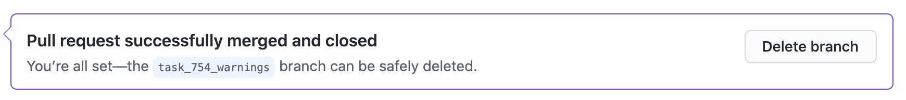

.. _github-workflow:

GitHub Workflow
===============

How METplus releases are created
--------------------------------

The branching model employed by the METplus GitHub repository is similar to
that described in
`A successful Git branching model <https://nvie.com/posts/a-successful-git-branching-model/>`_,
where new or updated code is created on a 'feature' branch that is based on
the `NCAR/METplus GitHub 'develop' branch <https://github.com/dtcenter/METplus/tree/develop>`_.

The feature branch is named after the corresponding GitHub issue:

*feature_<Github Issue number>_<brief_description>*

When work is complete, the code in the feature branch is merged into the
develop branch.  When a release candidate for METplus has been determined,
then the develop branch is used to create a master_vx.y release of METplus,
which includes data tarballs for use in running use cases.

Sequence of Events - Contributing Code
--------------------------------------

*Pre-requisite:*

The user must set up a GitHub repository account if one does not already have exhist.
Log into the account.  For more information about GitHub accounts, please refer
to the GitHub Documentation on
`GitHub accounts <https://help.github.com/en/github/getting-started-with-github/signing-up-for-a-new-github-account>`_.

Workflow Overview
~~~~~~~~~~~~~~~~~
A contributor to METplus will do the following:

1.  Create a GitHub Issue to track the new contribution.

2.  Fork the NCAR/METplus repository.

3.  Clone the fork to local repository.

4.  Set upstream remote (to assist in keeping upstream and local repositories synchronized).

5.  Generate a feature branch from the 'develop' branch for new development.

6.  Make changes to code in the feature branch.

7.  Commit changes to feature branch (limit one change per commit).

8.  Push the feature branch to GitHub.

9.  Open a pull request from feature branch to original repo (from which the original
    branch was forked, in step 2 above).

10.  Clean up after pull request has been merged by an authorized METplus developer.

Create a GitHub Issue that reflects what needs to be done
^^^^^^^^^^^^^^^^^^^^^^^^^^^^^^^^^^^^^^^^^^^^^^^^^^^^^^^^^

* Go to the `METplus repository <https://github.com/dtcenter/METplus>`_  and
  click on the `Issues link <https://github.com/dtcenter/METplus/issues>`_.

* Click on the green **New issue** button.

* Write a description of the task and attach appropriate values to Assignee,
  Labels, and Milestone links located on the right hand side of the page.

Fork the NCAR/METplus repository
^^^^^^^^^^^^^^^^^^^^^^^^^^^^^^^^

* Retrieve a copy of the source code by forking the NCAR/METplus repository
  into the user's own GitHub repository. Click on the **Fork** button in the upper right
  hand side of the `METplus repository <https://github.com/dtcenter/METplus>`_.

* Click on the appropriate GitHub account when presented with the pop-up window
  with the question 'Where should we fork METplus?'.

* The web page will refresh to the GitHub repository at, for example:

  .. code-block:: ini

    https://github.com/<your-github-user>/METplus

  where *<your-github-user>* is replaced with the user's GitHub username.
  An entire copy of the NCAR/METplus Github repository is now in the User's area.

Clone the fork to a local repository
^^^^^^^^^^^^^^^^^^^^^^^^^^^^^^^^^^^^

* Copy the source code to the directory where you will be doing your work.

* Change directories to a working directory. From the command line,
  enter the following:

  .. code-block:: ini

    git clone https://github.com/<your-github-user>/METplus

  replacing <your-github-user> with your GitHub username.

* Change directories to the METplus directory:

  .. code-block:: ini

    cd METplus

  Now you are in your local METplus repository.

Set upstream remote
^^^^^^^^^^^^^^^^^^^

* Add a remote named origin to the clone of your local Git repository, which
  will allow you to push changes to the repository you forked in step 1.

  .. code-block:: ini

    git remote add upstream https://github.com/dtcenter/METplus

* To verify that the upstream and origin are correct, at the command line enter:

  .. code-block:: ini

    git remote -v

  You should see something like the following:

  .. code-block:: ini

    origin	https://github.com/<your-github-user>/METplus (fetch)
    origin	https://github.com/<your-github-user>/METplus (push)
    upstream	https://github.com/dtcenter/METplus (fetch)
    upstream	https://github.com/dtcenter/METplus (push)

  where <your-github-user> is your GitHub username.

Generate a feature branch from the 'develop' branch for new development
^^^^^^^^^^^^^^^^^^^^^^^^^^^^^^^^^^^^^^^^^^^^^^^^^^^^^^^^^^^^^^^^^^^^^^^

* Create a feature branch in the NCAR/METplus GitHub repository following this naming convention

| *feature_<Github Issue number>_<brief_description>*
|

  For example, for GitHub issue #777 that creates new wrapper xyz, the feature branch would be named:

| *feature_777_wrapper_xyz*
|

* Create your feature branch based off the develop branch

  .. code-block:: ini

    git checkout develop

* Verify that you are currently working in the develop branch by running

  .. code-block:: ini

    git branch

  You should see something like the following:

  .. code-block:: ini

    * develop
    main_v3.1

  The asterisk, "*", indicates the currently active branch.

* At the command line, create and checkout the feature branch. For example:

  .. code-block:: ini

    git checkout -b feature_777_wrapper_xyz

  replacing *feature_777_wrapper_xyz* with your feature branch name.

* Verify that you are working in the correct branch by running:

  .. code-block:: ini

    git branch

  You should see something like the following:

  .. code-block:: ini

    develop
    main_v3.1
    * feature_777_wrapper_xyz

  where the asterisk, "*", indicates which branch is currently in use/checked out.

Make changes to code in the feature branch
^^^^^^^^^^^^^^^^^^^^^^^^^^^^^^^^^^^^^^^^^^

Users should make changes to their feature branch and commit changes to their
local repository.

* Create code following the coding standards in the :ref:`codingstandards` section of
  the Contributor's Guide.

* Provide some tests for your code using the pytest framework, provide user documentation
  describing what the code does, and provide any necessary data.

* Keep your fork in sync. While working, it is highly likely that changes are occurring in
  the original repository.  This may impact your work.  Regularly use the following commands
  to keep your fork in sync with the original repository.

  .. code-block:: ini

    git pull upstream develop
    git push origin develop
    git merge origin develop

  The first command pulls changes from the original repository (the
  `METplus GitHub repository <https://github.com/dtcenter/METplus>`_ that you see when you
  run *git remote -v* and that you set to upstream in step 4 above).  The second command
  pushes those changes to your forked repository.  The third command will merge the local
  develop branch into the feature branch.

Commit changes to feature branch
^^^^^^^^^^^^^^^^^^^^^^^^^^^^^^^^

* Commit any new files by running the following.  Run the *'git add'* command only if this file is
  newly created and does not yet exist in your repository.

  .. code-block:: ini

    git add <filename>
    git commit <filename>

  replacing <filename> with the filename.

  A popup window will appear, where you will enter a description of this commit, using the
  editor you selected when you set up your Git account.  Please refer to the
  `Git Setup <https://git-scm.com/book/en/v2/Getting-Started-First-Time-Git-Setup>`_
  documentation on configuring your Git account.

  For the first line of your commit comment, enter a brief description, such as the GitHub
  Issue number and a brief description.  On the second and subsequent lines, provide a
  detailed description of the changes/additions you made.

  **Note**: It is a best practice to commit one change per commit, rather than wait
  until you have multiple changes to include in one commit.

Push the feature branch to GitHub
^^^^^^^^^^^^^^^^^^^^^^^^^^^^^^^^^

* Run the following:

  .. code-block:: ini

    git push origin <feature_777_wrapper_xyz>

  replacing *feature_777_wrapper_xyz* with your feature branch name, to push your changes to
  the origin (i.e. to your *https://github.com/<your-github-user>/METplus* repository)

Open a pull request using a browser
^^^^^^^^^^^^^^^^^^^^^^^^^^^^^^^^^^^^^^

* To request to have your changes be incorporated into the remote repository
  (i.e. the `GitHub METplus repository <https://github.com/dtcenter/METplus>`_).

* An authorized METplus developer will need to approve the request and then merge your files
  into the repository's develop branch.  The develop branch will be used to create a future
  METplus release.

* In your browser, navigate to *https://github.com/<your-github-user>/METplus* replacing
  <your-github-user> with your GitHub username.

* Click on the green 'Compare & pull request' button

  * A web page with four grey buttons should appear:

    * On the left-most button (for setting the base repository), make sure you have selected
      'base repository:NCAR/METplus'

    * For the base button, make sure you have selected 'base:develop'

    * For the head repository button, make sure you have selected
      'head repository:<your-github-user>/METplus' where <your-github-user> is your GitHub
      account name.

    * For the compare button, make sure you have selected 'compare:<your_feature_branch>'
      where <your_feature_branch> corresponds to the feature branch where you have been
      making your changes (e.g. feature_777_wrapper_xyz).

    * In the 'write' window, follow the directions and fill in the template
      add any additional comments/details.  When filling in the template,
      users will need to "Define the PR metadata, as permissions allow.
      Select: **Reviewer(s), Project(s)**, and **Milestone**" When selecting a
      reviewer, internal contributors submitting pull requests should select
      the appropriate reviewer(s) and let the reviewer know that the pull
      request has been assigned to them. If external contributors are unsure
      who to assign as a reviewer, they should send an email to
      met_help@ucar.edu asking the met-help point person to help with the
      assignment of a reviewer.
      
    * When everything looks satisfactory, click on the green 'Create pull
      request' button.

    * An authorized METplus developer will accept the pull request (if
      everything meets acceptance criteria) and merge your code into the remote
      repository's develop branch.

Approve a pull request using a browser
~~~~~~~~~~~~~~~~~~~~~~~~~~~~~~~~~~~~~~

Submitting a pull request allows a user to propose changes, request a
review of the contributions and have the proposed changes merged into a
different branch. Pull requests allow the reviewer to see the differences
in the content from both branches.

For issues with sub-tasks, it may be desired to get some changes into the
develop branch sooner, rather than later. If the changes seem to make sense
on their own and don't rely on other sub-tasks to be complete, creating a pull
request for a sub-task may make sense. If a sub-task does rely on other
sub-tasks to be complete, then it may be best to wait to create a pull request
until the other sub-tasks are also complete.

Creating a pull request
^^^^^^^^^^^^^^^^^^^^^^^

1.  Click on the “Pull requests” tab in the GitHub repository and
    click on the assigned pull request.
2.  Ensure the continuous integration (CI) tests from
    `GitHub Actions <https://github.com/dtcenter/METplus/actions>`_ have
    passed.  See "All checks have passed" in the figure below. If the tests
    were not successful or if there are conflicts with the base branch,
    ask the requestor make changes.

    .. figure:: figure/checks_pass_no_conflicts.png
    
3.  Take a look at the description of the testing already performed for
    these changes and then see what the recommended testing is for the
    reviewer to perform.
4.  Perform any testing that is requested of the reviewer.
5.  Check to ensure the correct "base" branch is selected. In most cases, the
    "base" branch will be the "develop" branch.
6.  Click on the “Files Changed” tab to review the differences in code
    between the “base” branch and the “compare” branch.
7.  Review each file and ensure that the changes seem reasonable.

    A reviewer can suggest changes be made by:
    
    a. Mousing over the line to comment on.

       .. figure:: figure/add_comment_on_line.png

         A blue box with a plus will appear. Click on the blue box.

       .. figure:: figure/insert_suggestion.png
    
         Click on the icon of a paper with +/- to “Insert a Suggestion”.  The line
         will be quoted and the reviewer can enter their suggestion below. Then, click on
         the “Add Single Comment” button, so that the requestor will get an
         email letting them know the reviewer has made a suggested change.

    b. Or, a reviewer can edit the file directly on the web by clicking on the
       “...” icon (three dots) in the right hand corner next to
       “Viewed” icon and select “Edit file”. 	

       .. figure:: figure/how_to_edit_file.png

8.  Ensure the requestor has made all necessary documentation updates.

9.  Ensure the requestor has made all necessary testing updates.

10.  If any changes were made, note that the CI tests will rerun.
     Before moving on, make sure "All checks have passed." and make sure
     “This branch has no conflicts with the base branch”.  Let the requestor
     know if the checks do not pass or if there is a conflict with the base
     branch so that they can make the  necessary changes.

11.  A reviewer has three possible options:

     * **Comment**: Submit general feedback without explicitly approving the
       changes or requesting additional changes.
     
     * **Approve**: Submit feedback and approve merging the changes proposed in
       the pull request.

     * **Request changes**: Submit feedback that must be addressed before the
       pull request can be merged.
	    
     .. figure:: figure/review_approve_changes.png

     A reviewer should click on: "Review changes", add comments to
     the "Write box", and select either  "Comment", "Approve",
     or "Request Changes", and then click on "Submit Review".

12. Once the recommended testing is complete and any necessary changes have
    been made, approve the request.
					  

Merging pull requests
^^^^^^^^^^^^^^^^^^^^^
Once the pull request has been approved it is ready to be merged.  **As
permissions allow, the requestor is responsible for merging the pull request
once it has been approved.**

There are three merge methods to choose from: "Create a merge commit",
"Squash and merge", and "Rebase and merge". It is recommended to use the
**Squash and merge** method because all of the merge request’s commits are
combined into one and a clean history is retained. Click on the chosen merge
method.  

After merging, the requestor can then decide whether or not to delete the branch.

If the requestor wishes to delete the “compare” branch, the “Delete branch”
button should be selected and the corresponding GitHub issue should be closed.

Clean up after a successfully merged pull request
^^^^^^^^^^^^^^^^^^^^^^^^^^^^^^^^^^^^^^^^^^^^^^^^^

* After an authorized METplus developer has accepted your changes and merged
  them into the develop repository, update your local clone by pulling changes
  from the original repository's (i.e. the `METplus develop branch <https://github.com/dtcenter/METplus/tree/develop>`_):

* Checkout your develop branch

  .. code-block:: ini

    git checkout develop

* Verify that you are now working from the develop branch

  .. code-block:: ini

    git branch

* Merge changes from the upstream develop branch with your local develop branch

  .. code-block:: ini

    git pull upstream develop

* Your local cloned repository should now have all the latest changes from the
  original repository's develop branch.

  Now you can delete your feature branch:

  .. code-block:: ini

    *git branch -D <branch name>*
    *git push --delete origin <branch name>*

  where <branch name> is your feature branch name, e.g. feature_777_wrapper_xyz

  You can verify that your feature branch has been successfully removed/deleted
  via your web browser. Navigate to *https://github.com/<your-github-user>/METplus*,
  replacing <your-github-user> with your GitHub username, and under the 'Branch'
  pulldown menu, you should no longer find your feature branch as a selection.

