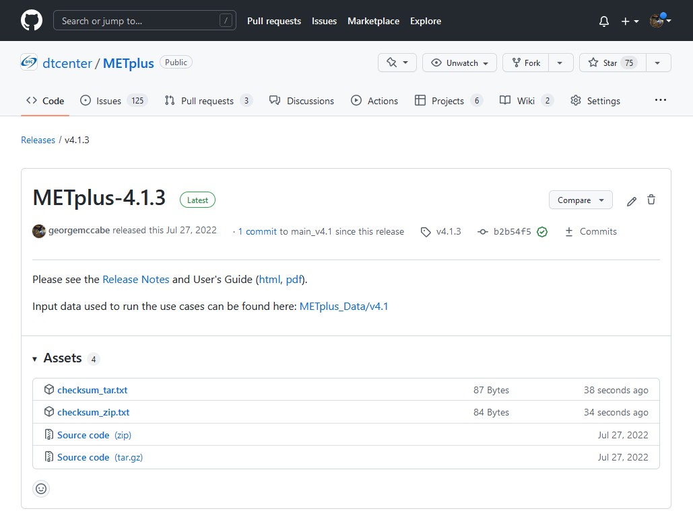

.. _install:

************
Installation
************

Introduction
============

This chapter describes how to download and set up METplus Wrappers.

Supported architectures
=======================

METplus Wrappers was developed on Debian Linux and is supported on this
platform. Each release listed on the
`METplus Downloads <https://dtcenter.org/community-code/metplus/download>`_
page includes a link to the **Existing Builds and Docker** for that version.
The METplus team supports the installation of the METplus components on
several operational and research high performance computing platforms,
including those at NCAR, NOAA, and other community machines.
Pre-built METplus images on DockerHub are also provided.

Programming/scripting languages
===============================

METplus Wrappers is written in Python. It is intended to be a tool
for the modeling community to use and adapt. As users make upgrades and
improvements to the tools, they are encouraged to offer those upgrades
to the broader community by offering feedback to the developers or
coordinating for a GitHub pull. For more information on contributing
code to METplus Wrappers, please create a post in the
`METplus GitHub Discussions Forum <https://github.com/dtcenter/METplus/discussions>`_.

Requirements
============

Software Requirements
---------------------

**Minimum Requirements**

The following software is required to run METplus Wrappers:

-  Python 3.8.6 or above

-  MET version 10.0.0 or above - 
   For information on installing MET please see the `Software Installation/Getting Started <https://met.readthedocs.io/en/latest/Users_Guide/installation.html>`_
   section of the MET User's Guide. 

**Wrapper Specific Requirements**

- TCMPRPlotter wrapper

    - R version 3.2.5

-  SeriesAnalysis wrapper

    - convert (ImageMagick) utility -
      if generating plots and/or animated images from the output

-  PlotDataPlane wrapper

    - convert (ImageMagick) utility - 
      if generating images from the Postscript output

Python Package Requirements
---------------------------

The version number listed next to any Python package corresponds to the version
that was used for testing purposes. Other versions of the packages **may**
still work but it is not guaranteed. Please install these packages using pip
or conda.

**Minimum Requirements**

To run most of the METplus wrappers, the following packages are required:

- dateutil (2.8)

Using pip::

    pip3 install python-dateutil==2.8

Using conda::

  conda install -c conda-forge python-dateutil=2.8

**MET Python Embedding Requirements**

If running use cases that use Python embedding, the **MET** executables
must be installed with Python enabled
and the following Python packages installed:

- xarray (2022.3.0)

- numpy (1.22.4)

- pandas (1.4.2)

- netCDF4 (1.5.8)

See `Appendix F Python Embedding <https://met.readthedocs.io/en/latest/Users_Guide/appendixF.html>`_
section in the MET User's Guide for more information.

**Wrapper Specific Requirements**

The following wrappers require that additional Python packages be installed
to run.

-  SeriesAnalysis wrapper

    - netCDF4 (1.5.4)

-  MakePlots wrapper

    - cartopy (0.20.3)
    - pandas (1.4.3)

-  CyclonePlotter wrapper

    - cartopy (0.20.3)
    - matplotlib (3.5.2)

Cartopy, one of the dependencies of CyclonePlotter, attempts to download shapefiles from the internet to complete successfully. So if CyclonePlotter is run on a closed system (i.e. no internet), additional steps need to be taken. First, go to the Natural Earth Data webpage and download the small scale (1:110m) cultural and physical files that will have multiple extensions (e.g. .dbf, .shp, .shx). Untar these files in a noted location. Finally, create an environment variable in the user-specific system configuration file for CARTOPY_DIR, setting it to the location where the shapefiles are located. 

.. _getcode:

Getting the METplus Wrappers source code
========================================

The METplus Wrappers source code is available for download from the public
GitHub repository. The source code can be retrieved either through a web
browser or the command line.

Get the source code via Web Browser
-----------------------------------

-  Create a directory where the METplus Wrappers will be installed

-  Open a web browser and go to the
   `latest stable METplus release <https://github.com/dtcenter/METplus/releases/latest>`_.

-  Click on the 'Source code' link (either the *zip* or *tar.gz*) under Assets
   and when prompted, save it to the directory.

- (Optional) Verify the checksum of the source code download
  
    - Download the checksum file that corresponds to the source code download
      link that was used (checksum_zip.txt for the *zip* file and
      checksum_tar.txt for the *tar.gz* file).
      Put the checksum file into the same directory as the source code file.
    - Run the *sha256sum* command with the --check argument to verify that the
      source code download file was not corrupted.

Zip File::

    sha256sum --check checksum_zip.txt

Tar File::

    sha256sum --check checksum_tar.txt

.. note::
   If the source code is downloaded using **wget**, then the filenames will not
   match the filenames listed in the checksum files. If the source code is
   downloaded using **curl**, the *-LJO* flags should be added to the command to
   preserve the expected filenames found in the checksum files.

-  Uncompress the source code (on Linux/Unix\ *: gunzip* for zip file or
   *tar xvfz* for the tar.gz file)

Get the source code via Command Line
------------------------------------

- Open a shell terminal

- Clone the DTCenter/METplus GitHub repository:

SSH::

    git clone git@github.com:dtcenter/metplus

HTTPS::

    git clone https://github.com/dtcenter/metplus

.. _obtain_sample_input_data:

Obtain sample input data
========================

The use cases provided with the METplus release have sample input data
associated with them. This step is optional but is required to be able to run
the example use cases, which illustrate how the wrappers work.

- Create a directory to put the sample input data. This will be the directory
  to set for the value of INPUT_BASE in the METplus Configuration.

- Go to the web page with the
  `sample input data <https://dtcenter.ucar.edu/dfiles/code/METplus/METplus_Data>`_.

- Click on the vX.Y version directory that corresponds to the release to
  install, i.e. v4.0 directory for the v4.0.0 release.

- Click on the sample data tgz file for the desired use case category or
  categories run and when prompted, save the file to the directory created
  above.

.. note::
    Files with the version number in the name,
    i.e. sample_data-data_assimilation-4.0.tgz, have been updated since the
    last major release. Files without the version number in the file name have
    not changed since the last major release and can be skipped if the data
    have already been obtained with a previous release.

METplus Wrappers directory structure
====================================

The METplus Wrappers source code contains the following directory structure::

  METplus/
    build_components/
    docs/
    environment.yml
    internal_tests/
    manage_exernals/
    metplus/
    parm/
    produtil/
    README.md
    requirements.txt
    scripts/
    setup.py
    ush/

The top-level METplus Wrappers directory consists of a README.md file
and several subdirectories.

The **build_components/** directory contains scripts that use manage_externals
and files available on dtcenter.org to download MET and start
the build process.

The **docs/** directory contains documentation for users and contributors
(HTML) and Doxygen
files that are used to create the METplus wrapper API documentation. The
Doxygen documentation can be created and viewed via web browser if the
developer has Doxygen installed on the host.
The Doxygen documentation is useful to
contributors and is not necessary for METplus end-users.

The **internal_tests/** directory contains test scripts that are only
relevant to METplus developers and contributors.

The **manage_externals/** directory contains scripts used to
facilitate the downloading and management
of components that METplus interacts with such as MET and METviewer.

The **metplus/** directory contains the wrapper scripts and utilities.

The **parm/** directory contains all the configuration files for MET and
METplus Wrappers.

The **produtil/** directory contains part of the external utility produtil.

The **scripts/** directory contains scripts that are used for creating
Docker images.

The **ush/** directory contains the run_metplus.py script that is
executed to run use cases.

External Components
===================

.. _external-components-gfdl-tracker:

GFDL Tracker (optional)
-----------------------

- The standalone Geophysical Fluid Dynamics Laboratory (GFDL) vortex tracker
  is a program that objectively analyzes forecast data to provide an
  estimate of the vortex center position (latitude and longitude),
  and track the storm for the duration of the forecast.

- Visit https://dtcenter.org/community-code/gfdl-vortex-tracker for
  more information

    - See the manage externals section of this documentation to download
      the GFDL vortex tracker automatically as part of the system.

    - To download and install the tracker locally, get
      http://dtcenter.org/sites/default/files/community-code/gfdl/standalone_gfdl-vortextracker_v3.9a.tar.gz
      and follow the instructions listed in that archive to build on
      a local system.

    -  Instructions on how to configure and use the GFDL tracker are found here
       https://dtcenter.org/sites/default/files/community-code/gfdl/standalone_tracker_UG_v3.9a.pdf

Disable UserScript wrapper (optional)
=====================================

The UserScript wrapper allows any shell command or script to be run as part
of a METplus use case. It is used to preprocess/postprocess data or to run
intermediate commands between other wrappers.

**If desired, this wrapper can be disabled upon installation to prevent
security risks.** To disable the UserScript wrapper,
simply remove the following file from the installation location::

    METplus/metplus/wrapper/user_script_wrapper.py

Please note that use cases provided with the METplus repository that utilize
the UserScript wrapper will fail if attempted to run after it has been
disabled.

Add ush directory to shell path (optional)
==========================================

To call the run_metplus.py script from any directory, add the ush directory
to the path. The following commands can be run in a terminal. They can also
be added to the shell run commands file
(.cshrc for csh/tcsh or .bashrc for bash).
For the following commands, change **/path/to** to
the actual path to the METplus directory on the local file system.

**csh/tcsh**:

.. code-block:: tcsh

    # Add METplus to path
    set path = (/path/to/METplus/ush $path)

**bash/ksh**:

.. code-block:: bash

    # Add METplus to path
    export PATH=/path/to/METplus/ush:$PATH

Set Default Configuration File for Shared Install
=================================================

The default METplus configurations are found in
*parm/metplus_config/defaults.conf*.
If configuring METplus Wrappers in a common location for multiple users,
it is recommended that the values for **MET_INSTALL_DIR** and **INPUT_BASE**
are set in the default configuration file. More information on how to
set these values can be found in the
:ref:`Default Configuration File section<default_configuration_file>` in the
next chapter.
