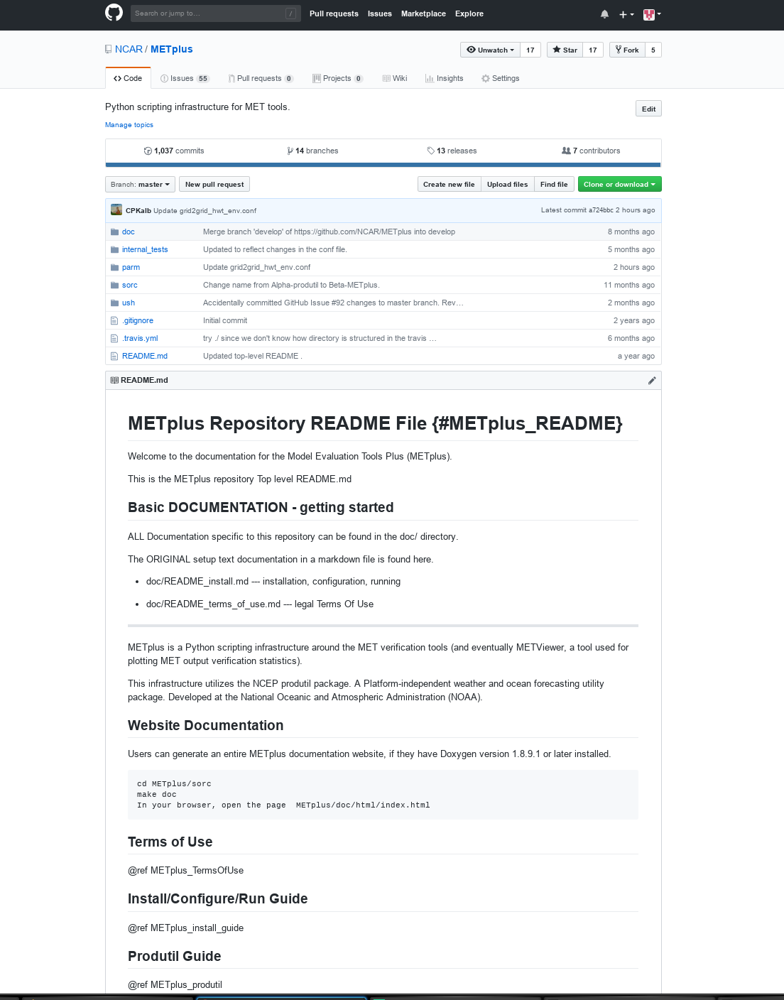
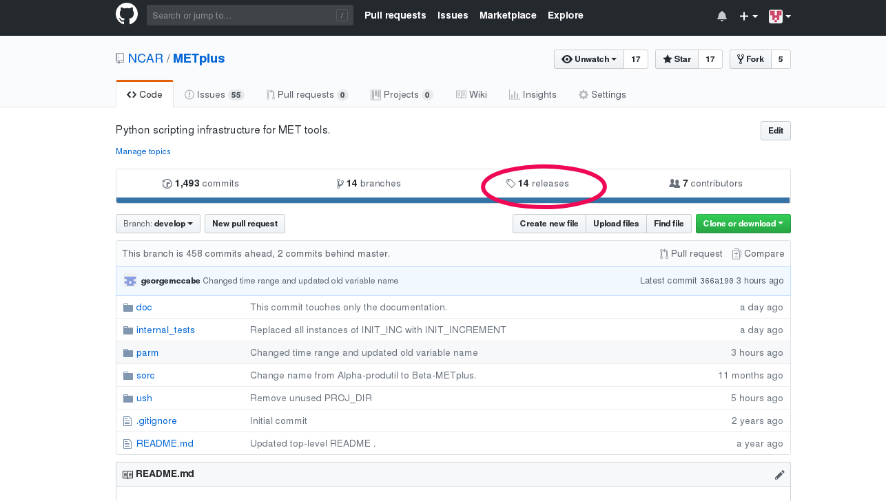

.. _install:

Software Installation/Getting Started
=====================================

Introduction
------------

This chapter describes how to download and set up METplus Wrappers.
METplus Wrappers has been developed and tested on the Debian Linux
operating system.

Supported architectures
-----------------------

METplus Wrappers was developed on Debian Linux and is supported on this
platform.

Programming/scripting languages
-------------------------------

METplus Wrappers is written in Python 3.6.3. It is intended to be a tool
for the modeling community to use and adapt. As users make upgrades and
improvements to the tools, they are encouraged to offer those upgrades
to the broader community by offering feedback to the developers or
coordinating for a GitHub pull. For more information on contributing
code to METplus Wrappers, please contact
`met_help@ucar.edu <met_help@ucar.edu>`__.

Pre-requisites
--------------

The following software is required to run METplus Wrappers:

-  Python 3.6.3

-  R version 3.2.5  [1]_

-  nco (netCDF operators)

-  MET version 9.0 or above

-  Basic familiarity with MET

-  GitHub account (if you plan on contributing code to METplus Wrappers)

.. _getcode:

Getting the METplus Wrappers source code
----------------------------------------

The METplus Wrappers source code is available for download from a public
GitHub repository. You can retrieve the source code through your web
browser or the command line.

Get the source code via your Web Browser
~~~~~~~~~~~~~~~~~~~~~~~~~~~~~~~~~~~~~~~~

If you are a new METplus Wrappers user and would like to experiment with
the use cases, you will want to follow these instructions to retrieve
the source code, additional documentation and sample data that
accompanies the use cases:

-  On your local host (or wherever you wish to install the METplus
   Wrappers code) create a directory where you want the code to reside

-  Open the browser of your choice and navigate to
   https://github.com/NCAR/METplus. You will see something like the
   following:

-  Click on the 'releases' link, highlighted by a red circle in the
   diagram below:

-  You will be redirected to another screen. The latest available
   release appears at the top of the screen:

.. image:: ../_static/metplus_repo_releases_page.png

-  Expand the Assets menu by clicking on the black triangle to the left of the 'Assets' text (below the description of the latest release)

-  Click on the 'Source code' link (either the *zip* or *tar.gz*) and
   when prompted, save it to the directory you created.

-  Uncompress the source code (on Linux/Unix\ *: gunzip* for zip file or
   *tar xvfz* for the tar.gz file)

-  Create a directory for the sample data directory for the use case you
   are interested in running

-  Click on the sample data link for the use case you will run and when
   prompted, save the file to the directory you created above. Sample
   data are available for the following use case categories:

   -  Model Applications:
         -  Convection allowing models: *sample_data-convection_allowing_models-3.0.tgz*

         -  Medium Range: *sample_data-medium_range-3.0.tgz*

         -  Precipitation: *sample_data-precipitation-3.0.tgz*

         -  TC and Extra TC: *sample_data-tc_and_extra_tc-3.0.tgz*

   -  MET Tool Wrapper:
         -  For single MET tool/METplus wrapper use cases and MET tests: *sample_data-met_test-9.0.tgz*

METplus Wrappers directory structure
------------------------------------

Once you have cloned the METplus Wrappers from the GitHub repository at
https://github.com/NCAR/METplus to a location on your host, change
directories to the METplus Wrappers directory. You should have the
following directory structure::

  METplus/
    docs/
    internal_tests/
    parm/
    sorc/
    ush/
    README.md

The top-level METplus Wrappers directory consists of a README.md file
and several subdirectories.

The docs/ directory contains documentation for users and contributors (HTML) and Doxygen
files that are used to create the METplus wrapper API documentaton. The Doxygen
documentation can be created and viewed via web browser if the developer
has Doxygen installed on the host.  The Doxygen documentation is useful to contributors and is not
necessary for METplus end-users.

The internal_tests/ directory contains unit test scripts that are only
relevant to METplus Wrappers developers and contributors.

The parm/ directory contains all the configuration files for MET and
METplus Wrappers.

The sorc/ directory contains Doxygen executables to generate
documentation for developers.

The src/ directory contains the source code for each of the wrappers in
METplus Wrappers.

The ush/ directory contains the Python wrappers to the MET tools.

Set up your environment
-----------------------

Environment variables need to be set to allow the METplus Wrappers
application to be run from any directory and for locating the necessary
Python modules. There is an option to set the JLOGFILE environment
variable, which indicates where JLOGS will be saved. JLOGS provide
information pertinent to the configuration-file framework. If this
environment is unset, then output from the configuration framework will
be directed to stdout (your display).

Add the following information to your .cshrc (C shell) or .bashrc (Bash
shell):

.cshrc:
~~~~~~~

-  Open your .cshrc file and do the following:

-  To your PATH, add: *<full-path-to*-*METplus*>/ush

-  Optional: add JLOGFILE variable and set to
   *<full-path-to-save-jlog-files>*

-  Close your .cshrc file and run ``source ~/.cshrc``

-  For example:

.. code-block:: tcsh

    # Add METplus to $PATH
    set path = (other_path_entries ~/METplus/ush)

    # Optional JLOGFILE
    setenv JLOGFILE ~/jlog_out

.bashrc:
~~~~~~~~

-  Open your .bashrc file and do the following:

-  To your PATH, add : *<full-path-to-METplus*>/ush

-  Optional: add a JLOGFILE environment variable and set it to the
   directory where you want the logs to reside

-  Close your .bashrc file and run ``source ~/.bashrc``

-  For example:

.. code-block:: bash

    # Add METplus to $PATH
    export PATH=~/METplus/ush:$PATH

    # Optional JLOGFILE
    export JLOGFILE=~/

Set up METplus Wrappers Configuration files
-------------------------------------------

There are four METplus Wrappers configuration files that must be defined
prior to running METplus Wrappers. These configuration files reside in
the METplus_INSTALL_DIRECTORY/METplus/parm/metplus_config

The following configuration files are automatically loaded during a
METplus Wrappers run and do not need to be invoked on the command line.

-  metplus_data.conf

   -  data-relevant settings:

      -  filename templates

      -  regular expressions for input or output filenames

      -  directories where input data are located

-  metplus_logging.conf

   -  set logging levels for METplus and MET output

   -  turn on/off logging to stdout (screen) or log files

-  metplus_runtime.conf

   -  runtime-related settings:

      -  location of METplus master_metplus.conf file (the 'master' conf
         file that is a collection of all the final METplus
         configuration files)

-  metplus_system.conf

   -  system-related settings:

      -  location of METplus source code

      -  location of MET source and build

      -  location of other non-MET executables/binaries

      -  location of METplus parm directory

They must be fully defined by replacing all variables preset to
*</path/to>* with valid path names, or have those variables defined in a
down-stream config file. If configuring METplus Wrappers in a common
location for multiple users, it is recommended that the these four
configuration files are fully defined. Individual users have the option
to make customizations by over-riding any of these values in their own
configuration files.

Running METplus Wrappers
------------------------

Running METplus Wrappers involves invoking the Python script
master_metplus.py from any directory followed by a list of configuration
files (file path relative to the
*<path_to_METplus_install_dir*>/METplus/parm directory).

**Example 1: Using a "default" configuration:**
Copy and paste the following into an empty text file and name it 'my_user_config.conf':

.. code-block:: none

  # This is a comment, comments are defined with a # at the beginning of the line
  
  # Setting the PROCESS_LIST to **Usage** indicates that we want usage information
  [config]
  PROCESS_LIST = Usage

  # Set the MET_INSTALL_DIR to the location of the MET install
  [dir]
  MET_INSTALL_DIR = /usr/local/met-9.0

  # Set these to any valid directory to override the </path/to> placeholder set in the metplus_system.conf file
  [dir]
  TMP_DIR = /tmp
  INPUT_BASE = /tmp/input
  OUTPUT_BASE = /tmp/output

Run METplus via: ``master_metplus.py -c ./<my_user_config.conf>`` or ``master_metplus.py -c /<username>/<my_user_config.conf>`` if you saved your default config in a directory other than where you are running master_metplus.py.

When the above command is run, a usage message appears indicating that other config files are required to perform useful tasks, as well as a list of currently supported wrappers:

.. code-block:: none

  USAGE: This is a default process, please indicate more specific processes in the PROCESS_LIST variable in one or more of the following configuration files:
  
  -parm/metplus_config/metplus_runtime.conf
  -parm/metplus_use_cases/<usecase_name>/<usecase_name.conf>
  -parm/metplus_use_cases/<usecase_name>/examples/<example_name>.conf

  Currently available processes are:
  - CyclonePlotter
  - EnsembleStat
  - ExtractTiles
  - GempakToCF
  - GridStat
  - Mode
  - MTD
  - PB2NC
  - PcpCombine
  - PointStat
  - RegridDataPlane
  - SeriesByLead
  - SeriesByInit
  - TcPairs
  - TcStat
  - TCMPRPlotter

**Example 2: Using a use-case configuration:**

The command: 

.. code-block:: none

  master_metplus.py -c use_cases/feature_relative/feature_relative.conf

will run METplus using the defaults set in the three config files found in parm/metplus_config. Any variables defined in these three config files can be over-ridden in the parm/use_cases/feature_relative/feature_relative.conf file. METplus will run using the values specified in the feature_relative.conf file.

**Example 3: Using example configuration to perform a specific evaluation (e.g. Model 1 vs. Obs 1, Model 1 vs. Obs 2, Model 2 vs. Obs 1, etc...):**

The command: 

.. code-block:: none
  
  master_metplus.py -c use_cases/feature_relative/feature_relative.conf \
  -c use_cases/feature_relative/examples/series_by_lead_all_fhrs.conf

will run METplus using the defaults set in the three config files in parm/metplus_config, where variables can be over-ridden by parm/use_cases/feature_relative/feature_relative.conf or in parm/use_cases/feature_relative/examples/series_by_lead_all_fhrs.conf. The order in which conf files are called is important. Variables that are defined in intermediate conf files will be over-ridden by the same variables set in the conf file following it, or the last conf file.

.. [1]
   R version 3.2.5 is required when the TCMPRPlotter wraps the
   plot_tcmpr.R script. Please refer to Chapter 21 Plotting and Graphics
   Support for more information about plot_tcmpr.R.
