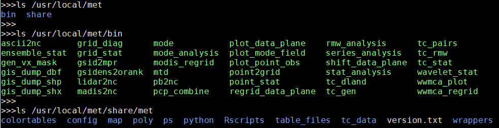
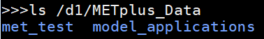

.. _sysconf:

********************
System Configuration
********************

This chapter is a guide on configuring METplus Wrappers.

Config Best Practices / Recommendations
=======================================

* Set the log level (:ref:`log_level`) to an appropriate level. Setting the
  value to DEBUG will generate more information in the log output. Users are
  encouraged to run with DEBUG when getting started with METplus or when
  investigating unexpected behavior.

* Review the log files to verify that all of the processes ran cleanly.
  Some log output will be written to the screen, but the log files
  contain more information, such as log output from the MET tools.

* The order in which METplus config files are read by run_metplus.py matters.
  Each subsequent config file defined on the command line will override any
  values defined in an earlier config file. It is recommended to create a
  :ref:`user_configuration_file` and pass it to the script last to guarantee
  that those values are used in case any variables are accidentally defined
  in multiple conf files.

* Check the metplus_final.conf (see :ref:`metplus_final_conf`) file to
  verify that all variables are set to the expected value,
  as it contains all the key-values that were specified.

* If configuring METplus Wrappers in a common location for multiple users:

    * It is recommended that the values for **MET_INSTALL_DIR** and
      **INPUT_BASE** are changed to valid values in the
      :ref:`default_configuration_file`.

    * It is recommended to leave **OUTPUT_BASE** set to the default value in
      the :ref:`default_configuration_file`. This prevents multiple users from
      accidentally writing to the same output directory.

* If obtaining the METplus Wrappers with the intention of updating
  the same local directory as new versions become available,
  it is recommended to leave all default values in the
  :ref:`default_configuration_file` unchanged and set them in a
  :ref:`user_configuration_file` that is passed into every call to
  run_metplus.py. This is done to avoid the need to change the default values
  after every update.

.. _default_configuration_file:

Default Configuration File
==========================

The default METplus configurations are found in
*parm/metplus_config/defaults.conf*.
These settings are automatically loaded at the start of
a METplus Wrappers run and do not need to be invoked on the command line.

These settings include:

* Location of MET installation
* Directories where input data are located
* Directory to write output data and temporary files
* Logging levels for METplus wrapper and MET application output
* Location of other non-MET executables/binaries

The values in this file can either be set directly in this file or
in a :ref:`user_configuration_file`.

Required (/path/to)
-------------------

Some of the variables in this file must be changed from the default value
before running. These variables are set to **/path/to** by default and are
described below. Running METplus with **/path/to** configuration entries
present results in an error.

.. _sys_conf_met_install_dir:

MET_INSTALL_DIR
^^^^^^^^^^^^^^^

The MET installation directory is the location where the MET tools are
installed on the system. This directory is typically named 'met' or 'met-X.Y'
or 'met-X.Y.Z' and should contain at least two directories:
**share** and **bin** (or **exec** on some installations).
The **bin** directory will contain the MET executables, such as grid_stat.

Based on the directory listing output above, the following should be set::

    MET_INSTALL_DIR = /usr/local/met

.. _sys_conf_input_base:

INPUT_BASE
^^^^^^^^^^

The input base is the directory that contains the sample input data used to run
the use case examples found in the parm/use_cases directory. This directory
should contain one or more of the following:

* A directory called **model_applications** which contains directories that
  correspond to each use case directory under
  *parm/use_cases/model_applications*

* A directory called **met_test** which contains data used for the use cases
  found under
  *parm/use_cases/met_tool_wrapper*

Based on the directory listing output above, the following should be set::

    INPUT_BASE = /d1/METplus_Data

.. _sys_conf_output_base:

OUTPUT_BASE
^^^^^^^^^^^

The output base is the directory where logs and output files are written.
This should be set to a path where the user running the METplus wrappers
has permission to write files.
The directory will be created automatically if it does not exist already.

Example::

    OUTPUT_BASE = /d1/user/output

Optional
--------

MET_BIN_DIR
^^^^^^^^^^^

The MET bin directory contains all of the MET executables, like grid_stat.
Typically this is a directory under
:ref:`MET_INSTALL_DIR<sys_conf_met_install_dir>`
named **bin**. This is the default value::

    MET_BIN_DIR = {MET_INSTALL_DIR}/bin

However, some environments require these files to be contained in a directory
named **exec** instead. If this is the case for the MET installation, then
change the value appropriately::

    MET_BIN_DIR = {MET_INSTALL_DIR}/exec

.. _metplus_final_conf:

METPLUS_CONF
^^^^^^^^^^^^

This is the path to the final METplus configuration file that contains the full
list of all configuration variables set for a given run.
This includes all of the values set by the METplus configuration files that
were passed into the script, as well as the values from the
:ref:`default_configuration_file` and any default values set by the wrappers.
This file is useful
to review for debugging to see which values were actually used for the run.
If a value set in the final conf differs from what was set in a configuration
file passed to run_metplus.py, there is a good chance that this variable is
set in another configuration file that was passed in afterwards.

The default value is a file called metplus_final.conf that is written in the
:ref:`OUTPUT_BASE<sys_conf_output_base>` directory::

    METPLUS_CONF = {OUTPUT_BASE}/metplus_final.conf

This value is rarely changed, but it can be if desired.

TMP_DIR
^^^^^^^

Directory to write any temporary files created by the MET applications.
By default, this is a directory inside the
:ref:`OUTPUT_BASE<sys_conf_output_base>` directory::

    TMP_DIR = {OUTPUT_BASE}/tmp

This value is rarely changed, but it can be if desired.

STAGING_DIR
^^^^^^^^^^^

Directory to write files that have been uncompressed or converted by the
wrapper scripts. Files are written to this directory to prevent corrupting
input data directories in case something goes wrong.
File list ASCII files that contain a list of file paths to pass into MET
tools such as MODE-TimeDomain or SeriesAnalysis are also written to this
directory.

By default this is a directory called **stage** inside the
:ref:`OUTPUT_BASE<sys_conf_output_base>` directory::

    STAGING_DIR = {OUTPUT_BASE}/stage

This value is rarely changed, but it can be if desired.

CONVERT
^^^^^^^

Location of the ImageMagick utility called **convert** used by PlotDataPlane
and SeriesAnalysis wrappers to generate images from Postscript files.
The default value is the name of the executable::

    CONVERT = convert

If the executable is in the user's path, then this value does not need to be
changed. However, if the tool is not in the user's path but is still available
on the file system, this value can be set to the full path of the file.

GEMPAKTOCF_JAR
^^^^^^^^^^^^^^

Path to the GempakToCF.jar file used to convert GEMPAK data to NetCDF format.
This is only used if running a use case that reads GEMPAK data. The value
should be set to the full path of the JAR file. The file can be found here:
https://dtcenter.org/sites/default/files/community-code/metplus/utilities/GempakToCF.jar

.. _logging-config:

Logging
-------

Log File Information
^^^^^^^^^^^^^^^^^^^^

Where to write logs files

LOG_METPLUS
"""""""""""

This defines the name of the METplus log file::

    LOG_METPLUS = {LOG_DIR}/metplus.log.{LOG_TIMESTAMP_TEMPLATE}

The value references :ref:`LOG_DIR<log_dir>` and
:ref:`LOG_TIMESTAMP_TEMPLATE<log_timestamp_template>`.

.. _log_dir:

LOG_DIR
"""""""

This defines the directory that will contain log files. Typically this is set
to a directory called "logs" inside the :term:`OUTPUT_BASE` directory::

    LOG_DIR = {OUTPUT_BASE}/logs

The value can be changed if another location to write log files is preferred.

.. _log_timestamp_template:

LOG_TIMESTAMP_TEMPLATE
""""""""""""""""""""""

Sets the desired timestamp format, using strftime format directives.
It must only contain valid strftime format directives (see
https://strftime.org).
The current run time is substituted using the format specified unless
:ref:`LOG_TIMESTAMP_USE_DATATIME<log_timestamp_use_datatime>`
is set to true/yes.
By default, a new log file is created for each METplus run::

    LOG_TIMESTAMP_TEMPLATE = %Y%m%d%H%M%S

This example will use the format YYYYMMDDHHMMSS, i.e. 20141231101159.
Change this value to adjust the frequency that new log files are created.
For example, to write all log output that is generated within a day to a
single log file, set::

    LOG_TIMESTAMP_TEMPLATE = %Y%m%d

This example will use the format YYYYMMDD, i.e. 20141231

.. _log_timestamp_use_datatime:

LOG_TIMESTAMP_USE_DATATIME
""""""""""""""""""""""""""

If set to false/no (default), write log timestamps using the current time
when the METplus run was started::

    LOG_TIMESTAMP_USE_DATATIME = no

If set to true/yes, write log timstamps using the value set for
:term:`INIT_BEG` or :term:`VALID_BEG` depending on the value set for
:term:`LOOP_BY`. This is useful if it is desired to organize the
log output files based on the data that was processed during the run.

LOG_MET_OUTPUT_TO_METPLUS
"""""""""""""""""""""""""

If set to true/yes (default), log output from MET applications are written
to the METplus log file::

    LOG_MET_OUTPUT_TO_METPLUS = yes

If set to false/no, the output is written to a separate
file in the log directory named after the application.

Log Level Information
^^^^^^^^^^^^^^^^^^^^^

How much information to log

.. _log_level:

LOG_LEVEL
"""""""""

This controls the level of logging output from the METplus wrappers. It does
not control the logging level of the actual MET applications. The possible
values to:

* CRITICAL
* ERROR
* WARNING
* INFO
* DEBUG
* NOTSET

The default logging level is INFO::

    LOG_LEVEL = INFO

The log output will contain messages from the level selected and above.
If a use case is producing errors, then setting::

    LOG_LEVEL = DEBUG

will produce additional logging output that is helpful
to discover the cause of the error.

LOG_MET_VERBOSITY
"""""""""""""""""

This controls the logging verbosity level for all of the MET applications.
The value can be set to an integer. Higher values produce more log output.
The logging verbosity can also be set individually for each MET tool if more
log output is desired for a specific application. For example::

    LOG_MET_VERBOSITY = 2
    LOG_ASCII2NC_VERBOSITY = 3
    LOG_POINT_STAT_VERBOSITY = 4

In the above example, ASCII2NC will use 3, PointStat will use 4, and
all other MET applications with use 2.

Log Formatting Information
^^^^^^^^^^^^^^^^^^^^^^^^^^

How to format lines in log files

.. note:: The following variables control the format of the METplus log output
          that is written to the log files. It does not control the format of
          the log output that is written to the screen as standard output.

For more information on acceptable values, see the Python documentation for
LogRecord:
https://docs.python.org/3/library/logging.html#logging.LogRecord

.. _log_info_line_format:

LOG_INFO_LINE_FORMAT
""""""""""""""""""""

This defines the format of the INFO log messages. Setting the value to::

    LOG_INFO_LINE_FORMAT = %(asctime)s.%(msecs)03d %(name)s %(levelname)s: %(message)s

Produces a log file with INFO lines that match this format::

    04/29 15:54:22.413 metplus INFO: Completed METplus configuration setup.

The format of the timestamp is set by
:ref:`LOG_LINE_DATE_FORMAT<log_line_date_format>`.

.. _log_err_line_format:

LOG_ERR_LINE_FORMAT
"""""""""""""""""""

This defines the format of the ERROR log messages. Setting the value to::

    LOG_ERR_LINE_FORMAT = %(asctime)s.%(msecs)03d %(name)s (%(filename)s:%(lineno)d) %(levelname)s: %(message)s

Produces a log file with ERROR lines that match this format::

    04/29 16:03:34.858 metplus (met_util.py:218) ERROR: METplus has finished running but had 1 error.

The format of the timestamp is set by
:ref:`LOG_LINE_DATE_FORMAT<log_line_date_format>`.

.. _log_debug_line_format:

LOG_DEBUG_LINE_FORMAT
"""""""""""""""""""""

This defines the format of the DEBUG log messages. Setting the value to::

    LOG_DEBUG_LINE_FORMAT = %(asctime)s.%(msecs)03d %(name)s (%(filename)s:%(lineno)d) %(levelname)s: %(message)s

Produces a log file with DEBUG lines that match this format::

    04/29 15:54:22.851 metplus (met_util.py:207) DEBUG: METplus took 0:00:00.850983 to run.

The format of the timestamp is set by
:ref:`LOG_LINE_DATE_FORMAT<log_line_date_format>`.

.. _log_line_date_format:

LOG_LINE_DATE_FORMAT
""""""""""""""""""""

This defines the format of the timestamps used in the METplus log messages.

Setting the value to::

    LOG_LINE_DATE_FORMAT = %m/%d %H:%M:%S

Produces a log file with timestamps that match this format::

    04/29 15:54:22.851

LOG_LINE_FORMAT
"""""""""""""""

Defines the default formatting of each METplus log output line.
By default, this variable is referenced in
:ref:`LOG_ERR_LINE_FORMAT<log_err_line_format>` and
:ref:`LOG_DEBUG_LINE_FORMAT<log_debug_line_format>`.

.. _user_configuration_file:

User Configuration File
=======================

It is recommended that users create a METplus configuration file for each
system that they are running the METplus wrappers.
The file can be passed into run_metplus.py after any
:ref:`use case configuration files<use_case_configuration_files>`
so that the settings are applied to every use case that is run.
Multiple user configuration files can also be created on a system to
customize different work environments.
At a minimum, a user configuration file should set the
:ref:`OUTPUT_BASE<sys_conf_output_base>` variable so that output files are
created in a familiar directory.

A minimal user configuration file contains::

    [config]
    OUTPUT_BASE = /my/output/base

where /my/output/base is a path where the user has write permission.

If using an installation of the METplus wrappers that does not have
:ref:`MET_INSTALL_DIR<sys_conf_met_install_dir>` and/or
:ref:`INPUT_BASE<sys_conf_input_base>` set in the
:ref:`default configuration file<default_configuration_file>`, or if a
different value for either variable is desired, it is appropriate to override
these variables in a user configuration file::

    [config]
    OUTPUT_BASE = /my/output/base
    INPUT_BASE = /my/input/base
    MET_INSTALL_DIR = /usr/local/met-10.0.0

Overriding MET_INSTALL_DIR in the user configuration file allows users to use a
older version or test a new beta version of MET.
Overriding INPUT_BASE can be useful when developing a new use case.

Any other METplus configuration variables that are intended to be set for
each run can be added to this file to the user's taste.
:ref:`Logging <logging-config>` configuration variables are often set in these
files, most commonly :ref:`LOG_LEVEL<log_level>` = DEBUG to produce additional
log output.

.. _use_case_configuration_files:

Use Case Configuration Files
============================

Example configuration files that contain settings to run various use cases
can be found in the *parm/use_cases* directory. There are two directories
inside this directory:

* **met_tool_wrapper** contains simple use cases that run
  one wrapper at a time. They provide examples of how to configure and run
  a single wrapper to help users become familiar with the configurations
  that are available for that wrapper.

* **model_applications** contains directories organized
  by category. These use cases often run multiple wrappers in succession to
  demonstrate how the tools can be used in more complex verification
  workflows by end users.

The use case configuration files found in these directories contain
:ref:`common_config_variables` that define each use case.
Configuration variables that are specific to a
user's environment (INPUT_BASE, OUTPUT_BASE, MET_INSTALL_DIR, etc.) are not
*set* in these files. However, INPUT_BASE and OUTPUT_BASE are *referenced*
by variables that are found in these files. For example::

    FCST_GRID_STAT_INPUT_DIR = {INPUT_BASE}/met_test/data/sample_fcst
    ...
    GRID_STAT_OUTPUT_DIR = {OUTPUT_BASE}/met_tool_wrapper/GridStat

All input data read by the use case is relative to INPUT_BASE and all output
paths for data written by the use case is relative to OUTPUT_BASE. The
expectation is a use case can be run locally if the user's INPUT_BASE
contains the sample data associated with the use case *AND* any additional
dependencies (i.e. Python packages) are available.
See the chapter titled :ref:`metplus_use_cases` to view the documentation for
the existing use cases to see if additional dependencies are required for a
given use case.

More information about the variables set in the use case configuration files
can be found in the :ref:`common_config_variables` section.

Running METplus
===============

Example Wrapper Use Case
------------------------

* Create a :ref:`user_configuration_file`
  (named user_system.conf in this example)

* Run the Example Wrapper use case. In a terminal, run::

    run_metplus.py \
    -c /path/to/METplus/parm/use_cases/met_tool_wrapper/Example/Example.conf \
    -c /path/to/user_system.conf

replacing **/path/to/user_system.conf** with the path to the
user configuration file and
**/path/to/METplus** with the path to the location where METplus is installed

The last line of the screen output should match this format::

    05/04 09:42:52.277 metplus (met_util.py:212) INFO: METplus has successfully finished running.

If this log message is not shown, there is likely an issue with one or more
of the default configuration variable overrides in the
:ref:`user_configuration_file`.

This use case does not utilize any of the MET tools, but simply demonstrates
how the :ref:`common_config_variables` control a use case run.

If the run was successful, the line above the success message should contain
the path to the METplus log file that was generated::

    05/04 09:44:21.534 metplus (met_util.py:211) INFO: Check the log file for more information: /path/to/output/logs/metplus.log.20210504094421

* Review the log file and compare it to the Example.conf use case
  configuration file to see how the settings correspond to the result.

* Review the :ref:`metplus_final.conf<metplus_final_conf>` file to see all
  of the settings that were used in the use case.

GridStat Wrapper Basic Use Case
-------------------------------

* :ref:`obtain_sample_input_data` for the **met_tool_wrapper** use cases.
  The tarfile should be in the directory that corresponds to the
  major/minor release and starts with sample_data-met_tool_wrapper

* Create a :ref:`user_configuration_file` (named user_system.conf in this
  example). Ensure that **INPUT_BASE** is set
  to the directory where the sample data tarfile was uncompressed.

* Run the GridStat Wrapper basic use case. In a terminal, run::

    run_metplus.py \
    -c /path/to/METplus/parm/use_cases/met_tool_wrapper/GridStat/GridStat.conf \
    -c /path/to/user_system.conf

replacing **/path/to/user_system.conf** with the path to the
user configuration file and
**/path/to/METplus** with the path to the location where METplus is installed

If the run was successful, the line above the success message should contain
the path to the METplus log file that was generated.

* Review the log file and compare it to the GridStat.conf use case
  configuration file to see how the settings correspond to the result.

* Review the :ref:`metplus_final.conf<metplus_final_conf>` file to see all
  of the settings that were used in the use case.

.. _common_config_variables:

Common Config Variables
=======================

Timing Control
--------------

This section describes the METplus wrapper configuration variables that are
used to control which times are processed. It also covers functionality that
is useful for processing data in realtime by setting run times based on the
clock time when the METplus wrappers are run.

.. _LOOP_BY_ref:

:term:`LOOP_BY`
^^^^^^^^^^^^^^^

The METplus wrappers can be configured to loop over a set of valid times or a
set of initialization times. This is controlled by the configuration variable
called :term:`LOOP_BY`. If the value of this variable is set to INIT or
RETRO, looping will be relative to initialization time. If the value is set
to VALID or REALTIME, looping will be relative to valid time.

.. _Looping_by_Valid_Time:

Looping by Valid Time
^^^^^^^^^^^^^^^^^^^^^

When looping over valid time (`LOOP_BY` = VALID or REALTIME), the following
variables must be set:

:term:`VALID_TIME_FMT`:
This is the format of the valid times the user can configure in the METplus
Wrappers. The value of `VALID_BEG` and `VALID_END` must correspond to this
format.

Example::

    VALID_TIME_FMT = %Y%m%d%H

Using this format, the valid time range values specified must be defined
as YYYYMMDDHH, i.e. 2019020112.

:term:`VALID_BEG`:
This is the first valid time that will be processed. The format of this
variable is controlled by :term:`VALID_TIME_FMT`. For example, if
VALID_TIME_FMT=%Y%m%d, then VALID_BEG must be set to a valid time matching
YYYYMMDD, such as 20190201.

:term:`VALID_END`:
This is the last valid time that can be processed. The format of this
variable is controlled by :term:`VALID_TIME_FMT`. For example, if
VALID_TIME_FMT=%Y%m%d, then VALID_END must be set to a valid time matching
YYYYMMDD, such as 20190202.

.. note::
    The time specified for this variable will not necessarily be processed.
    It is used to determine the cutoff of run times that can be processed.
    For example, if METplus Wrappers is configured to start at 20190201 and
    end at 20190202 processing data in 48 hour increments, it will process
    valid time 20190201 then increment the run time to 20190203. This is
    later than the VALID_END value, so execution will stop. However, if the
    increment is set to 24 hours (see :term:`VALID_INCREMENT`), then METplus
    Wrappers will process valid times 20190201 and 20190202 before ending
    execution.

:term:`VALID_INCREMENT`:
This is the time interval to add to each run time to determine the next run
time to process. See :ref:`time-interval-units` for information on time
interval formatting. Units of hours are assumed if no units are specified.
This value must be greater than or equal to 60 seconds because the METplus
wrappers currently do not support processing intervals of less than one minute.

The following is a configuration that will process valid time 2019-02-01 at
00Z until 2019-02-02 at 00Z in 6 hour (21600 seconds) increments::

   [config]
   LOOP_BY = VALID
   VALID_TIME_FMT = %Y%m%d%H
   VALID_BEG = 2019020100
   VALID_END = 2019020200
   VALID_INCREMENT = 6H

.. note::
    Substituting VALID_INCREMENT = 21600 will generate the same result.

This will process data valid on 2019-02-01 at 00Z, 06Z, 12Z, and 18Z as well as 2019-02-02 at 00Z. For each of these valid times, the METplus wrappers can also loop over a set of forecast leads that are all valid at the current run time. See :ref:`looping_over_forecast_leads` for more information.

.. _Looping_by_Initialization_Time:

Looping by Initialization Time
^^^^^^^^^^^^^^^^^^^^^^^^^^^^^^

When looping over initialization time (:term:`LOOP_BY` = INIT or LOOP_BY = RETRO), the following variables must be set:

:term:`INIT_TIME_FMT`:
This is the format of the initialization times the user can configure in METplus Wrappers. The value of :term:`INIT_BEG` and :term:`INIT_END` must correspond to this format. Example: INIT_TIME_FMT = %Y%m%d%H. Using this format, the initialization time range values specified must be defined as YYYYMMDDHH, i.e. 2019020112.

:term:`INIT_BEG`:
This is the first initialization time that will be processed. The format of this variable is controlled by :term:`INIT_TIME_FMT`. For example, if INIT_TIME_FMT = %Y%m%d, then INIT_BEG must be set to an initialization time matching YYYYMMDD, such as 20190201.

:term:`INIT_END`:
This is the last initialization time that can be processed. The format of this variable is controlled by INIT_TIME_FMT. For example, if INIT_TIME_FMT = %Y%m%d, then INIT_END must be set to an initialization time matching YYYYMMDD, such as 20190202.

.. note::
    The time specified for this variable will not necessarily be processed. It is used to determine the cutoff of run times that can be processed. For example, if METplus Wrappers is configured to start at 2019-02-01 and end at 2019-02-02 processing data in 48 hour increments, it will process 2019-02-01 then increment the run time to 2019-02-03. This is later than the INIT_END valid, so execution will stop. However, if the increment is set to 24 hours (see INIT_INCREMENT), then METplus Wrappers will process initialization times 2019-02-01 and 2019-02-02 before ending executaion.

:term:`INIT_INCREMENT`:
This is the time interval to add to each run time to determine the next run time to process. See :ref:`time-interval-units` for information on time interval formatting. Units of hours are assumed if no units are specified. This value must be greater than or equal to 60 seconds because the METplus wrappers currently do not support processing intervals of less than one minute.

The following is a configuration that will process initialization time 2019-02-01 at 00Z until 2019-02-02 at 00Z in 6 hour (21600 second) increments::

  [config]
  LOOP_BY = INIT
  INIT_TIME_FMT = %Y%m%d%H
  INIT_BEG = 2019020100
  INIT_END = 2019020200
  INIT_INCREMENT = 6H

.. note::
    Substituting VALID_INCREMENT = 21600 will generate the same result.

This will process data initialized on 2019-02-01 at 00Z, 06Z, 12Z, and 18Z as well as 2019-02-02 at 00Z. For each of these initialization times, METplus Wrappers can also loop over a set of forecast leads that are all initialized at the current run time. See :ref:`looping_over_forecast_leads` for more information.

.. _looping_over_forecast_leads:

Looping over Forecast Leads
^^^^^^^^^^^^^^^^^^^^^^^^^^^

Many of the wrappers will also loop over a list of forecast leads relative to the current valid/initialization time that is being processed.

:term:`LEAD_SEQ`
""""""""""""""""

This variable can be set to a comma-separated list of integer values (with
optional units) to define the forecast leads that will be processed relative
to the initialization/valid time. See :ref:`time-interval-units` for
information on time interval formatting. Units of hours are assumed if no
units are specified. For example::

  [config]
  LEAD_SEQ = 3, 6, 9

If :term:`LOOP_BY` = VALID and the current run time is 2019-02-01 at 00Z,
then three times will be processed:

1. Initialized on 2019-01-31 at 21Z / valid on 2019-02-01 at 00Z
2. Initialized on 2019-01-31 at 18Z / valid on 2019-02-01 at 00Z
3. Initialized on 2019-01-31 at 15Z / valid on 2019-02-01 at 00Z

If :term:`LOOP_BY` = INIT and the current run time is 2019-02-01 at 00Z,
then three times will be processed:

1. Initialized on 2019-02-01 at 00Z / valid on 2019-02-01 at 03Z
2. Initialized on 2019-02-01 at 00Z / valid on 2019-02-01 at 06Z
3. Initialized on 2019-02-01 at 00Z / valid on 2019-02-01 at 09Z

You can also define :term:`LEAD_SEQ` using a special notation for many
forecast leads. The notation is **begin_end_incr(b,e,i)** where b = the
first lead value, e = the last lead value (inclusive), and
i = the increment between leads. For example::

  [config]
  LEAD_SEQ = begin_end_incr(0,12,3)

is equivalent to setting::

  [config]
  LEAD_SEQ = 0, 3, 6, 9, 12

Grouping forecast leads is possible as well using a special version of
the :term:`LEAD_SEQ` variable for the
**SeriesByLead Wrapper Only**.
If :term:`SERIES_BY_LEAD_GROUP_FCSTS` = True, then groups of
forecast leads can be defined to be evaluated together.
You can define any number of these groups by setting
configuration variables LEAD_SEQ_1, LEAD_SEQ_2, ..., :term:`LEAD_SEQ_\<n\>`.
You can define the value with a
comma-separated list of integers (currently only hours are supported here)
or using the special begin_end_incr(b,e,i) notation described just
above. Each :term:`LEAD_SEQ_\<n\>` must have a corresponding
variable :term:`LEAD_SEQ_<n>_LABEL`. For example::

  [config]
  LEAD_SEQ_1 = 0, 6, 12, 18
  LEAD_SEQ_1_LABEL = Day1
  LEAD_SEQ_2 = begin_end_incr(24,42,6)
  LEAD_SEQ_2_LABEL = Day2

:term:`INIT_SEQ`
""""""""""""""""

If METplus Wrappers is configured to loop by valid time
(:term:`LOOP_BY` = VALID), INIT_SEQ can be used instead of :term:`LEAD_SEQ`.
This is a list of initialization hours that are available in the data. This
is useful if the data initialization times are known and a
different list of forecast leads should be used depending on the valid time
being evaluated. For example::

  [config]
  LOOP_BY = VALID
  INIT_SEQ = 0, 6, 12, 18

At valid time 2019-02-01 00Z, this initialization sequence will build a
forecast lead list of 0, 6, 12, 18, 24, 30, etc. and at valid time
2019-02-01 01Z, this initialization sequence will build a forecast lead
list of 1, 7, 13, 19, 25, 31, etc.

If using :term:`INIT_SEQ`, restrict the forecast leads
that will be used by setting :term:`LEAD_SEQ_MIN` and :term:`LEAD_SEQ_MAX`.
For example, to only process forecast leads between 12 and 24 set::

  [config]
  LEAD_SEQ_MIN = 12
  LEAD_SEQ_MAX = 24

At valid time 2019-02-01 00Z, this initialization sequence will build a
forecast lead list of 12, 18, 24 and at valid time 2019-02-01 01Z, this
initialization sequence will build a forecast lead list of 13, 19.

Setting minimum and maximum values will also affect the list of forecast
leads if :term:`LEAD_SEQ` is used. :term:`LEAD_SEQ` takes precedence over
:term:`INIT_SEQ`, so if both variables are set in the configuration,
:term:`INIT_SEQ` will be ignored in favor of :term:`LEAD_SEQ`.

.. _time-interval-units:

Time Interval Units
^^^^^^^^^^^^^^^^^^^
Time intervals defined in configuration variables each have default values:
:term:`LEAD_SEQ` and :term:`INIT_SEQ` default to hours,
:term:`VALID_INCREMENT` and :term:`INIT_INCREMENT` default to seconds.
Units of years, months, days, hours, minutes, or seconds can also be
specified by adding a letter (Y, m, d, H, M, or S respectively) to the end
of the number.
If no units are specified, seconds are assumed.

Examples::

    3600 : 3600 seconds
    3600S : 3600 seconds
    60M : 60 minutes or 3600 seconds
    1H : 1 hour or 3600 seconds
    1m : 1 month (relative)
    1d : 1 day or 24 hours or 86400 seconds
    1Y : 1 year (relative)

Units of months (m) and years (Y) do not have set intervals because the
length of a month or year is relative to the relative date/time.
Therefore these intervals are calculated based on the current run time and
cannot be expressed in seconds unless the run time value is available.

Skipping Times
^^^^^^^^^^^^^^

Version 3.1 added the ability to skip certain valid times. The configuration
variable :term:`SKIP_TIMES` can be used to
provide a list of time formats each with a list of times to not process.
The format and time list are separated by
a colon. Any numeric python strftime formatting directive can be used as
the time format (see
https://strftime.org). Each item in the list must be surrounded by
quotation marks. Here are a few examples.

Example 1::

    [config]
    SKIP_TIMES = "%m:3"

This will skip the 3rd month, March.

Example 2::

    [config]
    SKIP_TIMES = "%d:30,31"

This will skip every 30th and 31st day.

Example 3::

    [config]
    SKIP_TIMES = "%d:30,31", "%m:3"

This will skip every 30th and 31st day **and** every 3rd month.

You can use **begin_end_incr(b,e,i)** syntax to define a range of times to
skip.

b = begin value, e = end value,

i = increment between each value

Example 4::

    [config]
    SKIP_TIMES = "%H:begin_end_incr(0,22,2)"

This will skip every even hour (starting from 0, ending on 22, by 2).
This is equivalent to::

    [config]
    SKIP_TIMES = "%H:0,2,4,6,8,10,12,14,16,18,20,22"

You can also specify multiple strftime directives in a single time format.

Example 5::

    [config]
    SKIP_TIMES = "%Y%m%d:19991231, 20141031"

This will skip the dates Dec. 31, 1999 and Oct. 31, 2014.

To only skip certain times for a single wrapper, use a wrapper-specific
variable.
Using a wrapper-specific variable will ignore the generic SKIP_TIMES values.

Example 6::

    [config]
    GRID_STAT_SKIP_TIMES = "%m:3,4,5,6,7,8,9,10,11"
    SKIP_TIMES = "%d:31"

This will skip the months March through November for GridStat wrapper only.
All other wrappers in the
:term:`PROCESS_LIST` will skip the 31st day of each month. Note that the
SKIP_TIMES values are not applied to GridStat in this case.

Realtime Looping
^^^^^^^^^^^^^^^^

Now and Today
"""""""""""""

To make running in realtime easier, the METplus Wrappers support defining
the begin and end times relative to
the current clock time. For example, if the current time is 2019-04-26 08:17
and the METplus Wrappers is run with::

  [config]
  VALID_END = {now?fmt=%Y%m%d%H}

then the value of :term:`VALID_END` will be set to 2019042608. You can also
use {today} to substitute the
current YYYYMMDD, i.e. 20190426. You cannot change the formatting for
the 'today' keyword.

Shift Keyword
"""""""""""""

You can use the 'shift' keyword to shift the current time by any number of
seconds. For example, if the METplus Wrappers are run at the
same clock time with::

  [config]
  VALID_BEG = {now?fmt=%Y%m%d%H?shift=-86400}

then the value of :term:`VALID_BEG` will be set to the current clock
time shifted by -86400 seconds (24 hours backwards), or 2019-04-25 08Z.

The value defined for 'shift' also supports :ref:`time-interval-units`.

If :term:`VALID_INCREMENT` is set to 21600 seconds (6 hours), then the
METplus Wrappers will process the following valid times:

| 2019-04-25 08Z
| 2019-04-25 14Z
| 2019-04-25 20Z
| 2019-04-26 02Z
| 2019-04-26 08Z

Truncate Keyword
""""""""""""""""

You may want to configure the METplus Wrappers to process at 00Z, 06Z, 12Z,
and 18Z of a given day instead of 02Z, 08Z, 14Z, and 20Z. Having to adjust
the shift amount differently if running at 08Z or 09Z to get the
times to line up would be tedious. Instead, use the 'truncate' keyword.
The value set here is the number of seconds that is used to determine the
interval of time to round down. To process every 6 hours, set
'truncate' to 21600 seconds::

  [config]
  VALID_BEG = {now?fmt=%Y%m%d%H?shift=-86400?truncate=21600}

This will round down the value to the nearest 6 hour interval of time.
Starting METplus Wrappers on or after 06Z but before 12Z on 20190426 will
result in VALID_BEG = 2019042506 (clock time shifted backwards by 24 hours
then truncated to the nearest 6 hour time).

Starting METplus Wrappers on 20190426 at 08:16 with the following
configuration::

  [config]
  LOOP_BY = VALID
  VALID_TIME_FMT = %Y%m%d%H
  VALID_BEG = {now?fmt=%Y%m%d%H?shift=-86400?truncate=21600}
  VALID_END = {now?fmt=%Y%m%d%H}
  VALID_INCREMENT = 21600

will process valid times starting on 20190425 at 06Z every 6 hours until
the current run time is later than 20190426 at 08Z, which will result in
processing the following valid times:

| 20190425_06
| 20190425_12
| 20190425_18
| 20190426_00
| 20190426_06
|

.. note::

   When using the 'now' keyword, the value of VALID_TIME_FMT must be
   identical to the 'fmt' value corresponding to the 'now' item in
   VALID_BEG and VALID_END. In the above example, this would be the
   %Y%m%d%H portion within values of the VALID_TIME_FMT, VALID_BEG,
   and VALID_END variables.

.. _Process_List:

Process List
------------

The PROCESS_LIST variable defines the list of wrappers to run.
This can be a single value or a comma separated list of values.
Each value must match an existing wrapper name without the 'Wrapper' suffix.

**Example 1 Configuration**::

    [config]
    PROCESS_LIST = GridStat

This example will run GridStatWrapper only.

**Example 2 Configuration**::

    [config]
    PROCESS_LIST = PCPCombine, GridStat

This example will run PCPCombineWrapper then GridStatWrapper.

Added in version 4.0.0 is the ability to specify an instance name for each
process in the PROCESS_LIST. This allows multiple instances of the same
wrapper to be specified in the PROCESS_LIST. Users can create a new section
header in their configuration files with the same name as the instance.
If defined, values in this section will override the values in the
configuration for that instance. The instance name of the process is defined
by adding text after the process name inside parenthesis. There should be
no space between the process name and the parenthesis.

**Example 3 Configuration**::

    [config]
    PROCESS_LIST = GridStat, GridStat(my_instance_name)

    [dir]
    GRID_STAT_OUTPUT_DIR = /grid/stat/output/dir

    [my_instance_name]
    GRID_STAT_OUTPUT_DIR = /my/instance/name/output/dir

In this example, the first occurence of GridStat in the PROCESS_LIST does
not have an instance name associated with it, so it will use the value
/grid/stat/output/dir as the output directory. The second occurence has
an instance name 'my_instance_name' and there is a section header with
the same name, so this instance will use /my/instance/name/output/dir as
the output directory.

.. _Loop_Order:

Loop Order
----------

The METplus wrappers can be configured to loop first by times then
processes or vice-versa. Looping by times first will run each process in
the process list for a given run time, increment to the next run time, run
each process in the process list, and so on. Looping by processes first
will run all times for the first process, then run all times for the
second process, and so on.

**Example 1 Configuration**::

  [config]
  LOOP_ORDER = times

  PROCESS_LIST = PCPCombine, GridStat

  VALID_BEG = 20190201
  VALID_END = 20190203
  VALID_INCREMENT = 1d

will run in the following order::

  * PCPCombine at 2019-02-01
  * GridStat   at 2019-02-01
  * PCPCombine at 2019-02-02
  * GridStat   at 2019-02-02
  * PCPCombine at 2019-02-03
  * GridStat   at 2019-02-03

**Example 2 Configuration**::

  [config]
  LOOP_ORDER = processes

  PROCESS_LIST = PCPCombine, GridStat

  VALID_BEG = 20190201
  VALID_END = 20190203
  VALID_INCREMENT = 1d

will run in the following order::

  * PCPCombine at 2019-02-01
  * PCPCombine at 2019-02-02
  * PCPCombine at 2019-02-03
  * GridStat   at 2019-02-01
  * GridStat   at 2019-02-02
  * GridStat   at 2019-02-03

.. note::
    If running a MET tool that processes data over a time range, such as
    SeriesAnalysis or StatAnalysis, the tool must be run with
    LOOP_ORDER = processes.

    
.. _Custom_Looping:

Custom Looping
--------------

A list of text strings can be defined in the METplus wrappers configuration
files to allow each wrapper to process data multiple times for each run
time. The strings can be referenced in various places in the METplus
configuration files to change input/output file paths, configuration file
paths, and more. The value of each list item can be referenced in the
METplus configuration variables by using {custom?fmt=%s}. The variable
CUSTOM_LOOP_LIST will apply the values to each wrapper in the PROCESS_LIST
unless the wrapper does not support this functionality. CyclonePlotter,
MakePlots, SeriesByInit, SeriesByLead, StatAnalysis, TCStat, and
TCMPRPlotter wrappers are not supported. If the variable is not set or set
to an empty string, the wrapper will execute as normal without additional
runs. The name of the wrapper-specific variables contain the name of the
wrapper, i.e. SERIES_ANALYSIS_CUSTOM_LOOP_LIST,
PCP_COMBINE_CUSTOM_LOOP_LIST, GRID_STAT_CUSTOM_LOOP_LIST, etc.
Setting these variables will override the value set for
CUSTOM_LOOP_LIST for that wrapper only.

**Example 1 Configuration** (Reading different input files)::

  [config]
  PROCESS_LIST = PCPCombine

  VALID_BEG = 20190201
  VALID_END = 20190203
  VALID_INCREMENT = 1d

  PCP_COMBINE_CUSTOM_LOOP_LIST = mem_001, mem_002

  [dir]
  FCST_PCP_COMBINE_INPUT_DIR = /d1/ensemble

  [filename_templates]
  FCST_PCP_COMBINE_INPUT_TEMPLATE = {custom?fmt=%s}/{valid?fmt=%Y%m%d}.nc

This configuration will run the following:

* PCPCombine at 2019-02-01 reading from /d1/ensemble/mem_001/20190201.nc
* PCPCombine at 2019-02-01 reading from /d1/ensemble/mem_002/20190201.nc
* PCPCombine at 2019-02-02 reading from /d1/ensemble/mem_001/20190202.nc
* PCPCombine at 2019-02-02 reading from /d1/ensemble/mem_002/20190202.nc
* PCPCombine at 2019-02-03 reading from /d1/ensemble/mem_001/20190203.nc
* PCPCombine at 2019-02-03 reading from /d1/ensemble/mem_002/20190203.nc

**Example 2 Configuration** (Using different MET config files)::

  [config]
  PROCESS_LIST = SeriesAnalysis

  VALID_BEG = 20190201
  VALID_END = 20190203
  VALID_INCREMENT = 1d

  SERIES_ANALYSIS_CUSTOM_LOOP_LIST = one, two

  SERIES_ANALYSIS_CONFIG_FILE = {CONFIG_DIR}/SAConfig_{custom?fmt=%s}

  [dir]
  SERIES_ANALYSIS_OUTPUT_DIR = {OUTPUT_BASE}/SA/{custom?fmt=%s}

This configuration will run SeriesAnalysis:

* At 2019-02-01 using SAConfig_one config file and writing output to
  {OUTPUT_BASE}/SA/one
* At 2019-02-01 using SAConfig_two config file and writing output to
  {OUTPUT_BASE}/SA/two
* At 2019-02-02 using SAConfig_one config file and writing output to
  {OUTPUT_BASE}/SA/one
* At 2019-02-02 using SAConfig_two config file and writing output to
  {OUTPUT_BASE}/SA/two
* At 2019-02-03 using SAConfig_one config file and writing output to
  {OUTPUT_BASE}/SA/one
* At 2019-02-03 using SAConfig_two config file and writing output to
  {OUTPUT_BASE}/SA/two

.. _Field_Info:

Field Info
----------

This section describes how METplus Wrappers configuration variables can
be used to define field information that is sent to the MET applications to
read forecast and observation fields.

:term:`FCST_VAR<n>_NAME`
^^^^^^^^^^^^^^^^^^^^^^^^

Set this to the name of a forecast variable to evaluate.
<n> is any integer greater than or equal to 1, i.e.::

  [config]
  FCST_VAR1_NAME = TMP
  FCST_VAR2_NAME = RH

If this value is set for a given <n> value, then the corresponding
OBS_VAR<n>_NAME must be set. If the value for forecast and observation
data are the same, BOTH_VAR<n>_NAME can be used instead.

:term:`FCST_VAR<n>_LEVELS`
^^^^^^^^^^^^^^^^^^^^^^^^^^

Set this to a comma-separated list of levels or a single value.
FCST_VAR1_LEVELS corresponds to FCST_VAR1_NAME, FCST_VAR2_LEVELS
corresponds to FCST_VAR2_NAME, etc. For example::

  [config]
  FCST_VAR1_NAME = TMP
  FCST_VAR1_LEVELS = P500, P750

will process TMP at P500 and TMP at P750. If FCST_VAR<n>_LEVELS and
FCST_VAR<n>_NAME are set, then the corresponding OBS_VAR<n>_LEVELS and
OBS_VAR<n>_NAME must be set. If the value for forecast and observation
data are the same, BOTH_VAR<n>_NAME and BOTH_VAR<n>_LEVELS can be used instead.

:term:`OBS_VAR<n>_NAME`
^^^^^^^^^^^^^^^^^^^^^^^
Set this to the corresponding observation variable to evaluate
with FCST_VAR<n>_NAME. If this value is set for a given <n> value, then
the corresponding FCST_VAR<n>_NAME must be set. If the value for forecast
and observation data are the same, BOTH_VAR<n>_NAME can be used instead.

:term:`OBS_VAR<n>_LEVELS`
^^^^^^^^^^^^^^^^^^^^^^^^^

Set this to a comma-separated list of levels or a single value. If
OBS_VAR<n>_LEVELS and OBS_VAR<n>_NAME are set, then the corresponding
FCST_VAR<n>_LEVELS and FCST_VAR<n>_NAME must be set. If the value for
forecast and observation data are the same, BOTH_VAR<n>_NAME and
BOTH_VAR<n>_LEVELS can be used instead. For example, setting::

  [config]
  BOTH_VAR1_NAME = TMP
  BOTH_VAR1_LEVELS = P500
  BOTH_VAR2_NAME = RH
  BOTH_VAR2_LEVELS = P750, P250

is the equivalent of setting::

  [config]
  FCST_VAR1_NAME = TMP
  FCST_VAR1_LEVELS = P500
  FCST_VAR2_NAME = RH
  FCST_VAR2_LEVELS = P750, P250
  OBS_VAR1_NAME = TMP
  OBS_VAR1_LEVELS = P500
  OBS_VAR2_NAME = RH
  OBS_VAR2_LEVELS = P750, P250

This will compare:

| TMP/P500 in the forecast data to TMP/P500 in the observation data
| RH/P750 in the forecast data to RH/P750 in the observation data
| RH/P250 in the forecast data to RH/P250 in the observation data
|

If setting::

  [config]
  FCST_VAR1_NAME = TMP
  FCST_VAR1_LEVELS = P500, P750
  OBS_VAR1_NAME = TEMP
  OBS_VAR1_LEVELS = "(0,*,*)","(1,*,*)"

METplus Wrappers will compare:

| TMP/P500 in the forecast data to TEMP at (0,\*,\*) in the observation data
| TMP/P750 in the forecast data to TEMP at (1,\*,\*) in the observation data
|

.. note::
   NetCDF level values that contain (\*,\*) notation must be surrounded by
   quotation marks so it will not be misinterpreted as a list of items.

The number of level items must be equal in each list for a given comparison.
If separate names for a forecast and observation are defined,
separate levels must be defined for each even if they are equivalent.
For example,
setting FCST_VAR1_NAME, FCST_VAR1_LEVELS, and OBS_VAR1_NAME, but not
setting OBS_VAR1_LEVELS will result in an error.

The field information specified using the \*_NAME/\*_LEVELS variables
will be formatted to match the field info dictionary in the MET config
files and passed to the appropriate config file to evaluate the data. The
previous configuration comparing TMP (P500 and P750) in the forecast data
and TEMP ((0,*,*)) in the observation data will generate the following in
the MET config file::

  fcst = {field = [ {name="TMP"; level="P500";} ];}
  obs = {field = [{name="TEMP"; level="(0,*,*)";} ];}

and then comparing TMP (P500 and P750) in the forecast data and
TEMP ((1,*,*)) in the observation data will generate the following
in the MET config file::

  fcst = {field = [ {name="TMP"; level="P750";} ];}
  obs = {field = [{name="TEMP"; level="(1,*,*)";} ];}

Note that some MET applications allow multiple fields to be specified for
a single run. If the MET tool allows it and METplus Wrappers is configured
accordingly, these two comparisons would be configured in a single run.

Read explicit time dimension from a NetCDF level
""""""""""""""""""""""""""""""""""""""""""""""""

If the input NetCDF data contains a time dimension, the time can be specified
in the level value. The MET tool will find the data for the time requested::

    [config]
    OBS_VAR1_NAME = TEMP
    OBS_VAR1_LEVELS = "(20190201_120000,*,*)"

This example will extract the data that corresponds to Feb. 1, 2019 at 12Z if
it is available (see the MET Documentation for more information on this
functionality). The time can be specified based on the current run time, i.e.::

    [config]
    OBS_VAR1_NAME = TEMP
    OBS_VAR1_LEVELS = "({valid?fmt=%Y%m%d_%H%M%S},*,*)"

In this example, {valid?fmt=%Y%m%d_%H%M%S} will be substituted with the valid
time of the current run.

:term:`FCST_VAR<n>_THRESH` / :term:`OBS_VAR<n>_THRESH`
^^^^^^^^^^^^^^^^^^^^^^^^^^^^^^^^^^^^^^^^^^^^^^^^^^^^^^

Set this to a comma-separated list of threshold values to use in the
comparison. Each of these values must begin with a comparison operator
(>, >=, =, ==, !=, <, <=, gt, ge, eq, ne, lt, or le). For example, setting::

  [config]
  FCST_VAR1_NAME = TMP
  FCST_VAR1_LEVELS = P500
  FCST_VAR1_THRESH = le0.5, gt0.4, gt0.5, gt0.8

will add the following information to the MET config file::

   fcst = {field = [ {name="TMP"; level="P500"; cat_thresh=[ le0.5, gt0.4, gt0.5, gt0.8];} ];}

If FCST_VAR<n>_THRESH is set, then OBS_VAR<n>_THRESH must be set. If the
threshold list is the same for both forecast and observation data,
BOTH_VAR<n>_THRESH can be used instead.

:term:`FCST_VAR<n>_OPTIONS` /  :term:`OBS_VAR<n>_OPTIONS`
^^^^^^^^^^^^^^^^^^^^^^^^^^^^^^^^^^^^^^^^^^^^^^^^^^^^^^^^^

Set this to add additional information to the field dictionary in the MET
config file. The item must end with a semi-colon. For example::

  [config]
  FCST_VAR1_NAME = TMP
  FCST_VAR1_LEVELS = P500
  FCST_VAR1_OPTIONS = GRIB_lvl_typ = 105; ens_phist_bin_size = 0.05;

will add the following to the MET config file::

  fcst = {field = [ {name="TMP"; level="P500"; GRIB_lvl_typ = 105; ens_phist_bin_size = 0.05;} ];}

If FCST_VAR<n>_OPTIONS is set, OBS_VAR<n>_OPTIONS does not need to be set,
and vice-versa. If the extra options are the same for both forecast and
observation data, BOTH_VAR<n>_OPTIONS can be used instead.

:term:`ENS_VAR<n>_NAME` / :term:`ENS_VAR<n>_LEVELS`/
:term:`ENS_VAR<n>_THRESH` / :term:`ENS_VAR<n>_OPTIONS`:
**Used with EnsembleStat Wrapper only.** Users may want to define the ens
dictionary item in the MET EnsembleStat config file differently than the
fcst dictionary item. If this is the case, then use these variables. If
it is not set, the values in the corresponding
FCST_VAR<n>_[NAME/LEVELS/THRESH/OPTIONS] will be used in the ens dictionary.

Wrapper Specific Field Info
^^^^^^^^^^^^^^^^^^^^^^^^^^^

New to METplus 3.0 is the ability to specify VAR<n> items differently
across comparison wrappers. In previous versions, it was assumed that the
list of forecast and observation files that were processed would be
applied to any MET Stat tool used, such as GridStat, PointStat,
EnsembleStat, MODE, or MTD. This prevented the ability to run, for
example, EnsembleStat, then pass the output into GridStat.

Example 1::

  [config]
  PROCESS_LIST = EnsembleStat, GridStat

  FCST_ENSEMBLE_STAT_VAR1_NAME = HGT
  FCST_ENSEMBLE_STAT_VAR1_LEVELS = P500

  FCST_GRID_STAT_VAR1_NAME = HGT_P500_ENS_MEAN
  FCST_GRID_STAT_VAR1_LEVELS = "(*,*)"

If the generic :term:`FCST_VAR<n>_NAME` variables are used, the same values
will be applied to all tools that don't have wrapper specific fields
defined. If wrapper specific fields are defined, any generic fields will
be ignored.

Example 2::

  [config]
  PROCESS_LIST = GridStat, EnsembleStat

  FCST_VAR1_NAME = HGT
  FCST_VAR1_LEVELS = P500, P750
  FCST_VAR2_NAME = TMP
  FCST_VAR2_LEVELS = P500, P750

  FCST_ENSEMBLE_STAT_VAR1_NAME = HGT
  FCST_ENSEMBLE_STAT_VAR1_LEVELS = P500

In this example, GridStat will process HGT at pressure levels 500 and 750
and TMP at pressure levels 500 and 750, while EnsembleStat will only
process HGT at pressure level 500. To configure EnsembleStat to also
process TMP, the user will have to define it explicitly with
FCST_ENSEMBLE_STAT_VAR2_NAME.

This functionality applies to GridStat, EnsembleStat, PointStat, MODE,
and MTD wrappers only.

For more information on GRIB_lvl_typ and other file-specific commands,
review the MET User's Guide, Chapter 3.

.. _Directory_and_Filename_Template_Info:

Directory and Filename Template Info
------------------------------------

The METplus Wrappers use directory and filename template configuration
variables to find the desired files for a given run.

Using Templates to find Observation Data
^^^^^^^^^^^^^^^^^^^^^^^^^^^^^^^^^^^^^^^^

The following configuration variables describe input observation data::

  [dir]
  OBS_GRID_STAT_INPUT_DIR = /my/path/to/grid_stat/input/obs

  [filename_templates]
  OBS_GRID_STAT_INPUT_TEMPLATE = {valid?fmt=%Y%m%d}/prefix.{valid?fmt=%Y%m%d%H}.ext

The input directory is the top level directory containing all of the
observation data. The template contains items with keywords that will be
substituted with time values for each run. After the values are
substituted, METplus Wrappers will check to see if the desired file exists
relative to the input directory. At valid time 20190201_12Z, the full
desired path of the observation input data to grid_stat will be:

|   /my/path/to/grid_stat/input/obs/20190201/prefix.2019020112.ext
|

Note that the template contains a dated subdirectory. This cannot go in the
OBS_GRID_STAT_INPUT_DIR variable because the dated subdirectory changes
based on the run time.

METplus Wrappers does not need to be configured to loop by valid time
to find files using a template containing valid time information. For
example, at initialization time 20190201_12Z and forecast lead 3, the valid
time is calculated to be 20190201_15Z and the full desired path of the
observation input data to grid_stat will be:

|   /my/path/to/grid_stat/input/obs/20190201/prefix.2019020115.ext
|

The 'init' and 'valid' are keywords used to denote initialization and
valid times respectively. Other keywords that are supported include 'lead',
'offset', 'da_init', and 'cycle' which can all be used to find forecast
data and data assimilation data depending on the task.

Using Templates to find Forecast Data
^^^^^^^^^^^^^^^^^^^^^^^^^^^^^^^^^^^^^

Most forecast files contain the initialization time and the forecast lead
in the filename. The keywords 'init' and 'lead' can be used to describe
the template of these files::

  [dir]
  FCST_GRID_STAT_INPUT_DIR = /my/path/to/grid_stat/input/fcst

  [filename_templates]
  FCST_GRID_STAT_INPUT_TEMPLATE = prefix.{init?fmt=%Y%m%d%H}_f{lead?fmt=%3H}.ext

For a valid time of 20190201_00Z and a forecast lead of 3, METplus Wrappers
will look for the following forecast file:

|   /my/path/to/grid_stat/input/fcst/prefix.2019013121_f003.ext
|

Using Templates to find Data Assimilation Data
^^^^^^^^^^^^^^^^^^^^^^^^^^^^^^^^^^^^^^^^^^^^^^

Some data assimilation files contain offset and da_init (data assimilation
initialization) values in the filename. These values are used to determine
the valid time of the data. Consider the following configuration::

  [config]
  PB2NC_OFFSETS = 6, 3

  [dir]
  PB2NC_INPUT_DIR = /my/path/to/prepbufr

  [filename_templates]
  PB2NC_INPUT_TEMPLATE = prefix.{da_init?fmt=%Y%m%d}_{cycle?fmt=%H}_off{offset?fmt=%2H}.ext

The PB2NC_OFFSETS list tells METplus Wrappers the order in which to
prioritize files with offsets in the name. At valid time 20190201_12Z,
METplus Wrappers will check if the following file exists:

|   /my/path/to/prepbufr/prefix.20190201_18_off06.ext
|

The offset is added to the valid time to get the data assimilation
initialization time. Note that 'cycle' can be used interchangeably
with 'da_init'. It is generally used to specify the hour of the data that
was generated. If that file doesn't exist, it will check if the following
file exists:

|   /my/path/to/prepbufr/prefix.20190201_15_off03.ext
|

Shifting Times in Filename Templates
^^^^^^^^^^^^^^^^^^^^^^^^^^^^^^^^^^^^

Users can use the 'shift' keyword to adjust the time referenced in the
filename template relative to the run time. For example, if the input files
used contained data from 01Z on the date specified in the filename to 01Z on
the following day. In this example, for a run at 00Z you want to use the
file from the previous day and for the 01Z to 23Z runs you want to use the
file that corresponds to the current day. Here is an example::

  [filename_templates]
  OBS_POINT_STAT_INPUT_TEMPLATE = {valid?fmt=%Y%m%d?shift=-3600}.ext

Running the above configuration at a valid time of 20190201_12Z will shift
the valid time backwards by 1 hour (3600 seconds) resulting in 20190201_11Z
and will substitute the current day into the template, giving a filename of
20190201.ext. Running at valid time 20190201_00Z, the shift will result in
a file time of 20190131_23Z, so the filename will be 20190131.ext that is
generated by the template.

Using Windows to find Valid Files
^^^^^^^^^^^^^^^^^^^^^^^^^^^^^^^^^

The [FCST/OBS]_FILE_WINDOW_[BEGIN/END] configuration variables can be used
if the time information in the input data does not exactly line up with the
run time but you still want to process the data. The default value of the
file window begin and end variables are both 0 seconds. If both values are
set to 0, METplus Wrappers will require that a file matching the template
with the exact time requested exists. If either value is non-zero, METplus
Wrappers will examine all of the files under the input directory that match
the template, pull out the time information from the files, and use the file
with the time closest to the run_time. For example, consider the following
configuration::

  [config]
  OBS_FILE_WINDOW_BEGIN = -7200
  OBS_FILE_WINDOW_END = 7200

  [dir]
  OBS_GRID_STAT_INPUT_DIR = /my/grid_stat/input/obs

  [filename_templates]
  OBS_GRID_STAT_INPUT_TEMPLATE = {valid?fmt=%Y%m%d}/pre.{valid?fmt=%Y%m%d}_{valid?fmt=%H}.ext

For a run time of 20190201_00Z, and a set of files in the input directory
that looks like this:

|   /my/grid_stat/input/obs/20190131/pre.20190131_22.ext
|   /my/grid_stat/input/obs/20190131/pre.20190131_23.ext
|   /my/grid_stat/input/obs/20190201/othertype.20190201_00.ext
|   /my/grid_stat/input/obs/20190201/pre.20190201_01.ext
|   /my/grid_stat/input/obs/20190201/pre.20190201_02.ext
|

The following behavior can be expected for each file:

  1. The first file matches the template and the file time is within the
     window, so the filename and time difference relative to the valid time
     (7200 seconds, or 2 hours) is saved.
  2. The second file matches the template, the file time is within the
     window, and the time difference is less than the closest file so the
     filename and time difference relative to the valid time (3600 seconds,
     or 1 hour) is saved.
  3. The third file does not match the template and is ignored.
  4. The fourth file matches the template and is within the time range, but
     it is the same distance away from the valid time as the closest file.
     GridStat only allows one file to be processed so it is ignored (PB2NC
     is currently the only METplus Wrapper that allows multiple files to be
     processed).
  5. The fifth file matches the template but it is a further distance away
     from the closest file (7200 seconds versus 3600 seconds) so it is ignored.

Therefore, METplus Wrappers will use
/my/grid_stat/input/obs/20190131/pre.20190131_23.ext as the input to
grid_stat in this example.

Wrapper Specific Windows
^^^^^^^^^^^^^^^^^^^^^^^^

A user may need to specify a different window on a wrapper-by-wrapper basis.
If this is the case, you can override the file window values for each
wrapper. Consider the following configuration::

  [config]
  PROCESS_LIST = PCPCombine, GridStat, EnsembleStat
  OBS_FILE_WINDOW_BEGIN = 0
  OBS_FILE_WINDOW_END = 0
  OBS_GRID_STAT_FILE_WINDOW_BEGIN = -1800
  OBS_GRID_STAT_FILE_WINDOW_END = 1800
  OBS_ENSEMBLE_STAT_FILE_WINDOW_END = 3600

Using the above configuration, PCPCombine will use +/- 0 hours and require
exact file times. GridStat will use -1800/+1800 for observation data and
EnsembleStat will use -0/+3600 for observation data.
:term:`OBS_ENSEMBLE_STAT_FILE_WINDOW_BEGIN` was not set, so the
EnsembleStat wrapper will use :term:`OBS_FILE_WINDOW_BEGIN`.

.. _Runtime_Freq:

Runtime Frequency
-----------------

Some wrappers have an option to specify how frequently to process data. It can
be run once to process all of the available files in the desired time range,
or it can be configured to run over different intervals. This allows you to
aggregate the output in a variety of ways. The wrappers that support this
functionality (along with the configuration variable that controls the setting)
include:

* :ref:`series_analysis_wrapper` :   :term:`SERIES_ANALYSIS_RUNTIME_FREQ`
* :ref:`grid_diag_wrapper` :   :term:`GRID_DIAG_RUNTIME_FREQ`
* :ref:`user_script_wrapper` :   :term:`USER_SCRIPT_RUNTIME_FREQ`

At the start of execution of the wrapper (SeriesAnalysis and GridDiag),
a full list of all available files will be obtained. Then the wrapper will
subset the data and call the MET tool based on the runtime frequency setting.
UserScript wrapper will simply run at the interval specified without
obtaining a list of files.

Depending on which option is selected, some filename template tags will
translate to \* when performing string substitution.
The possible values for the \*_RUNTIME_FREQ variables are:

* RUN_ONCE : Runs once processing all files. \*
  is substituted for init/valid/lead
* RUN_ONCE_PER_INIT_OR_VALID : Run the command once for each
  initialization or valid time depending on the value of LOOP_BY.
  If LOOP_BY = INIT, \* is substituted for valid and lead.
  If LOOP_BY = VALID, \* is substituted for init and lead.
* RUN_ONCE_PER_LEAD : Run the command once for each forecast lead time.
  \* is substituted for valid and init
* RUN_ONCE_FOR_EACH : Run the command once for every runtime
  (init or valid and forecast lead combination).
  All filename templates are substituted with values.

Note that :term:`LOOP_ORDER` must be set to processes to run these wrappers.
Also note that the following example may not contain all of the configuration
variables that are required for a successful run. The are intended to show
how these variables affect how the data is processed.

**SeriesAnalysis Examples**::

    [config]
    LOOP_ORDER = processes

    LOOP_BY = INIT
    INIT_TIME_FMT = %Y%m%d%H
    INIT_BEG = 2020101712
    INIT_END = 2020101912
    INIT_INCREMENT = 1d

    LEAD_SEQ = 3H, 6H

    PROCESS_LIST = SeriesAnalysis

    [dir]
    FCST_SERIES_ANALYSIS_INPUT_DIR = /my/fcst/dir

    [filename_templates]
    FCST_SERIES_ANALYSIS_INPUT_TEMPLATE = I{init?fmt=%Y%m%d%H}_F{lead?fmt=%3H}_V{valid?fmt=%H}

In this example, the wrapper will go through all initialization and forecast
lead times and find any files that match the template under /my/fcst/dir:

| Init: 2020-10-17 12Z, Forecast: 3 hour, File: I2020101712_F003_V15
| Init: 2020-10-17 12Z, Forecast: 6 hour, File: I2020101712_F006_V18
| Init: 2020-10-18 12Z, Forecast: 3 hour, File: I2020101812_F003_V15
| Init: 2020-10-18 12Z, Forecast: 6 hour, File: I2020101812_F006_V18
| Init: 2020-10-19 12Z, Forecast: 3 hour, File: I2020101912_F003_V15
| Init: 2020-10-19 12Z, Forecast: 6 hour, File: I2020101912_F006_V18
|

Example 1: Run Once::

    [config]
    SERIES_ANALYSIS_RUNTIME_FREQ = RUN_ONCE

For this configuration, a single command will be built to call SeriesAnalysis.
The wildcard character '\*' will replace init, valid, and lead in the template
when attempting to find data to process.

Template Used: I\*_F\*_V\*
Files Processed::

    I2020101712_F003_V15
    I2020101712_F006_V18
    I2020101812_F003_V15
    I2020101812_F006_V18
    I2020101912_F003_V15
    I2020101912_F006_V18

Example 2 Run Once Per Initialization Time::

    [config]
    SERIES_ANALYSIS_RUNTIME_FREQ = RUN_ONCE_PER_INIT_OR_VALID

For this configuration, the wrapper will loop over each initialization time
and attempt to process all files that match that time.
The wildcard character '\*' will replace valid and lead in the template
when attempting to find data to process.

Runtime: Init: 2020-10-17 12Z
Template Used: I2020101712_F\*_V\*
Files Processed::

    I2020101712_F003_V15
    I2020101712_F006_V18

Runtime: Init: 2020-10-18 12Z
Template Used: I2020101812_F\*_V\*
Files Processed::

    I2020101812_F003_V15
    I2020101812_F006_V18

Runtime: Init: 2020-10-19 12Z
Template Used: I2020101912_F\*_V\*
Files Processed::

    I2020101912_F003_V15
    I2020101912_F006_V18

.. note::
    If LOOP_BY was set to VALID, then the values defined by VALID_BEG,
    VALID_END, and VALID_INCREMENT would be substituted for the valid time
    while init and lead would be wildcard values.

Example 3 Run Once Per Forecast Lead Time::

    [config]
    SERIES_ANALYSIS_RUNTIME_FREQ = RUN_ONCE_PER_LEAD

For this configuration, the wrapper will loop over each forecast lead time and
attempt to process all files that match that time.
The wildcard character '\*' will replace valid and init in the template
when attempting to find data to process.

Runtime: Lead: 3 hour
Template Used: I\*_F003*_V\*
Files Processed::

    I2020101712_F003_V15
    I2020101812_F003_V15
    I2020101912_F003_V15

Runtime: Lead: 6 hour
Template Used: I\*_F006*_V\*
Files Processed::

    I2020101712_F006_V18
    I2020101812_F006_V18
    I2020101912_F006_V18

Example 4 Run Once For Each Time::

    [config]
    SERIES_ANALYSIS_RUNTIME_FREQ = RUN_ONCE_FOR_EACH

For this configuration, the wrapper will loop over each initialization time and
forecast lead times and attempt to process all files that match that time.
The wildcard character '\*' will replace valid only in the template
when attempting to find data to process.

Runtime: Init: 2020-10-17 12Z, Forecast: 3 hour
Template Used: I2020101712_F003_V\*
Files Processed::

    I2020101712_F003_V15

Runtime: Init: 2020-10-17 12Z, Forecast: 6 hour
Template Used: I2020101712_F006_V\*
Files Processed::

    I2020101712_F006_V18

Runtime: Init: 2020-10-18 12Z, Forecast: 3 hour
Template Used: I2020101812_F003_V\*
Files Processed::

    I2020101812_F003_V15

Runtime: Init: 2020-10-18 12Z, Forecast: 6 hour
Template Used: I2020101812_F006_V\*
Files Processed::

    I2020101812_F006_V18

Runtime: Init: 2020-10-19 12Z, Forecast: 3 hour
Template Used: I2020101912_F003_V\*
Files Processed::

    I2020101912_F003_V15

Runtime: Init: 2020-10-19 12Z, Forecast: 6 hour
Template Used: I2020101912_F006_V\*
Files Processed::

    I2020101912_F006_V18

.. _metplus-control-met:

How METplus controls MET configuration variables
================================================

METplus provides powerful user control of MET tool configuration file settings.
If a MET tool uses a configuration file, then the corresponding METplus wrapper
supports METplus configuration variables that control the MET tool
configuration file settings.
**The METplus wrappers provide a special "wrapped" MET configuration file that
references environment variables that are set by the wrappers based on the
values set in the METplus configuration files.**
The following section demonstrates a few examples using GridStat.

GridStat Simple Example
-----------------------

Visit the :ref:`GridStat MET Configuration <grid-stat-met-conf>` section of the
User's Guide.
This section contains a link to the default GridStat MET config file,
which is found locally in **share/met/config/GridStatConfig_default** under the
:ref:`sys_conf_met_install_dir`. Next the content of the wrapped GridStat
configuration file (**parm/met_config/GridStatConfig_wrapped**) is displayed.
Notice that this file is similar to the default GridStat MET config file,
but some of the variables in the wrapped configuration file have been replaced
with environment variables.

GridStatConfig_**default**::

    desc = "NA";

GridStatConfig_**wrapped**::

    // desc =
    ${METPLUS_DESC}

When GridStat is run, the tool first reads its default configuration file
(GridStatConfig_**default**) and sets all of the default values. Then it reads
the configuration file that is passed into the tool on the command line, which
is *typically* the wrapped GridStat config file
(parm/met_config/GridStatConfig_**wrapped**).

If the user sets the following in their METplus config file::

  GRID_STAT_DESC = my_description

METplus will set the value of the ${METPLUS_DESC} environment variable to::

  desc = "my_description";

Notice that the variable name and equals sign is included in the value of the
environment variable. The default value for *desc* will be replaced with the
new value "my_description" when the wrapped config file is read.

If the user does not set :term:`GRID_STAT_DESC` in their METplus config files,
then METplus will set the value of the ${METPLUS_DESC} environment variable
to an empty string. This will result in the default value "NA" to be used.

Typically for single value or array MET config variables,
the names of the METplus config variable, environment variable, and
MET config variable are closely related, i.e.

*           **desc**: MET config name
* GRID_STAT_**DESC**: METplus config name
*  $METPLUS_**DESC**: Environment variable name

However, this is not always the case. Refer to the 'MET Configuration' section
for each wrapper in the:doc:`wrappers` chapter to see the full list of
supported variables.

GridStat Dictionary example
---------------------------

The MET configuration files may contain dictionaries that contain multiple
variables within a variable. For example::

    regrid = {
       to_grid    = NONE;
       method     = NEAREST;
       width      = 1;
       vld_thresh = 0.5;
       shape      = SQUARE;
    }

The *regrid* dictionary contains 5 variables named *to_grid*, *method*,
*width*, *vld_thresh*, and *shape*.

If only one or a few of the dictionary items are supported through the METplus
wrappers, then they are handled in the same way as single value or array values
described above. However, if the entire dictionary is supported, then it must
be handled a little differently. The reason is MET will throw an error if it
encounters a dictionary with no values inside, like this::

    regrid = {}

To handle this, the values for the entire dictionary are handled in a single
environment variable with a name that ends with "_DICT" to signify that it sets
values for a dictionary::

    // regrid = {
    ${METPLUS_REGRID_DICT}

Notice that the naming convention is still similar to the name of the MET
config variable name.

Instead of a single METplus configuration variable to control the value of this
environment variable, there are multiple variables -- one for each item of the
dictionary::

* GRID_STAT_REGRID_**TO_GRID**
* GRID_STAT_REGRID_**METHOD**
* GRID_STAT_REGRID_**WIDTH**
* GRID_STAT_REGRID_**VLD_THRESH**
* GRID_STAT_REGRID_**SHAPE**

If all of these variables are unset, then the value of ${METPLUS_REGRID_DICT}
will be an empty string. If one or more of these variables are set, then each
item will be formatted and added to the regrid dictionary.

If the following variable is set::

    GRID_STAT_REGRID_TO_GRID = OBS

then ${METPLUS_REGRID_DICT} will be set to::

    regrid = {to_grid = OBS;}

If the following variables are set::

    GRID_STAT_REGRID_TO_GRID = OBS
    GRID_STAT_REGRID_WIDTH = 2

then ${METPLUS_REGRID_DICT} will be set to::

    regrid = {to_grid = OBS; width = 2;}

When a subset of a dictionary is defined in a MET configuration file, only
the variables that are re-defined are replaced. The other dictionary items
that are absent will use the default value.

GridStat Fields
---------------

Field information, i.e. the fcst/obs dictionary field item, is handled
a little differently than other MET variables. Multiple fields can be
specified for a given use case to generate a command for each field or, if
the MET tool supports it, pass in all of the fields to a single command.
Refer to the :ref:`Field_Info`
section for information on how to sets these values.

.. _reconcile_default_values:

Reconcile Default Values
========================

While adding support for setting many new MET configuration variables through
METplus wrapper configuration variables, it was discovered that some of the
values set in the wrapped MET config files (found in *parm/met_config*)
were different than the MET default values
(found in :ref:`MET_INSTALL_DIR<sys_conf_met_install_dir>`/share/met/config).
Starting in v4.0.0, when a METplus configuration variable that overrides
a MET variable is not set, the default MET value is used.
Due to the disconnect between the wrapped config values and default values,
some of the default settings will now differ if the wrapped MET configuration
file found in *parm/met_config* is used in a use case.
For more information regarding this logic,
see the :ref:`metplus-control-met` section.

This section lists all of the default values that have changed in the wrapped
MET configuration files and the corresponding METplus configuration key/value
pair to use to set the values to the previous default value. Note that any
dictionary variables listed only include the variables inside that have
changed, not the full set of variables that the dictionary contains.

EnsembleStatConfig
------------------

message_type
^^^^^^^^^^^^

+------------------+---------------------------------------------+
| Old (Incorrect): |           message_type = [ "ADPSFC" ];      |
+------------------+---------------------------------------------+
|  New (Correct):  |           message_type = [ "ADPUPA" ];      |
+------------------+---------------------------------------------+
| METplus Config:  | :term:`ENSEMBLE_STAT_MESSAGE_TYPE` = ADPSFC |
+------------------+---------------------------------------------+

climo_cdf.cdf_bins
^^^^^^^^^^^^^^^^^^

+------------------+------------------------------------------+
| Old (Incorrect): | | climo_cdf = {                          |
|                  | |   cdf_bins    = 1;                     |
|                  | | }                                      |
+------------------+------------------------------------------+
| New (Correct):   | | climo_cdf = {                          |
|                  | |   cdf_bins    = 10;                    |
|                  | | }                                      |
+------------------+------------------------------------------+
| METplus Config:  | :term:`ENSEMBLE_STAT_CLIMO_CDF_BINS` = 1 |
+------------------+------------------------------------------+

mask.poly
^^^^^^^^^

+------------------+--------------------------------------------------------------------------------+
| Old (Incorrect): | | mask = {                                                                     |
|                  | |   poly  = [ "MET_BASE/poly/HMT_masks/huc4_1605_poly.nc",                     |
|                  | |             "MET_BASE/poly/HMT_masks/huc4_1803_poly.nc",                     |
|                  | |             "MET_BASE/poly/HMT_masks/huc4_1804_poly.nc",                     |
|                  | |             "MET_BASE/poly/HMT_masks/huc4_1805_poly.nc",                     |
|                  | |             "MET_BASE/poly/HMT_masks/huc4_1806_poly.nc" ];                   |
|                  | | }                                                                            |
+------------------+--------------------------------------------------------------------------------+
| New (Correct):   | | mask = {                                                                     |
|                  | |   poly  = [];                                                                |
|                  | | }                                                                            |
+------------------+--------------------------------------------------------------------------------+
| METplus Config:  | | :term:`ENSEMBLE_STAT_MASK_POLY` = MET_BASE/poly/HMT_masks/huc4_1605_poly.nc, |
|                  | |   MET_BASE/poly/HMT_masks/huc4_1803_poly.nc,                                 |
|                  | |   MET_BASE/poly/HMT_masks/huc4_1804_poly.nc,                                 |
|                  | |   MET_BASE/poly/HMT_masks/huc4_1805_poly.nc,                                 |
|                  | |   MET_BASE/poly/HMT_masks/huc4_1806_poly.nc                                  |
+------------------+--------------------------------------------------------------------------------+

output_flag (multiple items)
^^^^^^^^^^^^^^^^^^^^^^^^^^^^

+------------------+--------------------------------------------------+
| Old (Incorrect): | | output_flag = {                                |
|                  | |    ecnt  = BOTH;                               |
|                  | |    rhist = BOTH;                               |
|                  | |    phist = BOTH;                               |
|                  | |    orank = BOTH;                               |
|                  | |    ssvar = BOTH;                               |
|                  | |    relp  = BOTH;                               |
|                  | | }                                              |
+------------------+--------------------------------------------------+
| New (Correct):   | | output_flag = {                                |
|                  | |    ecnt  = NONE;                               |
|                  | |    rps   = NONE;                               |
|                  | |    rhist = NONE;                               |
|                  | |    phist = NONE;                               |
|                  | |    orank = NONE;                               |
|                  | |    ssvar = NONE;                               |
|                  | |    relp  = NONE;                               |
|                  | | }                                              |
+------------------+--------------------------------------------------+
| METplus Config:  | | :term:`ENSEMBLE_STAT_OUTPUT_FLAG_ECNT` = BOTH  |
|                  | | :term:`ENSEMBLE_STAT_OUTPUT_FLAG_RHIST` = BOTH |
|                  | | :term:`ENSEMBLE_STAT_OUTPUT_FLAG_PHIST` = BOTH |
|                  | | :term:`ENSEMBLE_STAT_OUTPUT_FLAG_ORANK` = BOTH |
|                  | | :term:`ENSEMBLE_STAT_OUTPUT_FLAG_SSVAR` = BOTH |
|                  | | :term:`ENSEMBLE_STAT_OUTPUT_FLAG_RELP` = BOTH  |
+------------------+--------------------------------------------------+

GridStatConfig
--------------

cat_thresh
^^^^^^^^^^

+------------------+---------------------------------------------------------------+
| Old (Incorrect): | cat_thresh = [ NA ];                                          |
+------------------+---------------------------------------------------------------+
| New (Correct):   | cat_thresh = [];                                              |
+------------------+---------------------------------------------------------------+
| METplus Config:  | :term:`GRID_STAT_MET_CONFIG_OVERRIDES` = cat_thresh = [ NA ]; |
+------------------+---------------------------------------------------------------+

output_flag (multiple items)
^^^^^^^^^^^^^^^^^^^^^^^^^^^^

+------------------+---------------------------------------------+
| Old (Incorrect): | | output_flag = {                           |
|                  | |    ctc    = STAT;                         |
|                  | |    cts    = STAT;                         |
|                  | |    grad   = BOTH;                         |
|                  | | }                                         |
+------------------+---------------------------------------------+
| New (Correct):   | | output_flag = {                           |
|                  | |    ctc    = NONE;                         |
|                  | |    cts    = NONE;                         |
|                  | |    grad   = NONE;                         |
|                  | | }                                         |
+------------------+---------------------------------------------+
| METplus Config:  | | :term:`GRID_STAT_OUTPUT_FLAG_CTC` = STAT  |
|                  | | :term:`GRID_STAT_OUTPUT_FLAG_CTS` = STAT  |
|                  | | :term:`GRID_STAT_OUTPUT_FLAG_GRAD` = BOTH |
+------------------+---------------------------------------------+

nc_pairs_flag (multiple items)
^^^^^^^^^^^^^^^^^^^^^^^^^^^^^^

+------------------+------------------------------------------------------+
| Old (Incorrect): | | nc_pairs_flag = {                                  |
|                  | |    latlon       = FALSE;                           |
|                  | |    raw          = FALSE;                           |
|                  | |    diff         = FALSE;                           |
|                  | |    climo        = FALSE;                           |
|                  | |    apply_mask   = FALSE;                           |
|                  | | }                                                  |
+------------------+------------------------------------------------------+
| New (Correct):   | | nc_pairs_flag = {                                  |
|                  | |    latlon       = TRUE;                            |
|                  | |    raw          = TRUE;                            |
|                  | |    diff         = TRUE;                            |
|                  | |    climo        = TRUE;                            |
|                  | |    apply_mask   = TRUE;                            |
|                  | | }                                                  |
+------------------+------------------------------------------------------+
| METplus Config:  | | :term:`GRID_STAT_NC_PAIRS_FLAG_LATLON` = FALSE     |
|                  | | :term:`GRID_STAT_NC_PAIRS_FLAG_RAW` = FALSE        |
|                  | | :term:`GRID_STAT_NC_PAIRS_FLAG_DIFF` = FALSE       |
|                  | | :term:`GRID_STAT_NC_PAIRS_FLAG_CLIMO` = FALSE      |
|                  | | :term:`GRID_STAT_NC_PAIRS_FLAG_APPLY_MASK` = FALSE |
+------------------+------------------------------------------------------+

MODEConfig
----------

grid_res
^^^^^^^^

+------------------+----------------------------+
| Old (Incorrect): | grid_res = 40;             |
+------------------+----------------------------+
| New (Correct):   | grid_res = 4;              |
+------------------+----------------------------+
| METplus Config:  | :term:`MODE_GRID_RES` = 40 |
+------------------+----------------------------+

fcst.merge_thresh and fcst.merge_flag
^^^^^^^^^^^^^^^^^^^^^^^^^^^^^^^^^^^^^

+------------------+-------------------------------------------+
| Old (Incorrect): | | fcst = {                                |
|                  | |   merge_thresh = >=75.0;                |
|                  | |   merge_flag         = NONE;            |
|                  | | }                                       |
+------------------+-------------------------------------------+
| New (Correct):   | | fcst = {                                |
|                  | |   merge_thresh = >=1.25;                |
|                  | |   merge_flag         = THRESH;          |
|                  | | }                                       |
+------------------+-------------------------------------------+
| METplus Config:  | | :term:`MODE_FCST_MERGE_THRESH` = >=75.0 |
|                  | | :term:`MODE_FCST_MERGE_FLAG` = NONE     |
|                  | | :term:`MODE_OBS_MERGE_THRESH` = >=75.0  |
|                  | | :term:`MODE_OBS_MERGE_FLAG` = NONE      |
+------------------+-------------------------------------------+

fcst_raw_plot.color_table
^^^^^^^^^^^^^^^^^^^^^^^^^

+------------------+-------------------------------------------------------------------------------------------------------------+
| Old (Incorrect): | | fcst_raw_plot = {                                                                                         |
|                  | |    color_table      = "MET_BASE/colortables/mode_raw.ctable";                                             |
|                  | | }                                                                                                         |
+------------------+-------------------------------------------------------------------------------------------------------------+
| New (Correct):   | | fcst_raw_plot = {                                                                                         |
|                  | |    color_table      = "MET_BASE/colortables/met_default.ctable";                                          |
|                  | | }                                                                                                         |
+------------------+-------------------------------------------------------------------------------------------------------------+
| METplus Config:  | :term:`MODE_MET_CONFIG_OVERRIDES` = fcst_raw_plot = {color_table = "MET_BASE/colortables/mode_raw.ctable";} |
+------------------+-------------------------------------------------------------------------------------------------------------+

obs_raw_plot.color_table
^^^^^^^^^^^^^^^^^^^^^^^^

+------------------+------------------------------------------------------------------------------------------------------------+
| Old (Incorrect): | | obs_raw_plot = {                                                                                         |
|                  | |    color_table      = "MET_BASE/colortables/mode_raw.ctable";                                            |
|                  | | }                                                                                                        |
+------------------+------------------------------------------------------------------------------------------------------------+
| New (Correct):   | | obs_raw_plot = {                                                                                         |
|                  | |    color_table      = "MET_BASE/colortables/met_default.ctable";                                         |
|                  | | }                                                                                                        |
+------------------+------------------------------------------------------------------------------------------------------------+
| METplus Config:  | :term:`MODE_MET_CONFIG_OVERRIDES` = obs_raw_plot = {color_table = "MET_BASE/colortables/mode_raw.ctable";} |
+------------------+------------------------------------------------------------------------------------------------------------+

PB2NCConfig
-----------

level_category
^^^^^^^^^^^^^^

+------------------+----------------------------------------------+
| Old (Incorrect): | level_category = [0, 1, 4, 5, 6];            |
+------------------+----------------------------------------------+
| New (Correct):   | level_category = [];                         |
+------------------+----------------------------------------------+
| METplus Config:  | :term:`PB2NC_LEVEL_CATEGORY` = 0, 1, 4, 5, 6 |
+------------------+----------------------------------------------+

quality_mark_thresh
^^^^^^^^^^^^^^^^^^^

+------------------+---------------------------------------+
| Old (Incorrect): | quality_mark_thresh = 3;              |
+------------------+---------------------------------------+
| New (Correct):   | quality_mark_thresh = 2;              |
+------------------+---------------------------------------+
| METplus Config:  | :term:`PB2NC_QUALITY_MARK_THRESH` = 3 |
+------------------+---------------------------------------+

time_summary.step and time_summary.width
^^^^^^^^^^^^^^^^^^^^^^^^^^^^^^^^^^^^^^^^

+------------------+-------------------------------------------+
| Old (Incorrect): | | time_summary = {                        |
|                  | |   step = 3600;                          |
|                  | |   width = 3600;                         |
|                  | | }                                       |
+------------------+-------------------------------------------+
| New (Correct):   | | time_summary = {                        |
|                  | |   step = 300;                           |
|                  | |   width = 600;                          |
|                  | | }                                       |
+------------------+-------------------------------------------+
| METplus Config:  | | :term:`PB2NC_TIME_SUMMARY_STEP` = 3600  |
|                  | | :term:`PB2NC_TIME_SUMMARY_WIDTH` = 3600 |
+------------------+-------------------------------------------+

PointStatConfig
---------------

regrid.method and regrid_width
^^^^^^^^^^^^^^^^^^^^^^^^^^^^^^

+------------------+--------------------------------------------+
| Old (Incorrect): | | regrid = {                               |
|                  | |   method = BILIN;                        |
|                  | |   width = 2;                             |
|                  | | }                                        |
+------------------+--------------------------------------------+
| New (Correct):   | | regrid = {                               |
|                  | |   method = NEAREST;                      |
|                  | |   width = 1;                             |
|                  | | }                                        |
+------------------+--------------------------------------------+
| METplus Config:  | | :term:`POINT_STAT_REGRID_METHOD` = BILIN |
|                  | | :term:`POINT_STAT_REGRID_WIDTH` = 2      |
+------------------+--------------------------------------------+

obs_quality
^^^^^^^^^^^

+------------------+------------------------------------------+
| Old (Incorrect): | obs_quality = [ "1", "2", "3" ];         |
+------------------+------------------------------------------+
| New (Correct):   | obs_quality    = [];                     |
+------------------+------------------------------------------+
| METplus Config:  | :term:`POINT_STAT_OBS_QUALITY` = 1, 2, 3 |
+------------------+------------------------------------------+

climo_mean.time_interp_method and climo_stdev.time_interp_method
^^^^^^^^^^^^^^^^^^^^^^^^^^^^^^^^^^^^^^^^^^^^^^^^^^^^^^^^^^^^^^^^

+------------------+---------------------------------------------------------------+
| Old (Incorrect): | | climo_mean = {                                              |
|                  | |   time_interp_method = NEAREST;                             |
|                  | | }                                                           |
|                  | | climo_stdev = {                                             |
|                  | |   time_interp_method = NEAREST;                             |
|                  | | }                                                           |
+------------------+---------------------------------------------------------------+
| New (Correct):   | | climo_mean = {                                              |
|                  | |   time_interp_method = DW_MEAN;                             |
|                  | | }                                                           |
|                  | | climo_stdev = {                                             |
|                  | |   time_interp_method = DW_MEAN;                             |
|                  | | }                                                           |
+------------------+---------------------------------------------------------------+
| METplus Config:  | | :term:`POINT_STAT_CLIMO_MEAN_TIME_INTERP_METHOD` = NEAREST  |
|                  | | :term:`POINT_STAT_CLIMO_STDEV_TIME_INTERP_METHOD` = NEAREST |
+------------------+---------------------------------------------------------------+

interp.type.method and interp.type.width
^^^^^^^^^^^^^^^^^^^^^^^^^^^^^^^^^^^^^^^^

+------------------+-------------------------------------------------+
| Old (Incorrect): | | interp = {                                    |
|                  | |    type = [                                   |
|                  | |       {                                       |
|                  | |          method = BILIN;                      |
|                  | |          width  = 2;                          |
|                  | |       }                                       |
|                  | |    ];                                         |
|                  | | }                                             |
+------------------+-------------------------------------------------+
| New (Correct):   | | interp = {                                    |
|                  | |    type = [                                   |
|                  | |       {                                       |
|                  | |          method = NEAREST;                    |
|                  | |          width  = 1;                          |
|                  | |       }                                       |
|                  | |    ];                                         |
|                  | | }                                             |
+------------------+-------------------------------------------------+
| METplus Config:  | | :term:`POINT_STAT_INTERP_TYPE_METHOD` = BILIN |
|                  | | :term:`POINT_STAT_INTERP_TYPE_WIDTH` = 2      |
+------------------+-------------------------------------------------+

.. _met-config-overrides:

Overriding Unsupported MET configuration variables
==================================================

While METplus does provide support for overriding many of the
commonly used MET config variables through the wrappers,
there will certainly be instances when a user wishes to control a
MET config variable that is not supported in the METplus configuration.
Wrappers for MET tools that utilize configuration files support a METplus
configuration variable used to override any unsupported MET config variables.
These variables contain the name of the MET tool (in all caps) followed by
_MET_CONFIG_OVERRIDES. Here are some examples:

* :term:`ENSEMBLE_STAT_MET_CONFIG_OVERRIDES`
* :term:`ASCII2NC_MET_CONFIG_OVERRIDES`
* :term:`GRID_DIAG_MET_CONFIG_OVERRIDES`
* :term:`GRID_STAT_MET_CONFIG_OVERRIDES`
* :term:`MODE_MET_CONFIG_OVERRIDES`
* :term:`MTD_MET_CONFIG_OVERRIDES`
* :term:`PB2NC_MET_CONFIG_OVERRIDES`
* :term:`POINT_STAT_MET_CONFIG_OVERRIDES`
* :term:`SERIES_ANALYSIS_MET_CONFIG_OVERRIDES`
* :term:`STAT_ANALYSIS_MET_CONFIG_OVERRIDES`
* :term:`TC_GEN_MET_CONFIG_OVERRIDES`
* :term:`TC_PAIRS_MET_CONFIG_OVERRIDES`
* :term:`TC_RMW_MET_CONFIG_OVERRIDES`
* :term:`TC_STAT_MET_CONFIG_OVERRIDES`

The value set for each of these variables are set to the
**${METPLUS_MET_CONFIG_OVERRIDES}** environment variable for the corresponding
MET tool. This environment variable is referenced at the bottom
of each wrapped MET configuration file, so the values are read at the end of
of parsing, overriding any values that were set.

.. note::
    We recommend using this approach to controlling unsupported MET
    config options over using a modified MET configuration file, although this
    approach is still supported. Newly added features and variable override
    support may be more difficult to incorporate using the latter approach.
    Please contact met_help@ucar.edu for assistance with updating a use case
    to migrate away from using a modified MET configuration file.

MET Config Override GridStat Simple Example
-------------------------------------------

Let's use the example of a user running GridStat. The user has a customized
GridStat verification task, and needs a specialized setting in the
'distance_map' dictionary in the MET GridStat configuration file.
Here's what the default MET config file looks like::

  distance_map = {
   baddeley_p        = 2;
   baddeley_max_dist = NA;
   fom_alpha         = 0.1;
   zhu_weight        = 0.5;
  }

Currently there is no support in METplus to control any of these items
specifically, however they can be set using
:term:`GRID_STAT_MET_CONFIG_OVERRIDES`.
Recall from `How METplus controls MET configuration variables`_ that METplus
will utilize the default settings for each variable in the 'distance_map'
dictionary. If a user wishes to override the default value of the
'baddeley_p' variable, then they would create the following entry in their
METplus configuration file::

  GRID_STAT_MET_CONFIG_OVERRIDES = distance_map = {baddeley_p = 10;}

This is quite confusing to read since there are three '=' characters,
however METplus interprets everything to the right of the first '=' character
(reading left --> right) as a single string. In this case the value is
**'distance_map = {baddeley_p = 10;}'**.
When METplus runs GridStat, it appends the 'distance_map' dictionary to the
end of the wrapped GridStat MET configuration file to override the default
value of the 'baddeley_p' variable in the 'distance_map' dictionary.
A line would be added that looks like::

  distance_map = {baddeley_p = 10;}

This causes MET to update the value of the 'baddeley_p' variable in the
'distance_map' dictionary to be 10 instead of the default value of 2.

More than one MET config variables can be set using this functionality.
Simply list all of the overrides in the same METplus configuration variable::

  GRID_STAT_MET_CONFIG_OVERRIDES = distance_map = {baddeley_p = 10;} rank_corr_flag = TRUE;

The values must match the format of the variables in the default MET
configuration file with a semi-colon after single values and arrays and curly
braces around dictionaries.

.. _user_defined_config:

User Environment Variables
==========================

In addition to the environment variables that the METplus wrappers set
automatically before running applications, users can define additional
environment variables. These environment variables will only be set in the
environment that runs the commands, so the user's environment is preserved.

This capability is useful when calling a script (such as a UserScript command
or a Python embedding script) that requires many inputs from the user.
Instead of calling the script and passing in all of the values as command line
arguments, the environment variables can be read from inside the script.
 
To set a user-defined environment variable, add a
section to a METplus configuration files called [user_env_vars].
Under this header, add key-value pairs as desired.
For example, if the following is added to a METplus configuration file::

  [user_env_vars]
  VAR_NAME = some_text_for_feb_1_1987_run

then an environment variable named "VAR_NAME" set to the value
"some_text_for_feb_1_1987_run" will be set in the environment for every command
run by the METplus wrappers.

This is the equivalent of running this bash command::

  $ export VAR_NAME=some_text_for_feb_1_1987_run

on the command line before calling run_metplus.py.

You can also reference other variables in the METplus config file.
For example::

  [config]
  INIT_BEG = 1987020104

  [user_env_vars]
  USE_CASE_TIME_ID = {INIT_BEG}

This is the equivalent of running this bash command::

  $ export USE_CASE_TIME_ID=1987020104

on the command line before calling run_metplus.py.

.. note::
    In previous versions of METplus, we recommended using this to control
    unsupported MET config file options. Since this requires also modifying
    the MET config file used by METplus, we no longer recommend this.
    Instead, we strongly encourage the user to use the new capability defined
    in `Overriding Unsupported MET configuration variables`_.

Setting Config Variables with Environment Variables
===================================================

You can set METplus config variables to the value of local environment
variables when METplus is run. To set any METplus config variable to the
value of a local environment variable, use the following syntax::

  METPLUS_MY_VAR = {ENV[LOCAL_ENV_VAR]}

If the following bash command is run before calling run_metplus.py::

    export LOCAL_ENV_VAR=my_value

then the METplus configuration variable METPLUS_MY_VAR will be set to my_value.

Updating Configuration Files - Handling Deprecated Configuration Variables
==========================================================================

If upgrading from a METplus version earlier than v3.0, this content is
important to getting started using a newly released version. **If upgrading
from METplus v3.0 and above or if installing METplus for the first time,
please skip this section.**

METplus developers strive to allow backwards compatibility so new versions of
the tools will continue to work as they did in previous versions.
However, sometimes changes are necessary for clarity and cohesion.
Many configuration variable names have changed in version 3.0 in an attempt to
make their function more clear.
If any deprecated METplus configuration variables are found in a user's
use case, execution will stop immediately and an error report of all variables
that must be updated is output.
In some cases, simply renaming the variable is sufficient.
Other changes may require more thought.
The next few sections will outline a few of common changes that will need to
be made. In the last section, a tool called validate_config.py is described.
This tool can be used to help with this transition by automating some of the
work required to update configuration files.

Simple Rename
-------------

In most cases, there is a simple one-to-one relationship between a deprecated configuration variable and a valid one. In this case, renaming the variable will resolve the issue.

Example::

    (met_util.py) ERROR: DEPRECATED CONFIG ITEMS WERE FOUND. PLEASE REMOVE/REPLACE THEM FROM CONFIG FILES
    (met_util.py) ERROR: [dir] MODEL_DATA_DIR should be replaced with EXTRACT_TILES_GRID_INPUT_DIR
    (met_util.py) ERROR: [config] STAT_LIST should be replaced with SERIES_ANALYSIS_STAT_LIST

These cases can be handled automatically by using the :ref:`validate_config`.

FCST/OBS/BOTH Variables
-----------------------

Field information passed into many of the MET tools is defined with the [FCST/OBS]_VAR<n>_[NAME/LEVELS/THRESH/OPTIONS] configuration variables.
For example, FCST_VAR1_NAME and FCST_VAR1_LEVELS are used to define forecast name/level values that are compared to observations defined with OBS_VAR1_NAME and OBS_VAR1_LEVELS.

Before METplus 3.0, users could define the FCST_* variables and omit the OBS_* variables or vice versa. In this case, it was assumed the undefined values matched the coresponding term. For example, if FCST_VAR1_NAME = TMP and OBS_VAR1_NAME is not defined, it was assumed that OBS_VAR1_NAME = TMP as well. This method was not always clear to users.

Starting in METplus 3.0, users are required to either explicitly set both FCST_* and OBS_* variables or set the equivalent BOTH_* variables to make it clear that the values apply to both forecast and observation data.

Example::

    (met_util.py) ERROR: If FCST_VAR1_NAME is set, you must either set OBS_VAR1_NAME or change FCST_VAR1_NAME to BOTH_VAR1_NAME
    (met_util.py) ERROR: If FCST_VAR2_NAME is set, you must either set OBS_VAR2_NAME or change FCST_VAR2_NAME to BOTH_VAR2_NAME
    (met_util.py) ERROR: If FCST_VAR1_LEVELS is set, you must either set OBS_VAR1_LEVELS or change FCST_VAR1_LEVELS to BOTH_VAR1_LEVELS
    (met_util.py) ERROR: If FCST_VAR2_LEVELS is set, you must either set OBS_VAR2_LEVELS or change FCST_VAR2_LEVELS to BOTH_VAR2_LEVELS

These cases can be handled automatically by using the :ref:`validate_config`, but users should review the suggested changes, as they may want to update differently.

PCPCombine Input Levels
-----------------------

Prior to METplus 3.0, the PCPCombine wrapper only allowed the user to define a single input accumulation amount to be used to build a desired accumulation. However, some data sets include more than one accumulation field.
PCPCombine wrapper was enhanced in version 3.0 to allow users to specify a list of accumulations available in the input data.
Instead of only being able to specify FCST_PCP_COMBINE_INPUT_LEVEL, users can now specify a list of accumulations with :term:`FCST_PCP_COMBINE_INPUT_ACCUMS`.

Example::

    (met_util.py) ERROR: [config] OBS_PCP_COMBINE_INPUT_LEVEL should be replaced with OBS_PCP_COMBINE_INPUT_ACCUMS

These cases can be handled automatically by using the :ref:`validate_config`, but users should review the suggested changes, as they may want to include other available input accumulations.

MET Configuration Files
-----------------------

The METplus wrappers set environment variables that are read by the MET configuration files to customize each run. Some of the environment variables that were previously set by METplus wrappers to handle very specific use cases are no longer set in favor of using a common set of variables across the MET tools. The following are examples of changes that have occurred in METplus regarding environment variables.

EnsembleStat previously set $GRID_VX to define the grid to use to regrid data within the tool. In version 3.0, MET tools that have a 'to_grid' value in the 'grid' dictionary of the MET config file have a uniformly named METplus configuration variable called <MET-tool>_REGRID_TO_GRID (i.e. :term:`ENSEMBLE_STAT_REGRID_TO_GRID`) that is used to define this value::

    Before:
       to_grid    = ${GRID_VX};

    After:
       to_grid    = ${REGRID_TO_GRID};

MET_VALID_HHMM was used by GridStat wrapper to set part of the climatology file path. This was replaced by the METplus configuration variables <MET-tool>_CLIMO_[MEAN/STDEV]_INPUT_[DIR/TEMPLATE] (i.e. :term:`GRID_STAT_CLIMO_MEAN_INPUT_TEMPLATE`)::

  Before:
     file_name = [ "${INPUT_BASE}/grid_to_grid/nwprod/fix/cmean_1d.1959${MET_VALID_HHMM}" ];

  After:
     file_name = [ ${CLIMO_MEAN_FILE} ];

The output_prefix variable in the MET config files was previously set by referencing variable environment variables set by METplus. This has since been changed so that output_prefix references the $OUTPUT_PREFIX environment variable. This value is now set in the METplus configuration files using the wrapper-specific configuration variable, such as :term:`GRID_STAT_OUTPUT_PREFIX` or :term:`ENSEMBLE_STAT_OUTPUT_PREFIX`::

  Before:
     output_prefix    = "${FCST_VAR}_vs_${OBS_VAR}";

  After:
     output_prefix    = "${OUTPUT_PREFIX}";

Due to these changes, MET configuration files that refer to any of these deprecated environment variables will throw an error. While the :ref:`validate_config` will automatically remove any invalid environment variables that may be set in the MET configuration files, the user will be responsible for adding the corresponding METplus configuration variable to reproduce the intended behavior. The tool will give a suggested value for <MET-tool>_OUTPUT_PREFIX.

Example log output::

    (met_util.py) DEBUG: Checking for deprecated environment variables in: DeprecatedConfig
    (met_util.py) ERROR: Please remove deprecated environment variable ${GRID_VX} found in MET config file: DeprecatedConfig
    (met_util.py) ERROR: MET to_grid variable should reference ${REGRID_TO_GRID} environment variable
    (met_util.py) INFO: Be sure to set GRID_STAT_REGRID_TO_GRID to the correct value.

    (met_util.py) ERROR: Please remove deprecated environment variable ${MET_VALID_HHMM} found in MET config file: DeprecatedConfig
    (met_util.py) ERROR: Set GRID_STAT_CLIMO_MEAN_INPUT_[DIR/TEMPLATE] in a METplus config file to set CLIMO_MEAN_FILE in a MET config

    (met_util.py) ERROR: output_prefix variable should reference ${OUTPUT_PREFIX} environment variable
    (met_util.py) INFO: You will need to add GRID_STAT_OUTPUT_PREFIX to the METplus config file that sets GRID_STAT_CONFIG_FILE. Set it to:
    (met_util.py) INFO: GRID_STAT_OUTPUT_PREFIX = {CURRENT_FCST_NAME}_vs_{CURRENT_OBS_NAME}

These cases can be handled automatically by using the :ref:`validate_config`, but users should review the suggested changes and make sure they add the appropriate recommended METplus configuration variables to their files to achieve the same behavior.

SED Commands
------------

Running run_metplus.py with one or more configuration files that contain deprecated variables that can be fixed with a find/replace command will generate a file in the {OUTPUT_BASE} called sed_commands.txt. This file contains a list of commands that can be run to update the configuration file. Lines that start with "#Add" are intended to notify the user to add a variable to their METplus configuration file.

The :ref:`validate_config` will step through each of these commands and
execute them upon approval.

Example sed_commands.txt content::

    sed -i 's|^   to_grid    = ${GRID_VX};|   to_grid    = ${REGRID_TO_GRID};|g' DeprecatedConfig
    #Add GRID_STAT_REGRID_TO_GRID
    sed -i 's|^   file_name = [ "${INPUT_BASE}/grid_to_grid/nwprod/fix/cmean_1d.1959${MET_VALID_HHMM}" ];|   file_name = [ ${CLIMO_MEAN_FILE} ];|g' DeprecatedConfig
    #Add GRID_STAT_CLIMO_MEAN_INPUT_TEMPLATE
    sed -i 's|^output_prefix    = "${FCST_VAR}_vs_${OBS_VAR}";|output_prefix    = "${OUTPUT_PREFIX}";|g' DeprecatedConfig
    #Add GRID_STAT_OUTPUT_PREFIX = {CURRENT_FCST_NAME}_vs_{CURRENT_OBS_NAME}
    sed -i 's|^FCST_VAR1_NAME|BOTH_VAR1_NAME|g' deprecated.conf
    sed -i 's|^FCST_VAR1_LEVELS|BOTH_VAR1_LEVELS|g' deprecated.conf

.. _validate_config:

Validate Config Helper Script
-----------------------------

The script named validate_config.py is found in the same directory as run_metplus.py. To use this script, call it with the same arguments as run_metplus.py::

  run_metplus.py  -c ./my_conf.py -c ./another_config.py
  validate_config.py -c ./my_conf.py -c ./another_config.py

You must pass a valid configuration to the script, as in you must properly set :term:`MET_INSTALL_DIR`, :term:`INPUT_BASE`, and :term:`OUTPUT_BASE`, or it will not run.

The script will evaluate all of the configuration files, including any MET configuration file that is referenced in a _CONFIG_FILE variable, such as :term:`GRID_STAT_CONFIG_FILE`.  For each deprecated item that is found, the script will suggest a replacement for the file where the deprecated item was found.

Example 1 (Simple Rename)::

    The following replacement is suggested for ./deprecated.conf

    Before:
    STAT_LIST = TOTAL, OBAR, FBAR

    After:
    SERIES_ANALYSIS_STAT_LIST = TOTAL, OBAR, FBAR

    Would you like the make this change to ./deprecated.conf? (y/n)[n]

Example 2 (FCST/OBS/BOTH Variables)::

    The following replacement is suggested for ./deprecated.conf

    Before:
    FCST_VAR1_NAME = TMP

    After:
    BOTH_VAR1_NAME = TMP

    Would you like the make this change to ./deprecated.conf? (y/n)[n]

Example 3 (PCPCombine Input Levels)::

    The following replacement is suggested for ./deprecated.conf

    Before:
    OBS_PCP_COMBINE_INPUT_LEVEL = 6

    After:
    OBS_PCP_COMBINE_INPUT_ACCUMS = 6

    Would you like the make this change to ./deprecated.conf? (y/n)[n]

Example 4 (MET Configuration File)::

    The following replacement is suggested for DeprecatedConfig

    Before:
       to_grid    = ${GRID_VX};

    After:
       to_grid    = ${REGRID_TO_GRID};

    Would you like the make this change to DeprecatedConfig? (y/n)[n]

    IMPORTANT: If it is not already set, add the following in the [config] section to your METplus configuration file that sets GRID_STAT_CONFIG_FILE:

    GRID_STAT_REGRID_TO_GRID
    Make this change before continuing! [OK]

Example 5 (Another MET Configuration File)::

  The following replacement is suggested for DeprecatedConfig

  Before:
  output_prefix    = "${FCST_VAR}_vs_${OBS_VAR}";

  After:
  output_prefix    = "${OUTPUT_PREFIX}";

  Would you like the make this change to DeprecatedConfig? (y/n)[n]

  IMPORTANT: If it is not already set, add the following in the [config] section to your METplus configuration file that sets GRID_STAT_CONFIG_FILE:

  GRID_STAT_OUTPUT_PREFIX = {CURRENT_FCST_NAME}_vs_{CURRENT_OBS_NAME}
  Make this change before continuing! [OK]

.. note::
    While the METplus developers are very diligent to include deprecated variables in this functionality, some may slip through the cracks. When upgrading to a new version of METplus, it is important to test and review your use cases to ensure they produce the same results as the previous version. Please contact met_help@ucar.edu with any questions.
