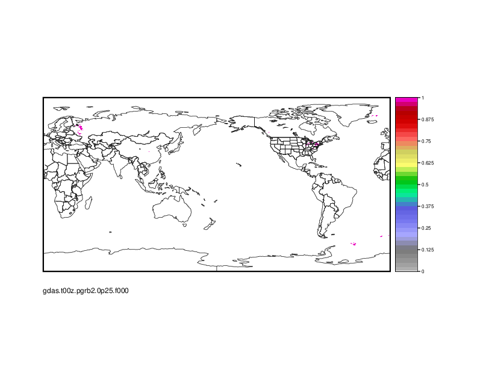

.. _vx-data-gdas-ice:

GDAS: Ice
---------

Description
  "The Global Data Assimilation System (GDAS) is the system used by the National Center for Environmental Prediction (NCEP) Global Forecast System (GFS) model to place observations into a gridded model space for the purpose of starting, or initializing, weather forecasts with observed data." from NOAA NCEI

Sample image
  Categorical freezing rain.

Recommended use
"Place observations into a gridded model space for the purpose of starting, or initializing, weather forecasts with observed data” from NOAA NCEI

File format
* Grib2

Location of data
  NCDC/NCEI: https://www.ncdc.noaa.gov/data-access/model-data/model-datasets/global-data-assimilation-system-gdas
  
  Ice data is in the first two rows in the "Product Types" table. 

Access restrictions
  None

Spatial resolution, grid, or coverage
  The spatial coverage is as follows. 
  Latitude: 90.000000 to -90.000000  
  Longitude: 0.000000 to 359.750000

  There are three spatial resolution options: 1° by 1°, 0.5° by 0.5°, and  0.25° by 0.25°

Temporal resolution
  * Model cycle: 4/day: 00, 06, 12, 18UTC
 
  * Output Timestep: Anl, +00, +03, +06, +09 hours

Starting and/or ending dates
  * Historical Dataset: 21Apr2019 – 11May2020
 
  * Present Dataset: 05Jun2020 – Present

Data latency
  Present data set appears to be a 6-7 day latency (no documented latency)

Variables available
  Here is a list of relevant variables. There are more in the grib2 files. 

 * Cloud mixing ratio, CMWR
 * Ice water mixing ratio, IWMR
 * Rain water mixing ratio, RWMR
 * Snow Mixing Ratio, SNMR 
 * Graupel, GRLE 
 * Ice concentration [ice=1, no ice=0], CI 
 * Ice Growth Rate, ICEG 
 * Percent frozen precipitation, CPOFP
 * Precipitation Rate, PRATE
 * Categorical Snow, CSNOW
 * Categorical Ice Pellets, CICEP 
 * Categorical Freezing Rain, CFRZR 
 * Categorical Rain, CRAIN
 * Snow depth, SNOD
 * Water equiv. of accum. snow depth, SDWE

METplus Use Cases
  Link to `METplus Use Cases <https://dtcenter.github.io/METplus/develop/search.html?q=VxDataGDAS%26%26UseCase&check_keywords=yes&area=default>`_ for this dataset.

Keywords
  .. note:: **Current Dataset:** VxDataGDAS

  .. note:: **Data Labels:** DataTypeGridded, DataLevelSurface, DataProviderNOAA, DataApplicationPrecipitation, DataApplicationMarineAndCryo
