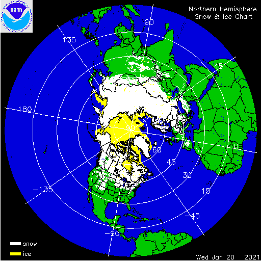

.. _vx-data-ims-ice:

IMS
---

Description
IMS stands for the Interactive Multisensor Snow and Ice Mapping System. 

"This data set provides maps of snow cover and sea ice for the Northern Hemisphere from February 1997 to the present from the United States National Ice Center (USNIC)." from the National Snow and Ice Data Center (NSIDC)

Sample image

Recommended use
  * "The IMS product is considered an operational product" from NSIDC
  * "Accurate monitoring of global snow and ice cover is a key component in the study of climate and global change as well as daily weather forecasting." from NSIDC
  * This is used as observation data in both research and operations. 

File format
  * ASCII Text (gridded data)
  * GeoTIFF (Geographic metadata)
  * GIF (images)

Location of data
  NSIDC: https://nsidc.org/data/G02156/versions/1
  Click on the "Download the Data" tab.

Access restrictions
  None

Spatial resolution, grid, or coverage
  Northern Hemisphere only (N: 90, S: 0, E: 180, W: -180)

  There are three resolution options: 1 x 1km, 4 x 4km, 24 x 24km

Temporal resolution
  1 Day

Starting and/or ending dates
  February 1997 - Present

Data latency
  1 Day

Variables available
  Snow and Ice Analysis: 
  * 1 (sea)
  * 2 (land)
  * 3 (sea ice)
  * 4 (snow)
  * 0 (outside Northern Hemisphere).

METplus Use Cases
  Link to `METplus Use Cases <https://dtcenter.github.io/METplus/develop/search.html?q=VxDataIMS%26%26UseCase&check_keywords=yes&area=default>`_ for this dataset.

Keywords
  .. note:: **Current Dataset:** VxDataIMS

  .. note:: **Data Labels:** DataTypeGridded, DataLevelSurface, DataProviderNSIDC, DataApplicationMarineAndCryo
