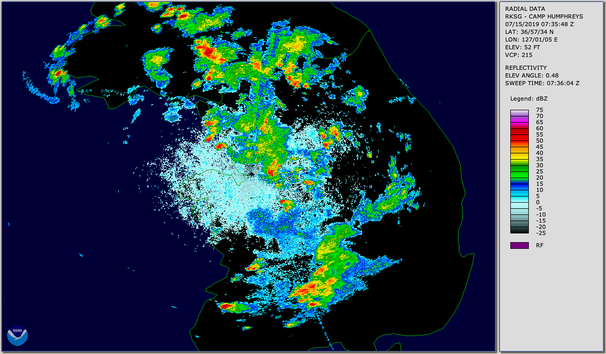

.. _vx-data-nexrad-level-2:

NEXRAD Level 2
--------------

Description
  Next-Generation Radar (NEXRAD) Level 2, gridded radial

  https://www.ncdc.noaa.gov/data-access/radar-data/nexrad-products

  Display/conversion: https://www.ncdc.noaa.gov/data-access/radar-data/radar-display-tools

Sample image

Recommended use
  Weather radar related research

File format
  Binary sweep files

Location of data
  Amazon AWS: https://s3.amazonaws.com/noaa-nexrad-level2/index.html
  
  NCEI: https://www.ncdc.noaa.gov/nexradinv/choosesite.jsp

Access restrictions
  None

Spatial resolution, grid, or coverage
  After 2008: 0.5° azimuth, 0.5km with 250 m spacing to 300 km range; CONUS, Alaska (7), Hawaii (4), Puerto Rico (1), South Korea (2), Japan (1), Guam (1)

Temporal resolution
  ~7 min

Starting and/or ending dates
  1991 (extremely limited) to present

Data latency
  A few hours

Variables available
  Reflectivity, radial velocity, spectrum width, >2011 differential reflectivity, correlation coefficient, differential phase

METplus Use Cases
  Link to `METplus Use Cases <https://dtcenter.github.io/METplus/develop/search.html?q=VxDataNexradLevel2%26%26UseCase&check_keywords=yes&area=default>`_ for this dataset.
Keywords
  .. note:: **Current Dataset:** VxDataNexradLevel2

  .. note:: **Data Labels:** DataTypeGridded, DataLevelSurface, DataProviderNOAA, DataApplicationConvectionAllowingModels, DataApplicationMediumRange
