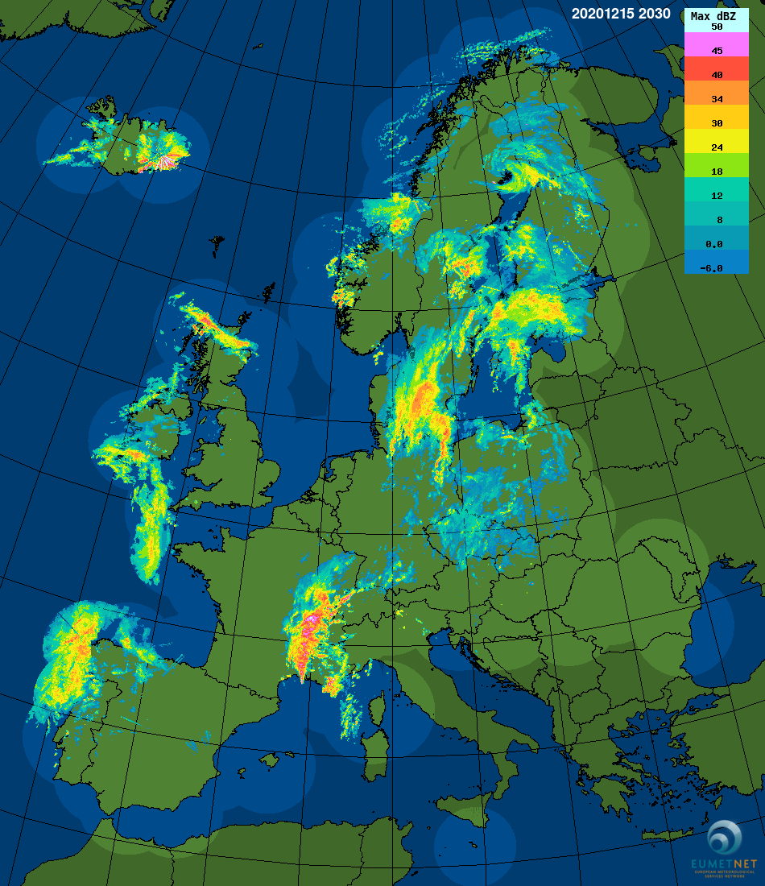

.. _vx-data-opera-eumetnet:

OPERA EUMETNET
--------------

Description
  Operational Program for Exchange of Weather Radar Information (OPERA) European National Meteorological Services (EUMETNET)

  Project Website: https://www.eumetnet.eu/activities/observations-programme/current-activities/opera/
 
  BAMS Paper: https://doi.org/10.1175/BAMS-D-12-00216.1

Sample image

Recommended use
  Weather radar related research

File format
  HDF5 and BUFR

Location of data
  Web: http://dcpcodpi.meteo.fr/openwis-user-portal/srv/en/main.home

Access restrictions
  Requires free research account/license: email info@eumetnet.eu

Spatial resolution, grid, or coverage
  2 km resolution
  
  projection: Lambert Equal Area (not yet supported in MET) gridded mosaic over Europe

Temporal resolution
  15 mins

Starting and/or ending dates
  At least 2011 to present

Data latency
  Archived and near-real-time (approximate 15 min latency)

Variables available
  Composite instantaneous max radar reflectivity, 1-hour rainfall accumulation, instantaneous surface rain rate

METplus Use Cases
  Link to `METplus Use Cases <https://dtcenter.github.io/METplus/develop/search.html?q=VxDataOperaEumetnet%26%26UseCase&check_keywords=yes&area=default>`_ for this dataset.

Keywords
  .. note:: **Current Dataset:** VxDataOperaEumetnet

  .. note:: **Data Labels:** DataTypeGridded, DataLevelSurface, DataProviderEUMETNET, DataApplicationPrecipitation, DataApplicationConvectionAllowingModels
