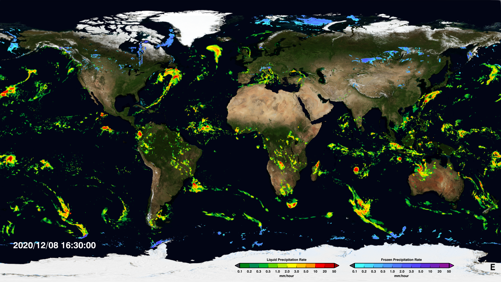

.. _vx-data-viirs:

VIIRS
-----

Description
  Visible Infrared Imaging Radiometer Suite (VIIRS)
  This instrument is on a polar-orbiting satellite providing global observations related to the atmosphere, oceans, and Earth's surface.
  
  Current version: V06B
  
  https://www.jpss.noaa.gov/viirs.html

Sample image

Recommended use
  Early Run: Flood analysis and other short-fuse applications
  
  Late Run: Daily and longer applications
  
  Final Run: Research-grade product

File format
  NetCDF

Location of data
  VIIRS Land: https://earthdata.nasa.gov/earth-observation-data/near-real-time/download-nrt-data/viirs-nrt
  VIIRS Atmosphere: https://earthdata.nasa.gov/earth-observation-data/near-real-time/download-nrt-data/viirs-a-nrt

Access restrictions
  Requires a free Earthdata account

Spatial resolution, grid, or coverage
  Global coverage (swath data) 
  
  375 m and 750 m at nadir (resampled to 500 m, 1 km, and 0.05 degrees in the NASA-produced products)

Temporal resolution
  Variable dependent, ranging from sub-daily to monthly

Starting and/or ending dates
  June 2000-Present

Data latency
  Need info

Variables available
  Thermal anomalies and fire, surface reflectance. vegetation indices, fraction of photosynthetically active radiation, leaf area index, emissivity, land surface temperature, land cover, bidirectional reflectance distribution function, albedo, burned area

METplus Use Cases
  Link to `METplus Use Cases <https://dtcenter.github.io/METplus/develop/search.html?q=VxDataIMERG%26%26UseCase&check_keywords=yes&area=default>`_ for this dataset.

Keywords
  .. note:: **Current Dataset:** VxDataVIIRS
  .. note:: **Data Labels:** DataTypeGridded, DataLevelUpperAir, DataProviderNASA, DataApplicationConvectionAllowingModels, DataApplicationMediumRange
